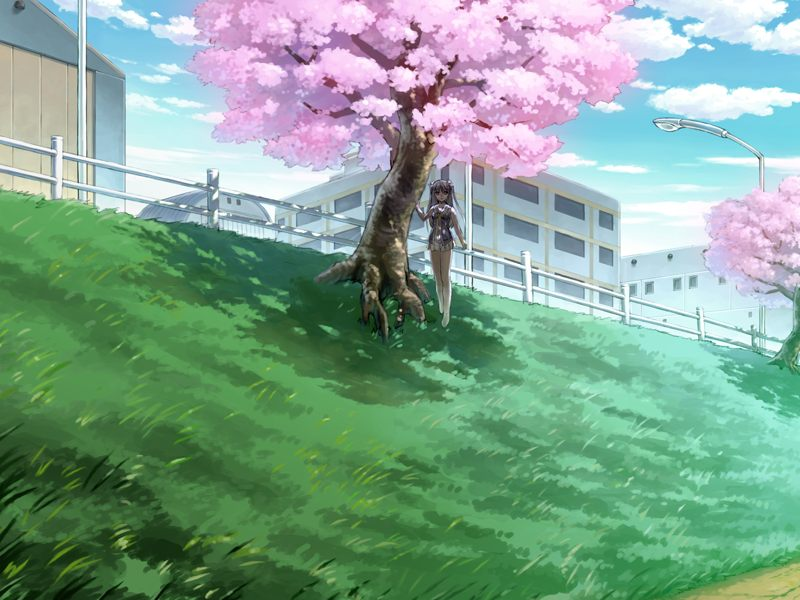

# 第2章 记忆溯行(Playback)

返回现实的甲与蕾迅速逃离已脑死的战友们所在的地下道，来到统合政府直辖都市清城市的地表。

蕾将甲带到作为临时住宿地点的爱情旅馆。
夜晚两人同床共枕，甲因为蕾在身边的缘故辗转难眠，而跟随甲多年的蕾似乎对此已习以为常。

第二日蕾将甲带到清都市的地下医生诊所，诊所医生诺依是个虽然拥有萝莉外貌却比甲还年长的黑市名医。
诺依使用医疗用纳米机器人对甲进行记忆修复，修复过程中甲回忆起学生时代的往事……

【记忆溯行】

> 因为原宿舍学长们非法访问军用数据库，刚升入二年级的甲与好友须藤雅不得不搬离宿舍。
> 甲的远房表姐，特级程序员(Wizard)西野亚季邀请两人入住她所在的宿舍如月寮。
> 
> 甲在前往途中经过操场时被飞来的足球击中，与踢球的元气少女简单交谈后，感到樱树下一位女孩的视线，但女孩的身影转瞬即逝。
> 
> 
> 
> 
> 
> 正在两人试图破解亚季的涂鸦风地图时，一位路过的男子将两人带到了如月寮。
> 一进门一股韭菜的香味铺面而来，原来甲年幼住在南八坂时的青梅竹马若草菜叶也考入了星修学园。
> 
> 
> 
> 
> 
> 饭后甲与雅在宿舍内挑选房间，误入亚季的房内发现并带走了有战斗用电子体安装程序的卡带。
> 
> 第二天，甲与雅一起安装了战斗用电子体并兴奋地准备进行模拟战，正在这时……

甲从记忆溯行中醒来，与诺依和蕾交谈后，再次进入梦乡。

---

[下一章](chapter3.md)