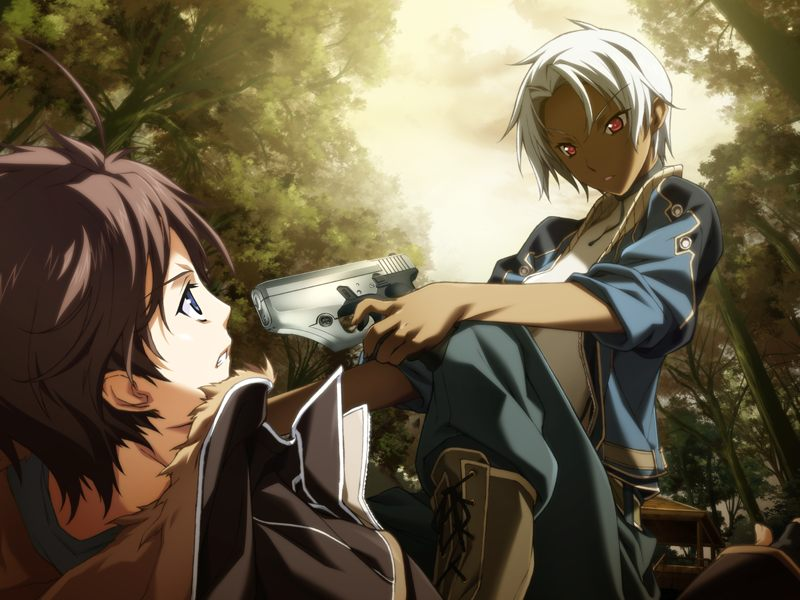

# 第4章 事发地(Ground Zero)

学生时代的记忆画面在甲的脑海中闪现，甲试着将唤醒的记忆碎片接合起来……

【记忆溯行】

> 甲和雅试图寻找参加比赛的队友，两人想起了之前的踢球少女渚千夏，但身为体育特长生的千夏声称对虚拟世界没有兴趣拒绝了邀请。
> 
> 管理星修的AI【玛萨】(Mother)为甲补课。
> 课上玛萨向甲讲解了智能化竞争时期，究极机械基体计算机巴德尔(Baldr)系统被生物基体计算机通过自我改良迅速超越，
> 而甲的母亲正是巴德尔计划的参与者之一。
> 尽管与人类相差甚远，拥有感觉质的生物学的AI仍然渴望能与人类交流。
> 
> 玛萨：【星修是我们和你们共同相互学习的环境】
> 
> 玛萨：【我渴望理解你们，也期盼着能够被你们所理解】
> 
> 补课结束后，甲在学园直接潜入，登出时发现千夏正在捉弄自己。
> 千夏跟甲说自己可以试试驾驶战斗用电子体，但作为交换要先和甲来一次“无聊”的约会……

甲想到这里忍不住笑了起来，满心怀念地打算回到星修寻找以前的朋友。
蕾欲言又止，最终决定与甲同行。

【记忆溯行】

> 甲在与千夏的约会中遇到一群男生在欺负一名女生，为首的红发青年就读于反AI派的凤翔学园，
> 是一名改造过基因的红发被造子。
> 两人为救助女生挺身而出……

甲在列车上醒来。
下车后，甲看到的故地却是一片废墟。
悲痛欲绝的甲脑海中最后闪现的好友的身影好似亚季私人空间中的女孩。
甲向隐瞒着自己的蕾询问事情的真相。

> 蕾：【“灰色圣诞节”】
> 
> 蕾：【那就是人们为这场惨剧所起的名字】

原来，甲成为佣兵，正是为了追捕引发灰色圣诞节的【德雷克斯勒机关】。
德雷克斯勒机关研究的编译者在那个圣诞节失控流出致使周边地区毁灭。
为了防止人类毁灭，统合军使用对地射击卫星群(Gungnir)将污染地区完全摧毁。
甲想起了那一天自己看到的地狱，想起自己拼命地向泄露中心的研究所赶去，因为……

> 【我得去找空……！我无论如何也要赶到水无月空的身边！】

甲不断地回想起那位与亚季私人空间中的少女一模一样的女孩的回忆碎片，想起刚成为恋人不久的她在那一天正在德雷克斯勒研究所前等待着自己到来。
心如死灰的甲拜托蕾让自己一个人呆一会儿。独处的甲想起自己与水无月空的初次相遇……

【记忆溯行】

> 在菜叶入学星修的那天，甲和好友们搭救了一位被舍友欺负的有电脑症的女孩。
> 被救后安心的女孩不禁哭了出来，结果另一位赶来的少女毫不犹豫地糊了甲一巴掌后带走了被救的女孩。
> 
> 甲在跟雅一起教千夏使用战斗用电子体。
> 
> 甲到宿舍外散心，发现之前搭救的女孩正在屋檐下避雨。
> 
> 
> 
> 甲将湿透发烧的女孩水无月真接到宿舍，亚季和雅联系到了女孩的姐姐……

打算进入废墟的甲被一位军装女性制止。
女性名为希泽鲁，隶属于甲的父亲属下的“门仓运输”，即因涉嫌虐杀平民而臭名昭著的佣兵部队“魔狼”。
因父亲在母亲临终时都不曾回家，甲对父亲和其所从事的佣兵行当深痛恶觉。
因此尽管得知魔狼也在追捕德雷克斯勒机关的残党，甲依然拒绝了希泽鲁让自己加入魔狼的要求。
希泽鲁试图用武力迫使甲加入，被蕾及时赶到解围。

向担心的蕾致歉后，两人搭上了回程的电车。

【记忆溯行】

> 亚季向宿舍成员们解释真患有电脑症——一种与AI适应性过高导致丧失与网络世界界线的症状各异的病症。
> 甲想起自己因电脑症去世的母亲辗转反侧，决定潜入到那片能让自己安心的有神秘女孩在的草原，被能无意识地穿透网络安全系统的真发现。
> 平时沉默寡言的真激动时滔滔不绝地将意识直接外漏出来。
> 
> 
> 
> 真离开前告诉甲那位不怎么会交谈的少女是喜欢甲的，甲想亲口向少女确认她的感情……

列车上，诺依联系甲为将其情况告知其父亲致歉，并建议甲向母亲那边的亲戚求助。
甲决定见一下亚季的养母，自己母亲的妹妹橘圣良叔母。
甲犹豫是否要提前联络亚季……

1. [进行联络](../route2_nanoha/chapter4-5.md)(路线2入口，开启条件：已攻略路线1)
2. [不进行联络](../route1_rain/chapter4-5.md)(默认)