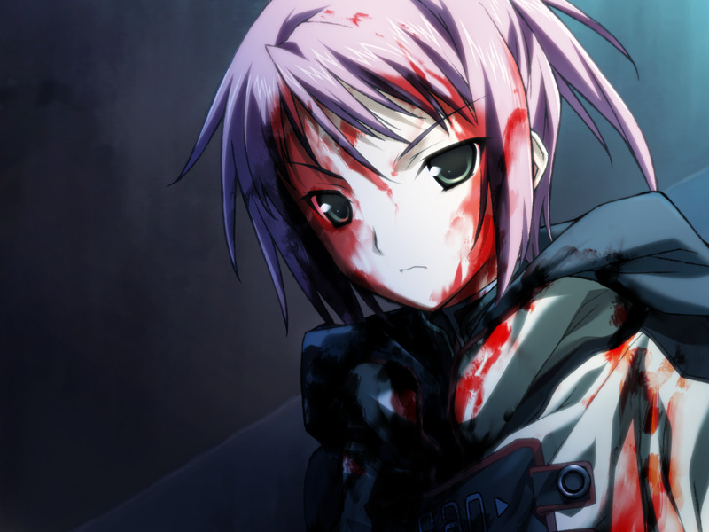

# 第6章 代理人(Agent)

【记忆溯行】

> 甲与千夏一同在甲的房间潜入参加新人战斗用电子体大赛，菜叶与空前来为甲、千夏、雅助阵。
> 空说真因为电脑症诊疗不能前来，并在远处和一位矮小的女性熟人说了一些私话。
> 对战前，久利原老师也来为三人鼓劲。

醒来的我接受以CDF为假想敌的魔狼训练，甲想起雅已是CDF刑警。
训练结束后，甲决定……

1. 先去洗澡
2. 先去吃饭

【选项1】

> 若甲先去洗澡，遇到在洗澡的希泽鲁。
> 甲发现希泽鲁是义体使用者。
> 希泽鲁坦承自己曾失去七成身体，因为全身细胞复制的审查和费用的原因选择了全身义体化。

【选项2】

> 若甲先去吃饭，会发现永二正在注视妻子的立体影像。
> 永二向甲坦承自己作为父亲和丈夫都不及格，本希望靠擅长的战争让家人幸福，最终在妻子逝世后却没脸再见甲。
> 希泽鲁让甲不要过分责怪父亲，并展示了自己的完全义体。

在吃饭淋浴后，少佐进行今日简报，得知甲曾联络的情报商曾将情报卖与米内的秘书。
甲并没有被分配任务，在蕾的陪同下前往希泽鲁指示的诊所，再次接受诺依久违的诊疗。

甲仿佛回忆起谁来，那个面庞是……

【Dive2选项】
【路线4分歧点】

1. 【是千夏的脸】
2. 【是亚季姐的脸】

【选项1】

> 【记忆溯行】
> 
> > 甲与千夏在学园旁遍地废弃军用器材的草原上组装摩托车。千夏承认自己家境不佳。
> > 两人手不小心触碰到了一起，千夏……开心地将满脸通红的甲掀倒在地。

【选项2】

> 【记忆溯行】
> 
> > 年幼的亚季向甲声称自己将来要成为特级程序员(Wizard)。

甲与蕾登入方舟虚拟都市，遇到迎接的菜叶。
蕾主动离开去图书馆，甲与菜叶边聊天边向如月寮前进。
路上，两人遭遇了仿佛拥有人类情感的呼型NPC，甲想起自己失忆那场战斗中发生的事情……

【记忆溯行】

> 甲追查德雷克斯勒机关在地下潜入，在单独潜入数据库时收到蕾发现自爆装置的警告。
> 正当甲找到编译者的资料时，遇到了拥有情感的呼型NPC.
> 甲为保护自称代理人的少女将其带走，但还是被爆炸卷入……
> 
> 

甲急忙确认少女的身份，NPC却马上恢复了营业模式。

回到如月寮后，亚季带甲看刚复原的甲的宿舍，甲看到了空的立体照片。
亚季向方舟量产呼型NPC为甲道歉，并承认有呼型NPC偶尔具有感情的传闻。
亚季说不会再去制作模仿体，惊讶地发现甲已经忘记了空的模仿体造成的悲伤事件。

甲被菜叶唤醒。蕾来到如月寮，通告甲米内要举行政治集会。
魔狼众在集会地点集合进行监视任务。
蕾发现了Dying Slave的行踪，甲被委托生擒刺客，遭遇了吉鲁贝鲁特。
莫霍克主动协助追捕，但还是被吉鲁贝鲁特逃脱。

甲登出时，米内正要宣布阿南的丑闻，却突然被狙击刺杀。
甲与蕾被人流冲散，约定在基地会合。
独行的甲撞到了背着狙击枪的千夏，逃离的千夏遭遇了暴徒的包围，想要解救的甲反而也被卷入。

昏迷的甲梦到……

【Dive2选项】
【路线4分歧点】

1. 梦到了千夏
2. 梦到了亚季姐

【选项1】

> 【记忆溯行】
> 
> 与千夏约会的当天晚上，为了让千夏的初次约会有个美好的结局，甲将千夏约往方舟最新制造的虚拟海边。
> 在无限制的海边两人纵情享受如同现实般的体验。
> 
> 

【选项2】

> 【记忆溯行】
> 
> 亚季和甲彼此诉说自己被寄养的理由。甲被亚季要求称呼为“亚季姐”

千夏在暴徒手中救下了甲。
千夏提起灰色圣诞节前的久利原老师神情古怪，但失忆的甲不记得了。

---

若在之前的所有分歧选项中选择倾向亚季的选项，进入[路线4](../route4_aki/chapter7.md)，
否则进入[路线3](../route3_chinatsu/chapter7.md)。