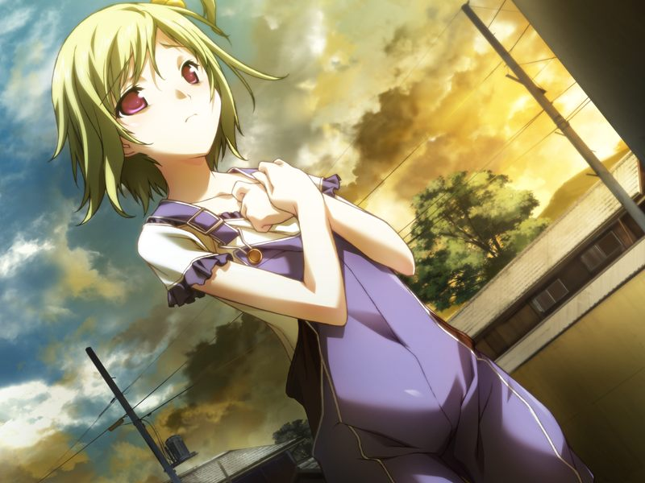
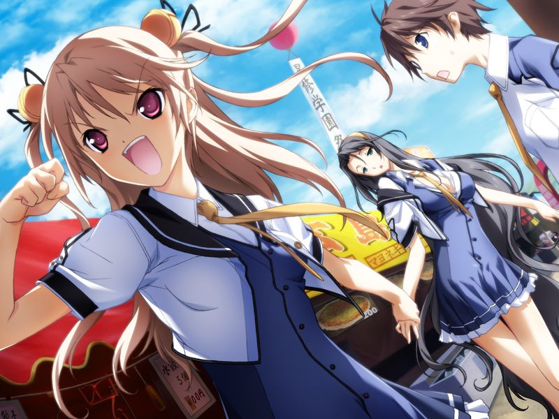
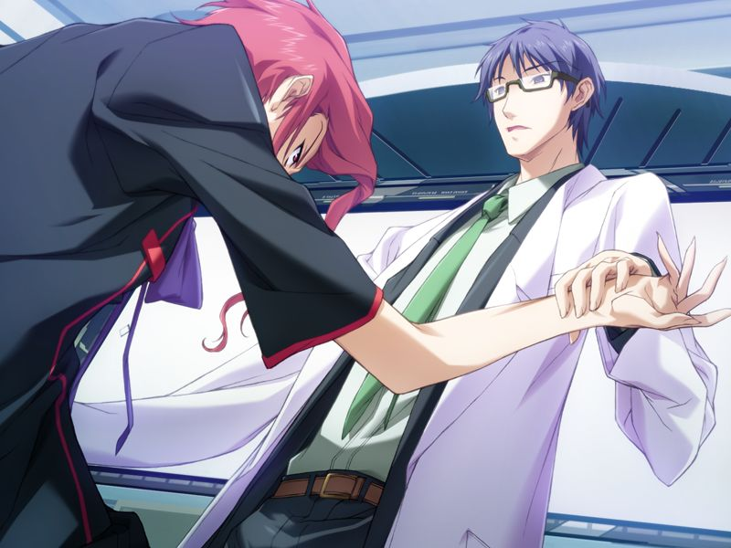

# 学园编第三章 终结的开始 秋

【那一天】-107日

---

## 9月8日

【第一次回溯：千夏线第11章】

甲和千夏在草原修理摩托车。甲意识到千夏在强装欢颜。
正在两人交谈时，一位严厉的统合军人训诫两人这片军方土地禁止一般人进入。
出乎两人意料的是，来训诫两人的军人桐岛勳大佐反而帮助两人修起摩托来。

【第一次回溯：菜叶线第6章】

甲回到宿舍，遇到菜叶在为编程懊恼。甲发现菜叶读的是农学系。
原来菜叶并没能考上最难考的纳米工程系，想要和父母做相同研究的菜叶向大家撒了谎，准备自习再考一次。
甲安慰了爱哭的菜叶。

【第一次回溯：菜叶线第7章】

甲安慰菜叶时在路上遇到了久利原老师。
久利原老师谈到菜叶的父母相当于自己的恩师，并称受到夫妇制作的纳米花触动才进入德雷克斯勒机关研究编译者。
久利原老师为“那件事”向菜叶表示遗憾，但菜叶阻止老师讲下去后离开了。
老师拜托甲成为支持菜叶内心的支柱。

## 9月10日

【第一次回溯：无】

甲的鞋柜被塞了巧克力，但融化到鞋上后气味尴尬。
千夏邀甲和同行的菜叶来到修理摩托的草原放松。

## 9月14日

【第一次回溯：无】

为了帮助备考的菜叶分担压力，空开始督促起如月寮的众人。

在上学路上，千夏和空一如既往地开始为甲的事情争斗起来。

## 9月17日

【第一次回溯：千夏线第11章】

甲寻找千夏时听到足球部的部员议论千夏今天也没有参加社团活动。
一身便装出现的千夏将甲拉到修理摩托的草原。
千夏为感谢甲之前的出手相助向甲吻去，恰好被路过的空遇到。

空来找两人是打算商量怎样为临近入学考试的菜叶鼓劲，同行的还有久利原和真。
正当久利原建议邀请众人到研究所参观时，勳也来到这片空地。
勳与久利原互相敌视，久利原借故与真离开。
本对甲和千夏亲切的勳因为得知两人是久利原的学生而对两人冷眼相对。
看不下去的空正面和勳争吵起来……

甲与千夏被迫回避，回来时发现勳正和空一脸和气地探讨和女儿说不上话的烦恼。

【第一次回溯：无】

千夏谈起菜叶的入学考试，说出了自己因为不想偷跑而在保留实力的意味深长的话。

【第一次回溯：菜叶线第8章】

久利原老师来到如月寮，在百忙中仍愿意帮菜叶补课。优等生的真也愿意帮忙。

## 9月18日

【第一次回溯：无】

千夏来找为努力学习的菜叶做夜宵的甲，表示自己特别喜欢甲坦率的反应。

甲将夜宵送到菜叶的房间，看到菜叶和真一起趴在桌上，感慨自己如果有妹妹或许也是这样的心情。

深夜，甲收到亚季的呼叫，得知呼被真带走了。
甲和亚季在追踪到星修虚拟空间时遭遇了菜叶和千夏，亚季交给两人方舟私有空间的门票打发两人离开。

甲和亚季终于追上在一起吃冰激凌的真和呼。
真严肃地希望亚季能让寂寞的呼体验外面的世界。
亚季被真说服，允许呼在方舟管辖区域内行动，并将众人带往方舟的虚拟大海。
在呼玩的全身湿透时，刚拿到票的菜叶和千夏也来到了海边。
为了不让接近的菜叶发现呼的秘密，甲只好抱紧遮住呼的脸假装与NPC亲密。

早晨，空拿着金属球棒来叫甲起床。
空好像梦到了有甲出现的H的梦。

甲在走廊遇到菜叶，想要解释昨晚发生的事情，但菜叶哭着逃走了。

## 10月2日

【第一次回溯：无】

试图帮菜叶做家务的空总是失败，搞得菜叶反而心神不宁。

回老家的千夏边淋浴边发来被检查过滤的视频通话，菜叶听闻将空的内裤套到了甲的头上，导致甲又被空揍了一顿。

## 10月3日

【第一次回溯：菜叶线第9章】

甲陪菜叶看榜。
再考纳米工程系的菜叶仍然没能通过。
久利原老师也认为菜叶还是更适合农学系一些，并提醒要去安慰菜叶的甲调查纳米花的事情。

【第一次回溯：千夏线第11章】

甲回到宿舍，得知千夏被从球队正式队员中除名的消息。

## 10月7日

【第一次回溯：千夏线第11章】

甲和空在空地遇到千夏和向千夏道歉的勳。
空说千夏从小踢球，只是和改变基因的被造子相比不再突出。

甲与千夏独处，给千夏递上自己本打算作为生日礼物送出的足球鞋。
千夏与甲相吻。

## 10月12日

【第一次回溯：千夏线第11章】

千夏在电话中和亲人争论。
空不安地说【千夏看来并没有重新振作】

甲和千夏的关系变得越来越亲密，千夏说【有件事想告诉你】。

【第一次回溯：千夏线第12章】

甲与千夏去藏浜约会。

约会到晚上，两人来到虚拟的海边。
千夏说自己要结束学园生活了，看到甲真心为自己担心时却又说自己是在骗甲玩。
不甘心被戏弄的甲追上了嬉闹的千夏……

千夏在虚拟的海边吻甲。
尽管千夏在诱惑甲，但千夏之前露出的寂寞的表情在甲的脑海中挥之不去。

【第一次回溯：千夏线第13章】

两人什么都没有做便返回了星修。
在甲的追问下，千夏说自己因为脚已经到了极限，而丧失特长生的资格后家庭将无力维持自己在星修的学费。
甲想要帮助不得不离开星修学园的千夏。
千夏不希望自己凭借甲一时的同情胜过菜叶与空，但相拥的两人刚好被路过买夜宵的菜叶与空逮个正着。

## 10月15日

【第一次回溯：菜叶线第13章】

如月寮众人看到了菜叶的离家出走的留言。

【第一次回溯：菜叶线第9章】

甲想起直树老师的提醒，调查纳米花的事情。
纳米花能像真正的植物一样净化土壤和空气。
选择康乃馨花的形状是因为菜叶和甲的缘故。
净化环境的功能则是赠与女儿的名为【未来的希望】的礼物。
然而两位开发者已在恐怖事件中死亡。

知道菜叶隐瞒的双亲已故的事情，连脚受伤的千夏也慌忙去帮忙找离家出走的菜叶……

【第一次回溯：菜叶线第13章】

宿舍全员开始寻找菜叶，甲意识到自己应该去的地方是……

【第一次回溯：菜叶线第10章】

甲在南八坂找到离家出走的菜叶，菜叶向甲倾诉自己的寂寞。

【第一次回溯：无】

在与大家联系时，大家拜托两人去蛋糕店买东西。
到达店里时，两人发现如月寮众人和直树已经在等着并为将到来的菜叶生日召开Party。

千夏将菜叶约到店外，所有人都把脸埋到菜单中倾听。
千夏坦率地承认自己喜欢甲，想要堂堂正正决出胜负的两人相视而笑。

## 11月1日

【第一次回溯：无】

甲去见呼，告诉呼文化祭就要开始了，呼非常想去学校参加，但意识到现实和虚拟之间的隔绝后不得不放弃了。

空硬领着亚季参加文化祭。

三人逛到千夏的摊位，千夏将疲惫的亚季带到草坪休息，但一不留神让亚季走失了。
寻找亚季的两人在后院目击了直树在边悲咽边依附着真，而真则在安慰直树。

下午，众人前往教室听直树演讲。

【第一次回溯：菜叶线第8章】

吉鲁贝鲁特在久利原老师的编译者公开课上与久利原对峙，声称AI与编译者都是疯狂科学家十九的遗产。
吉鲁贝鲁特不断地对众人进行挑衅，菜叶为自己的双亲愤怒地反驳。
甲替菜叶挡下了吉鲁贝鲁特的拳击。吉鲁贝鲁特想要继续攻击，被眼神冷酷的久利原老师死死扣住关节。
在吉鲁贝鲁特的胳膊几乎被折断前，亚季出声制止了久利原。

晚上，甲和菜叶在路上遇见衣袖滴血的久利原老师。
久利原老师声称被埋伏着的凤翔的人扔的石头打到，并趁菜叶找医疗用具时对甲谈起被恐怖袭击的菜叶的双亲，和自己对编译者的信念。
久利原邀请菜叶和闻讯而来的如月寮众人参观研究所，正当大家拉着老师去宿舍一起吃饭时，
只有甲和真发现了灌木丛对面倒下的浑身是血的男人们。

【那一天】-48日

## 11月6日

【第一次回溯：蕾线第11章】

甲在与空日常拌嘴的时候被亚季叫到虚拟草原。一旁的呼似乎最近心情一直很不错。

亚季向甲解释空与呼的关系。
原来方舟正进行着让集体知性的AI学习人性的机密计划。
为了让AI自主产生个体，方舟在AI中再现了人类头脑的仿真器，而呼正是学习空的个人经验和情感产生的空的心灵的模仿体(Simulacra)。
所以假如跟空的链接不存在，呼的人格也会消失。
亚季还提到，自己制作这个NPC的时候还不认识空，只是AI擅自选择了空作为原型。
面对对自己又亲又抱的呼，甲想起和自己见面就吵架的空，感到心情微妙……

## 11月8日

【第一次回溯：蕾线第12章】

甲又在鞋柜中发现了便当，一旁的空依旧神色诡异。
结果被空强行喂下生牡蛎的甲被众人抬进了保健室……

甲向呼吐槽空让自己吃生牡蛎的事情，呼催促甲去后院。
来到宿舍后院的甲偷看到沮丧地埋掉便当盒中食物的空。
回到宿舍，感到歉意的空被甲安慰后安心地流下了眼泪。

【那一天】-41日

## 11月13日

【第一次回溯：菜叶线第11章】

如月寮的成员们应久利原老师的邀请参观德雷克斯勒机关研究所。
久利原向大家展示了开发中的编译者的净化能力，并顺势邀请先驱者若草博士的女儿菜叶来打工。
正当大家准备大吃庆祝时，实验小白鼠发生了异常的变化……

【那一天】-33日

## 11月21日

【第一次回溯：菜叶线第12章】

为了让菜叶集中精神学习，空自告奋勇地下厨，结果惨不忍睹。

旅行回来的千夏和菜叶愉快地做起正常的料理来。

甲安慰了受挫的空。

独处的甲遇到赶来的久利原老师，聊起甲的母亲的电脑症，老师对那种精神上的磨损感似乎感同身受。

久利原老师让甲吃下纳米机器的胶囊，声称这个能让甲“到某个时候，能够了解某些情报”。

【第一次回溯：无(?)】

久利原提醒甲今后被改造为杀戮兵器的编译者可能会被人散播。
为防止被“他”针对开发对抗手段，久利原将修复程序通过纳米机器托付给有战斗力量和守护意志的甲，并令甲忘记了这段记忆。
直树相信甲在听到特定的关键词之时会回想起来，也相信正在注视两人的伊芙(AI)会助一臂之力。

【那一天】-31日

## 11月23日

【第一次回溯：无】

为了给老师打气，如月寮众人请直树出来吃饭作为参观会的回礼。
空说预约的饭店是受学者父母赞助的地方。

结果还是让直树老师请客了。
饭后的路上众人谈起空和真的父母，在真的阻碍下直树敷衍的回答了空的问题。

回家后，甲见到开心的呼，意识到呼确实在感知着空所感知的事物，并因此学习进化着。
呼甚至能通过感觉质感受到空对甲的感激之情。

真来到虚拟草原，向甲道出了水无月姐妹其实没有父母的事实。
水无月姐妹自小在方舟成长，年幼好奇的空想要进入方舟中禁止进入的区域。
真穿过了对她而言如同不存在的防护墙，却被自律型病毒攻击导致几乎失语。
为了安慰自责的空，真开始编造关于家庭的谎言，长此以往使得空相信了那样的故事。

真在呼的安慰下入睡。
共享情报的呼还在学习个体的意义。
甲意识到呼一直在注视并理解着身边的每一个人。
呼想要跟甲的朋友们都希望的那样跟甲“连结”，甲告诉呼人可以连结的只能是一个人，不这样的话，就会伤害彼此。

呼跟甲黏在一起的样子被刚好登入的千夏撞见。千夏误以为甲和空正在秘密交往。

【第一次回溯：千夏线第14章】

千夏把甲叫到学园竞技场，向甲发出“赢了就奉上我的处女之身”的请战。

甲战胜并拥吻自暴自弃的千夏，向千夏做出等毕业时再让千夏确定她自己的心意的约定。

【第一次回溯：无】

甲感到不能再继续隐瞒呼的事情了，和亚季关于呼的事跟圣良交涉。
圣良坚持命令亚季冻结呼，但在甲的要求下争取到了延期冻结的许可。

甲再次回到草地，遇到已从亚季得知部分情况的空。
空看到不想对自己泄露秘密的真在自己的模仿体呼身旁安睡有些悲伤。
空仅凭直觉看穿了呼作为NPC(人偶)却拥有心灵(感觉质)，并推断方舟因此才对呼的事情如此敏感。
空为了让呼在剩下的时间平稳度过，愿意帮助甲解开跟千夏的误解。

【那一天】-26日

## 11月28日

【第一次回溯：无】

千夏质问甲与空是否在交往。来帮忙解释的空越帮越忙。
趁甲独处时，一旁偷窥的雅向甲询问实情。
想起过往的交情，甲将呼介绍给雅。
在雅的劝说下，甲放下心来，决定向如月寮的众人介绍呼。
雅也在发现呼有感觉质之后才意识到秘密的重大和如月寮被监视的原因。

众人等待千夏回家。
空对雅曾对呼做的事情产生了下意识的反应，亚季观察到空和呼之间发生了干涉。

甲安慰了因为呼和千夏的事情沉浸在网络中自责的真。

千夏直到深夜才回到如月寮。
甲跟亚季将呼介绍给千夏和菜叶。
两人很快接受了呼。

一位年轻的女性医生打来电话，让翘掉诊疗的水无月姐妹与她联络。
空说自己因为小时候的治疗导致了记忆丧失。

空说自己最近在做奇怪的梦。甲说出了空与呼之间的联系。
甲将空带给呼做正式介绍，呼却不见了。
为找呼，空来到亚季的虚拟房间，却感到这里似曾相识，并询问甲两人是不是今年才第一次见面。

呼跑出来拥抱甲，一旁看着的空的精神状况开始异常。
甲抓住空登出。
空感觉内心纠缠不已并向甲告白，甲也不知为何内心开始鼓动，两人如同磁石般互相吸引。
空在甲的怀中失去了意识。

亚季意识到空与呼之间产生了共振现象，两人之间相互传递并增幅着彼此的情感。
更危险的是，不仅是对甲的爱意，类似疼痛等负面情感也会因此而增强。

---

[冬季篇](winter.md)