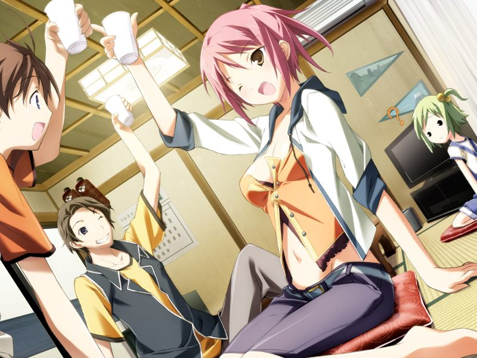

# 学园编第一章 相遇 春

那些和平的日子。
犹如在春日暖阳中安眠一般平静的日子。

呐，我会想。

那时候的我为什么会像个傻瓜一样呢。
你呢？

我在失去之后，才开始注意到。

你会将那时候的日子。
我们大家一起度过的那些日子。
当成宝石一般对待吗？

就算是现在也会想起。
而且——

还想再见到你。

就算是现在，
就算是这双手已经无法挽回地沾满了鲜血和仇恨的现在。

我还是想再见到你。

【那一天】-284日

---

## 3月15日

【第一次回溯：蕾线第2章】

春季，第三学期期末临近。
因为原宿舍学长们非法访问军用数据库，刚升入二年级的甲与好友须藤雅不得不搬离宿舍。
甲的远房表姐，特级程序员西野亚季邀请两人入住她所在的宿舍如月寮。
甲在前往途中经过操场时被飞来的足球击中，与踢球的元气少女简单交谈后，感到樱树下一位女孩的视线，但女孩的身影转瞬即逝。

正在两人试图破解亚季的涂鸦风地图时，一位路过的男子将两人带到了如月寮。
一进门一股韭菜的香味铺面而来，原来甲年幼住在南八坂时的青梅竹马若草菜叶也考入了星修学园。

饭后甲与雅在宿舍内挑选房间，误入亚季的房内发现并带走了有战斗用电子体安装程序的卡带。

## 3月16日

【第一次回溯：蕾线第2章】

甲与雅一起安装了战斗用电子体并兴奋地进行了模拟战。
这一天成为两人初次使用战斗用电子体的童贞丧失纪念日。

【第一次回溯：蕾线第3章】

甲与雅在模拟战后回到如月寮，发现之前为两人带过路的男子。
男子名为久利原直树，就职于星修大学研究所，是研究使用纳米机器人集合体修复已污染的环境的编译者项目的开发总指挥。
交谈中甲不慎将战斗用电子体的卡带掉在了地上，久利原不但没有责备两人，反而亲身指导并帮助两人将潜入攻击的反AI派主义狂信者们击退。

事后，亚季发现甲偷拿了卡带，却没有过多责怪。
原来亚季本来就打算将亲手制作的卡带送给甲当做礼物，甚至为卡带程序设计了与甲一同成长的自我进化能力。
亚季嘱咐甲要为自己的正义而战。

## 3月17日

【第一次回溯：无】

甲让亚季姐调查昨天袭击的【晓之虎】部队。
知道了对方幸存之后，甲和雅放下心来。

## 3月25日

【第一次回溯：蕾线第3章】

甲和雅想要参加战斗用电子体新人比赛，但发现比赛规格为三人团体战。
为和亚季商量比赛的事情，甲潜入了亚季的私有空间，在空间内的草原上偶遇了一位不怎么会交谈的少女。
亚季发现后希望甲和女孩成为朋友，但要求甲对其他人保密。甲和少女之间的对话笨拙而又温馨……

## 3月29日

【第一次回溯：无】

甲参加了竞技场第二战。
赛后，甲想起曾与虚拟空间中的迷之少女的交谈。

为了给少女起名，甲请求玛萨的帮助，玛萨委婉地表达了让甲自己挑选的意见。
看到少女拿起了康乃馨，甲想起了自己母亲去世时自己曾在悲伤中无法自拔。
那时将幼年的自己内心唤醒的，是一位“姐姐”的声音。

> 甲：【大姐姐……你是谁？】
> 
> 少女：【…迟早会知道的哦。我会一直守望着你的梦境…一直等待着，等待着与你的相会…】

亚季来到虚拟空间，看到甲对迷之少女的喜爱，不知为何感到十分低沉。

【第一次回溯：蕾线第4章】

甲和雅试图寻找参加比赛的队友，两人想起了之前的踢球少女渚千夏，但千夏声称对虚拟世界没有兴趣并拒绝了邀请。

## 3月30日

【第一次回溯：蕾线第4章】

甲与雅参加玛萨的补习。雅调查了体育特长生千夏的资料，又教唆甲去邀请她。

## 4月1日

【第一次回溯：蕾线第4章】

甲与雅再度邀请千夏。说服途中遇到了来学校办入学手续的菜叶。
千夏听到甲对菜叶的态度觉得他是个好人，但因为自己确实对运动会以外的事情没有兴趣婉拒了甲的邀请。

玛萨为甲补课。
课上玛萨向甲讲解了智能化竞争时期，究极机械基体计算机巴德尔系统被生物基体计算机通过自我改良迅速超越，
而甲的母亲正是巴德尔计划的参与者之一。
尽管与人类相差甚远，拥有感觉质的生物学的AI仍然渴望能与人类交流。

补课结束后，甲在学园直接潜入，登出时发现千夏正在捉弄自己。
千夏跟甲说自己可以试试驾驶战斗用电子体，但作为交换要先和甲来一次“无聊”的约会。

## 4月2日

【第一次回溯：蕾线第4章】

甲在约会前紧张不已，下意识地来到虚拟草原与迷之少女谈话。

千夏来到如月寮。甲与千夏前往藏浜约会。甲感到千夏阳光而善解人意。

两人来到公园散步，途中凤翔学园的一群男生在欺负一名女生。
两人为救助女生挺身而出。
甲为了保护千夏被红发男子等人围殴，但千夏不仅没有逃走，反而将被造子们击退。
想起童年记忆的甲抓起板砖伫立在对千夏起了杀意的红发男子面前。
最终这场争斗被赶来的警察制止。

【第一次回溯：千夏线第6章】

甲和千夏回到如月寮。
为了安慰因甲受伤而闷闷不乐的千夏，让千夏的初次约会有个美好的结局，甲将千夏约往方舟最新制造的虚拟海边。
在无限制的海边两人纵情享受如同现实般的体验。

## 4月5日

【第一次回溯：蕾线第4章】

在菜叶入学星修的那天，甲和好友们搭救了一位被舍友欺负的有电脑症的女孩。
被救后安心的女孩不禁哭了出来，结果另一位赶来的少女毫不犹豫地糊了甲一巴掌后带走了被救的女孩。

## 4月9日

【第一次回溯：蕾线第4章】

甲在跟雅一起教千夏使用战斗用电子体。

## 4月17日

【第一次回溯：蕾线第4章】

三人第一次参加团队战。

赛后甲到宿舍外散心，发现之前搭救的女孩正在屋檐下避雨。

甲将湿透发烧的女孩水无月真接到宿舍，亚季和雅联系到了女孩的姐姐。

亚季向宿舍成员们解释真患有电脑症——一种与AI适应性过高导致丧失与网络世界界线的症状各异的病症。
甲想起自己因电脑症去世的母亲辗转反侧，决定潜入到那片能让自己安心的有神秘女孩在的草原，被能无意识地穿透网络安全系统的真发现。
平时沉默寡言的真激动时滔滔不绝地将意识直接外漏出来。

真离开前告诉甲那位不怎么会交谈的少女是喜欢甲的。

【第一次回溯：蕾线第5章】

甲不好意思询问草原少女的真实心意。
尽管如此，甲却感到两人无需言语也能心有灵犀。两人在虚拟空间中安睡。

## 4月18日

【第一次回溯：蕾线第5章】

早晨醒来，甲得知真已经被姐姐接走了。
亚季单独找甲谈话，听到甲倾诉对一直在虚拟空间中出现的少女的感情，亚季对此感到非常抱歉。
原来，那个少女是亚季开发的NPC。
通常的NPC很容易通过固定做作的对话与无感情的表情被识别，而那个NPC少女却是试图学习感情的，并且因为特殊原因无法量产的独一无二的个体。
听着睡着的NPC少女发出的轻微呼吸声，甲为她起名为【呼】。

【第一次回溯：无】

甲想要偷吻沉睡中的呼，恰好被真发现。
真为自己姐姐开学打过甲致歉，说下次会和姐姐一起来道歉。
真还询问甲为何犹豫很久都没有亲吻呼，得到甲“果然还是希望征得呼的同意”的答复，确信甲已经认同了这位NPC女孩的人格。

## 4月24日

【第一次回溯：菜叶线第5章】

菜叶为准备入学欢迎会买菜。
在与菜叶通话时，泳装的千夏出来捣乱，吃醋赶来的菜叶见状跑出了宿舍。

【第一次回溯：蕾线第5章】

追上安慰菜叶的甲陪菜叶一同购买食材。
与菜叶同年级的真也被邀请加入如月寮举办的菜叶入学欢迎会。
甲看到一同前来的真的姐姐惊呆了，因为眼前的少女与呼有着一模一样的面庞。

【第一次回溯：蕾线第6章】

真的姐姐水无月空误会甲是跟踪自己妹妹的跟踪狂，在如月寮前与甲吵闹起来。
解除误会后，甲发现空虽然冒失冲动经常四处白忙活，却是个真诚坦率的好女孩。

【第一次回溯：蕾线第9章】

菜叶和真的入学庆祝会因为酒和空的原因被搞的一团糟。

【第一次回溯：无】

千夏正式同意与甲、雅组队参加大赛。

---

[夏季篇](summer.md)