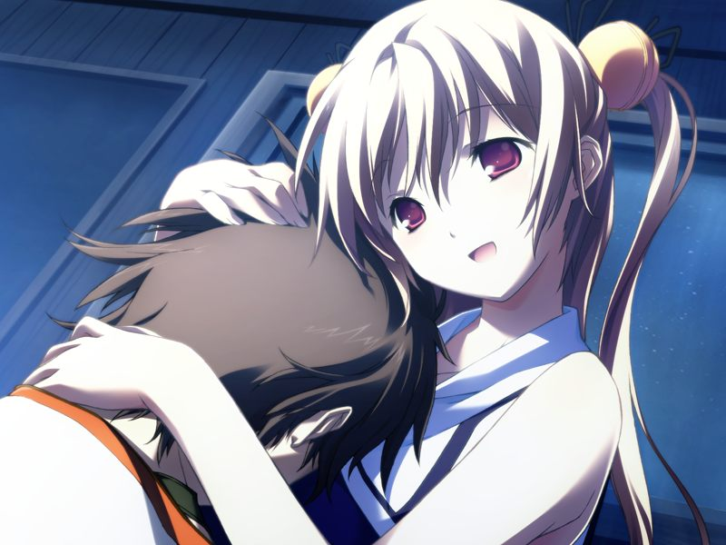
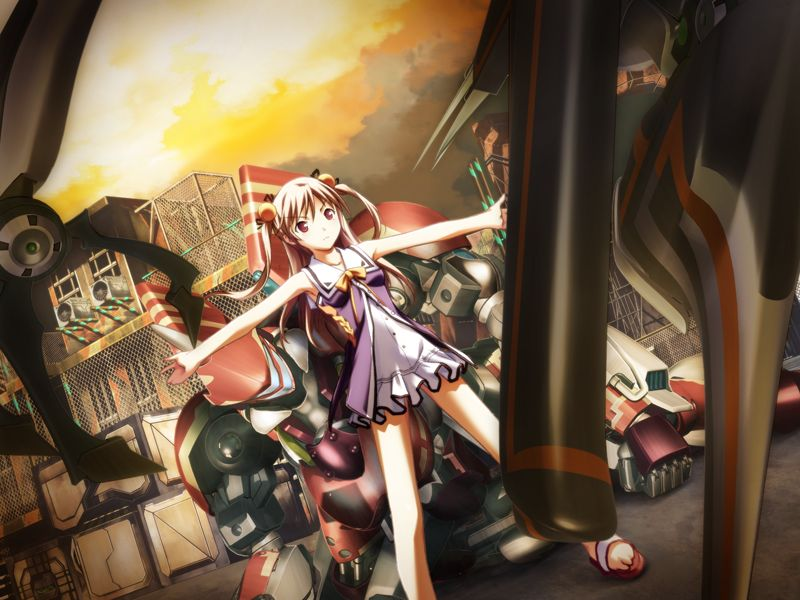

# 学园编第二章 战斗用电子体大会 夏

于是，夏天来了。
炎热的夏天。

那个夏天经历的事情，我这辈子都不会忘记。
那个时候，是这样想的。

然而，我错了……

【那一天】-174日

---

## 7月3日

【第一次回溯：蕾线第8章】

甲和雅接受久利原老师的补课。
久利原提到纳米机器因为其风险而被严格的管制，但甲满心都在想第二天的战斗用电子体新人对战大赛。

## 7月4日

【第一次回溯：千夏线第6章】

甲与千夏一同在甲的房间潜入参加新人战斗用电子体大赛，菜叶与空前来为甲、千夏、雅助阵。
空说真因为电脑症诊疗不能前来，并在远处和一位矮小的女性熟人说了一些私话。
对战前，久利原老师也来为三人鼓劲。

【第一次回溯：蕾线第6章】

反AI派的吉鲁贝鲁特加入了战斗用电子体预选赛，使用违规手段将甲的队伍逼到绝境。
赶来解围的久利原老师将斩机刀赠与甲，甲战胜了吉鲁贝鲁特。

【第一次回溯：蕾线第8章】

新人战大赛中一架单人组队作战的白色战斗用电子体救下了被吉鲁贝鲁特部下袭击的雅，在甲询问姓名时展开光体翼后登出了。

【第一次回溯：蕾线第7章】

战斗用电子体三人组向久利原老师表示感谢。
在其他人离开后，千夏亲吻甲的脸颊，感谢甲对自己的保护。

【第一次回溯：无】

想来慰问甲的空和菜叶恰好看到了甲被吻的一幕。

## 7月13日

【第一次回溯：蕾线第9章】

甲在圣堂发现穿着其他学校校服的金发美貌女子祈祷。

偶遇的空坦白自己打算向玛萨倾诉自己在为真的宿舍遭遇而烦恼。
甲邀请姐妹两人入住如月寮。

【第一次回溯：蕾线第9章】

水无月姐妹入住如月寮。
一阵喧闹后甲为了散心去找呼，发现呼今天意外的开心。
准备吻呼的甲被闯入的空撞个正着，空将甲误会成了变态。

## 7月16日

【第一次回溯：蕾线第10章】

在圣堂里空误以为甲因为暗恋自己制作了呼，两人拌起嘴来。

空离开后，来和玛萨交谈的久利原老师推荐甲也去和玛萨谈谈。

玛萨说自己也在学习人类中个体间的交流行为。

【第一次回溯：蕾线第9章】

甲在圣堂中遇到了之前祈祷的金发美女，但对方似乎对自己很畏怯的离开了。
冲入圣堂的真说姐姐被卷入争执，赶到时发现空已经解决了问题。
甲与空虽然又一言不合拌起嘴来，但还是因为真的缘故重归于好。

## 7月27日

【第一次回溯：无】

空、真正式搬入如月寮，千夏听闻也急忙搬入。
当晚召开了三人的欢迎会。
帮不上大家忙的空做出了猎奇的料理，甲强行忍住独自吃掉了整份料理。
晚上空来到甲的房间表示感谢，并说自己一定会帮助纠正甲溺爱NPC的行为。

## 8月1日

【第一次回溯：菜叶线第5章】

菜叶包办了宿舍的全部家务。

【第一次回溯：无】

空对甲沉迷战斗用电子体表示不解。
菜叶为维护甲的正义的伙伴的理想有些较真，但空马上表示了理解。

【第一次回溯：蕾线第10章】

战斗用电子体新人大赛正式赛第一回战胜利后，甲等三人组遇到了一位向甲吼“请与我互刺(交往)吧”的谜一样的女性战斗用电子体驾驶员。

【第一次回溯：无】

夜晚，甲来到虚拟草原。
呼并没有出现，甲与真单独聊天。
因疲劳睡着的真隐约泄露出“喜欢谁”的心声。

## 8月2日

甲去补习授课时在鞋柜中发现了温热的女式内裤，但马上被赶来的空回收了。

回到宿舍的甲找真聊天，发现真和突然闯入的空都在看恋爱方面的书籍。

受到真的邀请，甲陪同空一起送真去清城市的医院检查。
路上空感谢甲对真的照顾。

## 8月5日

空对翘掉学园课程的亚季进行说教。
亚季觉得自己将来会流落街头，空拿亚季制作的NPC说服亚季，但亚季说那只是因为寂寞才做出来的和自己一样寂寞的存在。
趁在真在网络中说服亚季的时候，甲劝空不要探究亚季过去的事，放心不下的空答应不去追问亚季进入学园前的事情。

## 8月6日

【第一次回溯：千夏线第7章】

散步时逃走的呼也来到虚拟竞技场为参赛的甲加油，引发了将千夏和雅都卷入的小骚动。

## 8月9日

【第一次回溯：无】

亚季姐被硬拉着随大家一起上学。
聊天中甲说起自己读过的书时随口报上了上次看到真在读的书的名字，结果被大家发现是描写虐待狂的书籍，场面十分尴尬。

在教室向千夏聊起真的电脑症，被千夏鼓励照顾好真。

【第一次回溯：千夏线第8章】

甲等三人对新人战的轻松战况感到不满足，遇到了邀请三人参加无限制对战的设赌人。

【第一次回溯：无】

赶来的直树赞许了三人不被诱惑的冷静，并与三人进行对战练习。
练习结束后亚季来叫三人吃饭，与直树相遇时看起来神态羞涩紧张。

夜晚，甲在虚拟草原与真相会。
因为早上的事情感到尴尬的甲想要提前离开，却被真拉住。
甲安抚了担心被讨厌的真。

空来找登出的甲谈话。
空虽然和妹妹关系很好，但也因为害怕互相伤害，在网络中从没有像甲和真这样自如地交谈。
聊起电脑症的甲因为想起母亲而悲伤，忍不住在空的怀中哭泣。

互相安慰鼓励的两人挥手道别，空突然说甲最近会遇到好事，让甲好好期待。

## 8月12日

【第一次回溯：蕾线第11章】

甲在鞋柜里收到了一盒便当，一旁的空行迹十分诡异。
甲打开便当盒，盒中的东西外观不堪入目，但却意外能入口。
甲尝出经过了真的加工。

【第一次回溯：千夏线第8章】

甲与如月寮众人在补习，听玛萨介绍关于AI的发展史。

【第一次回溯：无】

补习结束后千夏与空例行在路上吵闹，甲在此时却感受到人影的气息。
甲看到树下的身影，想起自己失去母亲哭泣时见到过这个沉默地注视着自己的人。
但这位和空相似的女性的身影转瞬即逝，甲以为是自己的错觉。

【第一次回溯：千夏线第9章】

空向补习结束的如月寮众人提起自己调查到亚季一年级时因拒绝到校而留级。
那时亚季曾在程序员大赛的演示中导致巴德尔系统错误，甚至使得米特斯拜亚城市机能停止。
与此同期的如月寮的学生们也全部被清退了。
空还调查到一位事件前就离开宿舍的战斗用电子体高手在无名都市十分有名。

## 8月19日

【第一次回溯：千夏线第10章】

甲、千夏、雅前往无限制空间——无名都市寻找亚季的前辈【教授】。
众人没有找到教授，却遭遇了再次出逃的呼。
千夏和雅将呼误会为空，骚乱后将甲和呼留下分头寻找教授。
甲与呼发现了盯上千夏的吉鲁贝鲁特……

甲与呼找到了被吉鲁贝鲁特袭击的千夏与雅。

在吉鲁贝鲁特准备虐待千夏时，呼挺身而出挡在千夏面前。
吉鲁贝鲁特意图杀死呼，为保护呼飞身扑出的千夏被贯穿双脚。

甲独自将吉鲁贝鲁特的手下打倒，吉鲁贝鲁特将千夏作为人质。
正在危难之时，【教授】——久利原老师出现并将千夏救下，吉鲁贝鲁特仓皇登出。
获救后的千夏抱着甲放声痛哭。

## 8月23日

【第一次回溯：千夏线第11章】

亚季发现甲等人去无名都市是为了调查自己的事情，并让甲相信久利原老师。

空在照顾千夏与雅。甲发现空梦见了呼在无名都市的体验。

## 8月24日

【第一次回溯：千夏线第6章】

甲与千夏在学园旁遍地废弃军用器材的草原上组装摩托车。千夏承认自己家境不佳。
两人手不小心触碰到了一起，千夏……开心地将满脸通红的甲掀倒在地。

【第一次回溯：无】

甲、雅、千夏讨论第二天比赛，谈到单人组队取得下次比赛资格的白色战斗用电子体。

## 8月25日

正式赛后千夏和雅的脚状况勉强，在甲的劝说下三人宣告退出大会。
而白色机体成功晋级。
观战的设赌人若有所指地说甲是在无限制器的战斗中会更强的类型，但甲拒绝了其诱惑。

晚上，沮丧的甲来到虚拟草原，在呼的身边安然入眠。

---

[秋季篇](autumn.md)