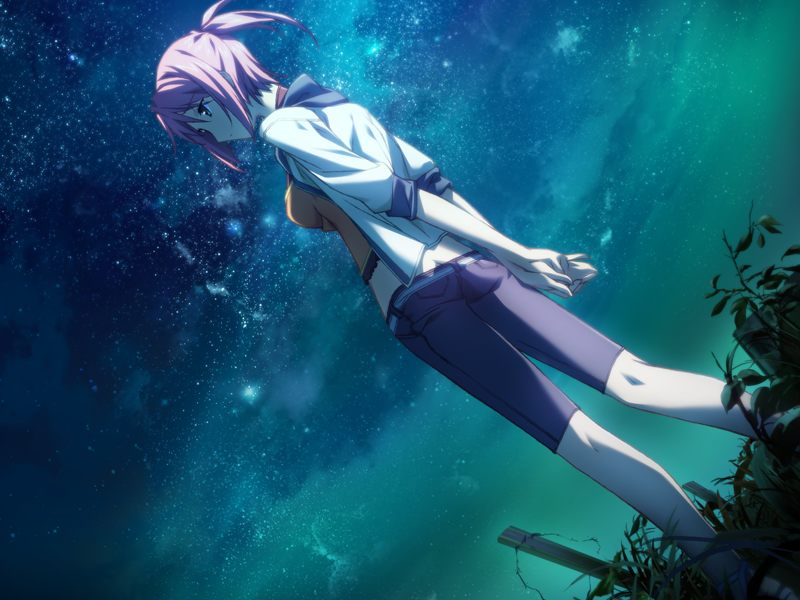
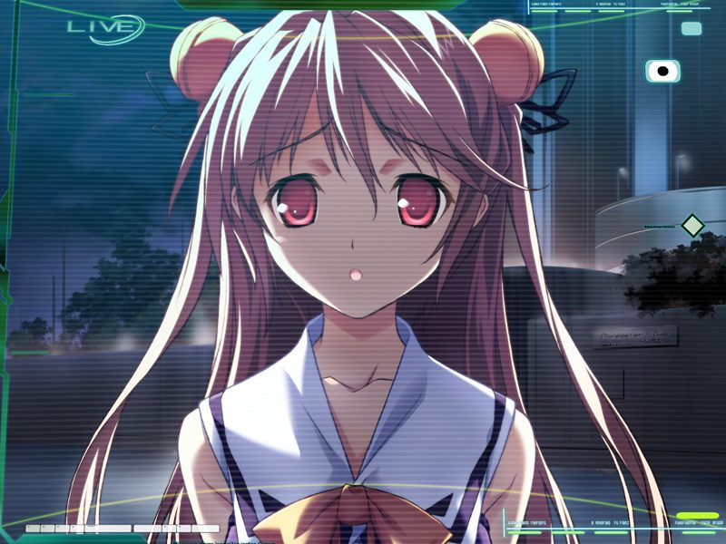

# 学园编第四章 开始的终结 冬

## 12月1日

【第一次回溯：无】

空承受着共振现象的负担，但还是反对将呼冻结。
甲紧拥着心灵要变得不是自己的一般坏掉的空。
空在甲的拥抱下逐渐冷静下来，但甲反而仿佛被共振现象影响一般精神崩坏。
两人相拥而泣，直到真救助前反复体验着共振。

【那一天】-20日

## 12月4日

【第一次回溯：无】

因为甲也原因不明地被共振影响，方舟决定对呼执行冻结。

空忍不住来找甲，两人了解到彼此之前的争吵并非厌恶之情。
空向甲告白，两人无法抗拒地相拥接吻，却被千夏看到。
愤怒而绝望的千夏留下“如果更喜欢我的话就到学校旁的空地来”的话语便跑开了。
甲不知如何是好，脑内逐渐嘈杂的噪音却使得自己无法放开空。

亚季唤醒了甲，空已经失去了意识。

甲被亚季叫到虚拟的草原。
呼说大家变得喜欢甲就好了。
甲感觉到作为AI的终端、通过甲学习恋爱情感进而理解人类的呼仿佛异知性体(Alien)一样。
但意识到空会因此遭遇危险的呼自愿提出今晚被亚季冻结。
为了不给空增加多余的刺激，呼最终没能在冻结前与甲做最后的拥抱。

【那一天】-12日

## 12月12日

【第一次回溯：无】

自呼冻结后甲一直没机会与空正常的交谈。

千夏将甲叫到曾属于两人的地方，胖揍了甲一拳后坦然原谅了甲，但声称自己还未死心。

甲回到如月寮，向等待在起居室内的空告白。
藏起来的众人出来祝福成为情侣的两人。

两人单独散步。空得知甲已经和千夏谈过，说自己也有必须要好好说清楚的朋友，决定暂时保留对甲的告白的最后的答复。
觉得还有的是时间的甲觉得不用那么着急加深关系也可以。

## 12月18日

【第一次回溯：游戏第1章开头】

甲被清晨的阳光唤醒，听到空的呼声，任性地等待着空将自己摇醒一同上学。

【第一次回溯：无】

放学后，甲与空来到藏浜为大家买圣诞礼物。
空看起来很喜欢一串吊坠。

【第一次回溯：蕾线第12章】

空和甲一起在街上买圣诞礼物。空为了说服一个外校好友的父亲允许她转入星修在烦恼。

【第一次回溯：无】

最终空自顾自地买了探索号宇宙飞船模型。

## 12月19日

【第一次回溯：蕾线第12章】

甲在整理宿舍时发现很久以前收到的便当饭盒底部有一封约见的信。
甲按信指示来到学园后院，撞到了以前多次见到的金发少女。
在向被撞坏礼物的少女赔罪时，甲得知了少女的姓名，桐岛蕾。

圣堂前甲和蕾谈起喜欢的人的话题。
甲为喜欢的人准备了礼物，却因为觉得不合适而懊恼。
最终，甲和蕾交换了礼物，并约好来年向蕾介绍如月寮的同伴。

甲在圣堂告别了蕾后撞到了空。
空将蕾送给甲的礼物误认为是甲为自己准备的礼物，感到非常的开心。

## 12月21日

【第一次回溯：无】

如月寮的众人交换彼此圣诞节前夜活动的安排。
清楚甲在圣诞夜的打算的千夏还是将圣诞节派对入场卷交给了甲。

甲约空在圣诞节约会，空说自己白天有事必须要出门，邀约甲傍晚一起度过。

> 空：【毕竟是开始交往之后的第一个平安夜嘛，我也想和甲……一起过……什么的】

## 12月24日

【第一次回溯：菜叶线第13章】

圣诞夜前，空说自己为了帮助一个朋友一定要去研究所，还悄悄说也是因为老师拜托了要准备一个惊喜派对的缘故。
老师在空和菜叶离开后联系了甲和千夏，感觉有些古怪的老师说今晚会成为美好的夜晚。

【第一次回溯：蕾线第12章】

平安夜，甲接到了空的通话请求。
可视电话中空说自己因为买错票还在研究所前，甲回复说自己会去接她。

突然，空的那边响起了警报声，甲视野中的空开始扭曲变形。
以为设备故障的甲最后听到的是空的呼救声……

---

原本是【空】的存在像被强风吹袭一样分崩离析，化作粉末飞散开来。

……头脑快要变得疯狂起来。
不，肯定有哪处已经变得不正常了。

随后，任何会活动的东西都消失了。

被留下的，只有毫发无损但生物已经死绝了的街道。

下一瞬间，这幅光景就被耸立的光之柱粉碎了。

从天上倾注而下的光之雨覆盖了这所有的一切。

消失掉。全部，都在这光芒中消失掉。

所有的，一切……

【离编译者流出、对地射击卫星群炮击还有-零日】

---

[个人感受](comment.md)

[返回](../start.md)