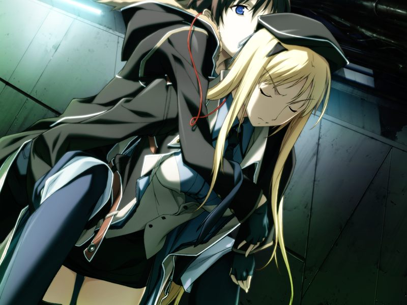

# 第13章 圣诞节(Xmas)

诺依看到登出后的两人纠缠在一起，识趣地离开了。
两人翻云覆雨，直到诺依冲进诊室抱怨才中止。

【记忆】

> 灰色圣诞节，已见证过对地射击卫星群的冲击的甲来到圣堂，思念着空的甲听到了一位生存者少女的哭声……

甲被父亲门仓永二唤醒。永二劝甲不要再踏上战场，声称毕竟自己不愿与儿子为敌。

在诊所外，蕾和诺依谈论之前多米尼恩构造体上空出现的奇点的事情。
诺依提到第一次观测到奇点的时间正是灰色圣诞节。

【记忆溯行】

> 甲背着空在地狱般的荒野中依靠空的共享视觉前行。

蕾与甲庆祝圣诞节。
蕾询问甲是否记得自己初体验的事情，对甲已经忘记似乎有些松气。
正当两人想要拥抱时，圣良发来通信道别，告知方舟即将撤离清都市。
从圣良发来的机密数据，两人得知已成为多米尼恩统帅的吉鲁贝鲁特使用编译者威胁夺取清城市。
甲决定阻止编译者流出。自愿协助的蕾与甲彻夜讨论作战内容。

临走时，诺依拜托蕾帮忙修理自己的助手机器人伊姆。
甲趁蕾帮忙时查看了菜叶和千夏的信息，两人分别与甲道别。

甲与蕾侵入一座地下军事设施并就地潜入。
甲让设施用于供电的核反应堆失控，但逃离时入侵的GOAT触发了警报。
蕾被鲜红色机体的敌人打倒并剥夺了视觉。机体看到甲后逃跑。
多米尼恩因为警报发现并干涉核反应堆的侵蚀，蕾建议转而对编译者的搬运人潜脑攻击。

为蕾入侵防火墙争取时间的甲发现银白色的光体翼机体正与鲜红色的机体缠斗。

蕾入侵完成后，甲潜入搬运者脑内，毫无阻碍地打破绿色的障蔽冲入核心。
守护着核心的正是吉鲁贝鲁特，吉鲁贝鲁特疯狂的言语如同死去的神父一般。
甲将吉鲁贝鲁特击倒，搬运者核心中传来少女的疯狂哭喊声。
早就考虑过牺牲无辜的可能的甲亲手击碎了核心。

甲随即脱离，发现吉鲁贝鲁特的尸体消失了，离开潜脑的甲发现身体被应该已死的神父切割。
无法移动的甲等待爆炸来临，却发现奇点再次降临，爆炸亦被暂停。

匍匐前行的甲遇到了既不是空也不是呼却和两人一模一样的少女。
少女颈上挂着甲送给空的吊坠，吊坠中水晶球中骰子显示着数字1.

【GE/NE分歧点（[Normal End](ne.md)）】

自称代理人(Agent)的少女，要甲认清空已逝去的现实后行动……

甲梦见自己被母亲背负前行。醒来发现自己正被蕾背着，失去视觉的蕾共享甲的视觉前行。

甲想起灰色圣诞节自己背着“那家伙”前行，蕾终于承认那时被甲背负的并不是空，而是……

【记忆溯行】

> 灰色圣诞节，甲在圣堂中遇到蕾。逝去挚友和女友的两人共享悲伤。甲将蕾带出圣堂……

【记忆溯行】

> 废墟中的两人救了一个被抢走行李的被造子男人。为了救被围攻的甲蕾第一次杀了人。
> 头部受重伤的甲双眼失明，借用蕾的感觉信息的甲将蕾误以为是空。
> 担心甲崩溃，想和甲一同活下去的蕾决定……

多米尼恩基地被爆破后清城市陷入内战，两人已被统合军和CDF追捕。
想到未来不可预期，两人在旅馆中相拥。甲想起自己的初体验……

【记忆溯行】

> 在废墟中绝望的甲与被甲误认为是空的蕾相拥……

视力尚未恢复的蕾与无法移动的甲笨拙地爱抚着对方……

终于，楼下传来门被踢破的声音，不想分离的两人相拥着等待追兵的到来……

---

[下一章(GE)](chapter14.md)