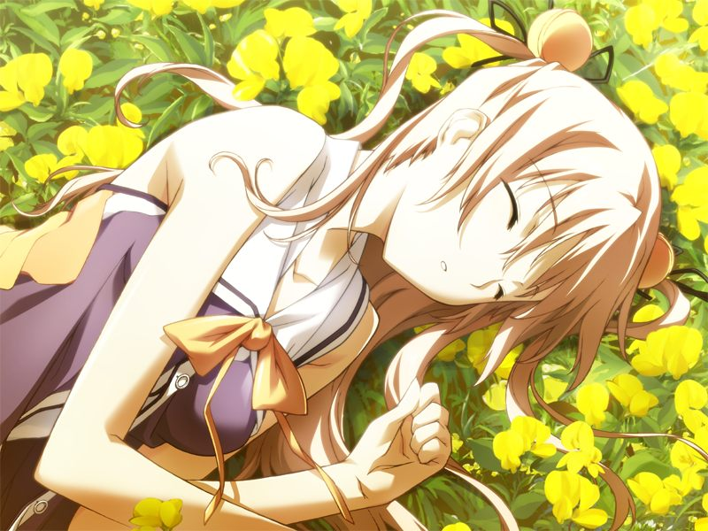

(接第4章)

下定决心后，甲看到列车外一架军用运输机正在摆脱地对空导弹向清城市飞去。

# 第5章 NPC(Non Player Character)

甲和蕾途径清都市的黑市，前往聚集着清城市两成人口和超过七成财富的自给自足型环境建筑都市【米特斯拜亚】。
途中两人遇到信奉AI为神明的狂信教团【多米尼恩】的教主格雷戈里神父在公屏演说。
蕾解释因为有自治州政府官员的默许，统合军还无法对多米尼恩进行军事行动。

两人来到处于虚拟空间领域最尖端的方舟工业集团，会见被称作AI魔女的方舟社长圣良。
圣良早已掌握甲的状况，建议两人先前往最尖端的虚拟空间，【方舟虚拟都市】。
在都市入口，欢迎两人的是甲熟悉的身影……

【记忆溯行】

> 甲不好意思询问草原少女的真实心意。
> 尽管如此，甲却感到两人无需言语也能心有灵犀。两人在虚拟空间中安睡。
> 
> 早晨醒来，甲得知真已经被姐姐接走了。
> 亚季单独找甲谈话，听到甲倾诉对一直在虚拟空间中出现的少女的感情，亚季对此感到非常抱歉。
> 原来，那个少女是亚季开发的虚拟人格程序(NPC)。
> 通常的NPC很容易通过固定做作的对话与无感情的表情被识别，而那个NPC少女却是试图学习感情的，并且因为特殊原因无法量产的独一无二的个体。
> 听着睡着的NPC少女发出的轻微呼吸声，甲为她起名为【呼】。
> 
> 

甲误认为在方舟虚拟都市入口迎接的NPC是呼，却发现只是以空为原型制造的量产型NPC.
在NPC带领下，甲来到虚拟的如月寮，终于见到了亚季姐。
甲从亚季口中得知自己和千夏自从灰色圣诞节后就刻意避开了他人的联系，但雅和菜叶都还与亚季保持联络。
甲询问水无月姐妹的状况，亚季回避了回答，称虚拟的如月寮是自己根据已被方舟AI【伊芙】(Eve)接管的玛萨的存储资料重构的。

亚季离开后，甲与蕾在如月寮中就寝。
蕾向甲倾诉自己的烦恼，本应帮助甲取回记忆达成夙愿的蕾现在却觉得，也许让甲就此放弃战斗重新开始更好。

【记忆溯行】

> 与菜叶同年级的真被邀请加入如月寮举办的菜叶入学欢迎会。
> 甲看到一同前来的真的姐姐惊呆了，因为眼前的少女与呼有着一模一样的面庞。

---

[下一章](chapter6.md)