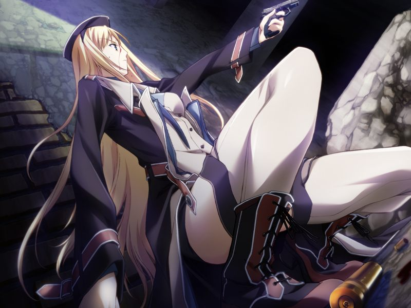

# 第6章 潜脑(Mind Hack)

【记忆溯行】

> 真的姐姐水无月空误会甲是跟踪自己妹妹的跟踪狂，在如月寮前与甲吵闹起来。
> 解除误会后，甲发现空虽然冒失冲动经常四处白忙活，却是个真诚坦率的好女孩。

蕾为甲离开方舟进行反潜脑的训练，以避免他人通过网络对自己大脑进行直接攻击。
训练结束后，蕾汇报之前解析的情报贩子艾迪脑内的情报，发现了有能力对德雷克斯勒机关原据点施加保护的嫌疑人清单。
清单上AI派的阿南市长和与阿南针锋相对的反AI派米内议员均在其列。
确认情报后，甲与蕾返回方舟，在虚拟都市内遇到了收到亚季联络赶来的菜叶。

甲赶到如月寮后，发现亚季已经将自己的房屋复原。
甲在复原的相框中看到了空的立体照片。

为了平复心情，甲与菜叶在宿舍外散心，菜叶似乎也不愿谈论自己的现状。

甲收到了蕾转达的诺依医生的诊疗要求。
两人前往诊所的途中遭遇了米内议员在街头的政治集会。
正当米内声称掌握了阿南市长等人的丑闻时，他却因受潜脑攻击痛苦地倒下。
为避开暴动，甲和蕾躲进了街角，蕾让甲潜入追踪暗杀米内的犯人，自己则保护甲的实体安全。
追捕过程中，蕾似乎遇到了麻烦，而甲发现自己的敌人，正是校园时起的老冤家，破坏了自己和千夏首次约会的吉鲁贝鲁.吉鲁贝鲁特……

【记忆溯行】

> 反AI派的吉鲁贝鲁特加入了战斗用电子体预选赛，使用违规手段将甲的队伍逼到绝境。
> 赶来解围的久利原老师将斩机刀赠与甲，甲战胜了吉鲁贝鲁特。

吉鲁贝鲁特透露出自己把守过使得甲失忆的据点，一如既往地使用杂兵拖延的手段逃脱了。
甲回到现实，发现蕾为了保护自己不被暴徒袭击受伤。

---

[下一章](chapter7.md)