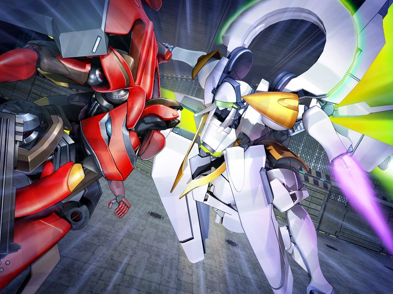

# 第8章 无名都市(Anonymous City)

【记忆溯行】

> 甲和雅接受久利原老师的补课。
> 久利原提到纳米机器因为其风险而被严格的管制，但甲满心都在想第二天的战斗用电子体新人对战大赛。

甲结束了早上的诊疗，诺依医生提供情报说阿南市长在无名都市运营着某个使用盗版NPC进行特殊服务的会员俱乐部。
甲在诺依提供的照片中看到了和呼一模一样的盗版NPC.
根据诺依的情报，甲与蕾在诊所附近的网吧潜入无名都市。

甲与蕾在侵入中为了避开巡逻人员对脑内分泌物质的检查，假装成恋人几乎假戏真做。

正当两人接近营业老板时，有其他的侵入者触发了警报。
追捕中甲发现一些被诱拐监禁的人类女孩。
甲向雅匿名通报情况后继续跟踪并传送到某个构造体内。

被甲捕获的营业老板被迫透露自己的交易伙伴被阿南摆了一道，随后被突袭的多米尼恩士兵灭口。
多米尼恩的巫女出现并劝告甲与蕾离开，但多米尼恩的教主格雷戈里神父邀请两人见面。
神父劝甲从事件中收手，被甲坚决拒绝。
神父透露他们也在追捕阿南市长，并继续追问甲调查事件的真正原因。

> 格雷戈里神父：【所以，我知道你一切的一切。比如说，你……失去了对“空”的记忆这件事我也知道……】

蕾警醒甲不要被善于挖掘他人痛苦过往的神父迷惑，神父转而向蕾提起其母亲的记忆。
接近崩溃的蕾开枪击穿了神父，然而狂气的神父反而感到了喜悦。
正当神父准备进入战斗时，一架鲜红的战斗用电子体冲入室内，神父和巫女在狂信者们的掩护下不见踪影。
随即，一架展开了光体翼的白色战斗用电子体飞身而出攻向深红色的机体。

【记忆溯行】

> 新人战大赛中一架单人组队作战的白色战斗用电子体救下了被吉鲁贝鲁特部下袭击的雅，在甲询问姓名时展开光体翼后登出了。

甲和蕾趁机逃离构造体，却遇到了希泽鲁少佐。希泽鲁提醒甲赶快离开。

两人来到地面时发现GOAT正在对该地区镇压。
甲在登出前遇到一个呼的复制体NPC，但其口吻让甲想起了呼。
正当甲怀疑她是否是空的时候，NPC却转眼不见了。

登出后甲和蕾立刻离开网吧，在途中撞见了依旧对甲十分的冷淡的千夏。

晚上甲与雅在酒馆约见。
甲谈到之前遇到的古怪的NPC，雅却告知那不可能是空。
离开酒馆后，蕾将甲接回了酒店。
甲问起之前神父提到蕾的母亲的事情。
蕾回答自己的母亲曾是多米尼恩信徒，并在自己很小时就去世了。

---

[下一章](chapter9.md)