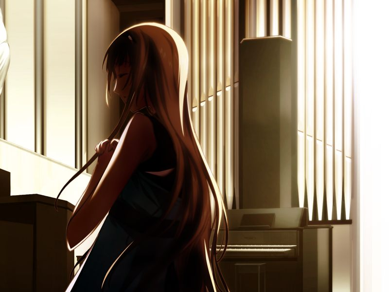

# 第9章 逃走(Escape)

甲看到新闻中阿南宣布要扫除暗杀米内的多米尼恩教团。
诺依告诉甲他的脑内芯片已修复完毕，但是仍然因为心理原因无法记起一些事情。

甲与蕾决定从旅馆搬入方舟。途中蕾怀念地谈及以前与甲一同流浪的军旅生活。尽管如此，蕾却说……

> 蕾：【对中尉而言，如果我变成了阻碍的话任何时候都可以和我解除关系……我和中尉有过这样的约定】

来到方舟的两人发现希泽鲁等人正在入口看守，两人只好回到之前的网吧潜伏。
潜入到如月寮的甲来到了新还原好的房间，甲意识到这正是空原先住过的房间。
得知甲脑内芯片已修复的亚季和菜叶决定庆祝一下……

【记忆溯行】

> 菜叶和真的入学庆祝会因为酒和空的原因被搞的一团糟……

甲睡醒后发现蕾已先行离开。
亚季为了帮助甲找回记忆正在虚拟空间中再现星修学园。
帮助亚季的时候，甲向亚季询问呼是否还存在，亚季断言不可能。
疲惫的两人躺倒在草地上……

【记忆溯行】

> 甲在圣堂发现穿着其他学校校服的金发美貌女子祈祷。
> 
> 
> 
> 偶遇的空坦白自己打算向玛萨倾诉自己在为真的宿舍遭遇而烦恼。
> 甲邀请姐妹两人入住如月寮。

菜叶将甲带到被重现的两人的故乡南八坂，甲只记得两人在这里做过星修再见的约定。

随后千夏用匿名通话约甲来到无名都市，警告甲避开阿南的私人部队，尽快离开即将成为战场的清都市。
千夏问甲是否记得自己欠甲的“那件事”，得知甲已经忘记后便离开了。

千夏离开后甲立刻遭到潜脑攻击。在蕾的帮助下，甲抵挡住了吉鲁贝鲁特的袭击。

【记忆溯行】

> 水无月姐妹入住如月寮。
> 一阵喧闹后甲为了散心去找呼，发现呼今天意外的开心。
> 准备吻呼的甲被闯入的空撞个正着，空将甲误会成了变态。
> 
> 甲在圣堂中遇到了之前祈祷的金发美女，但对方似乎对自己很畏怯的离开了。
> 冲入圣堂的真说姐姐被卷入争执，赶到时发现空已经解决了问题。
> 甲与空虽然又一言不合拌起嘴来，但还是因为真的缘故重归于好。

蕾通过强制登出救下在刚才战斗中耗尽力量濒临脑死的甲，打算逃到诺依诊所的两人收到诊所已被监视的警告。
蕾决定将甲带到自己的故乡米特斯拜亚。

---

[下一章](chapter10.md)