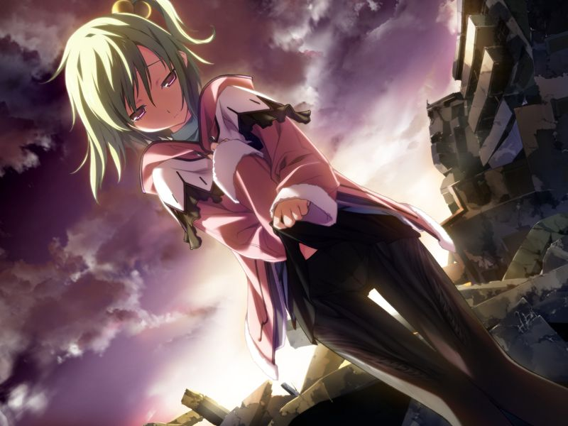

# 第13章 圣地(Promised Land)

甲让菜叶先登上列车，独自前来的蕾劝甲将菜叶交给魔狼救治，被不信任魔狼的甲拒绝。
蕾指出甲此行实际上是送死，甲坦承如此。
蕾对甲进行潜脑，甲一边与蕾对决，一边静静地倾听菜叶诉说着不可能实现的未来。
意识到无法登上列车的甲让菜叶先离开，自己随后赶上。菜叶与甲约定在回忆之地相见。

手下留情的甲没法对蕾尽全力，胜利的蕾劝甲追上菜叶，并拜托甲逃离后联络父亲永二。
蕾强调自己永远是甲的部下，只是不希望甲用赴死的想法前进，随后用电击枪将自己击晕。
甲留下被击晕的蕾登上了下一班列车。

【此战可胜可负，若甲胜利，蕾在被甲击晕前依然会拜托甲联络父亲】

【记忆溯行】

> 如月寮众人看到了菜叶的离家出走的留言。
> 想联络菜叶父母的众人发现菜叶一直是孑然一人。
> 宿舍全员开始寻找菜叶，甲意识到自己应该去的地方是……

已离开清都市的甲联系父亲永二。
甲不信任抛弃母亲的永二，但永二说自己要履行和菜叶的约定……

【记忆】

> 永二在家边却不愿进门。童年的菜叶希望永二为了甲不要再做军人了。
> 断言甲会和自己父辈们一样成为军人的永二拜托菜叶陪在甲身边，并接受了菜叶世界美丽后就不再从军的约定。

永二坦白让妻子死去是人生最大的失败，绝不会让儿子的女人也死去。甲看在蕾的份上相信了父亲。
正在此时列车发生故障，甲登上了魔狼的VTOL.

永二发现AI似乎在帮助菜叶逃走般只瘫痪了局部地域的机能。
甲趁机向父亲确认方舟是否隐瞒了AI暴走的事情，永二说方舟总部现已被GOAT包围，只留下了一次性的隐藏通信频道。

前往星修的希泽鲁并没有发现菜叶，却发现了意识到搬运人身份的GOAT部队。
甲想起菜叶离开前的话，前往与菜叶的约定之地。

甲在荒野中前行，想起和蕾曾在这片荒野上的过去。
甲在蕾的支援下来到南八坂遗迹，发现了独自伫立的菜叶。
菜叶掀起裙子，向甲展示自己的身体已被编译者侵蚀。

诉说着自己已经幸福过的菜叶拜托甲杀死自己。
甲不顾菜叶的阻拦和感染的风险冲上前拥抱并亲吻菜叶。

做好觉悟的甲掏出医生的践行礼物，被永二和蕾制止。
与方舟的隐藏通信频道被接通，圣良声称事态已在她的预料中，接下来将倾尽伊芙全力去改写指挥者。
甲以自己为外界连接菜叶的路由器，接受了叔母的在改写期间挡下GOAT攻击的任务。

甲来到绿色的障蔽构成的中转界，这正是菜叶的大脑。
千夏率领部队潜脑。甲意识到千夏已不可能信任方舟，将千夏击败。
战败的千夏用非人类的脚力向菜叶疾冲，发现自爆装置反应的蕾让甲开枪。
开枪前的一瞬间念起旧情的甲发现千夏倒在血泊中，转身见到了久利原老师的机体。
久利原向众人宣称编译者是无害的，希望停止改写，然而没有人相信他。
正在此时多米尼恩袭来，编译者内的抵抗代码也开始作用，指挥者的改写率持续下降。
久利原拒不提供改写密码，亚季终于说出玛萨保留的数据显示，使得研究者提前逃离的恐怖袭击预告是研究所内部发出的……

【记忆溯行】

> 空说自己为了帮助一个朋友一定要去研究所，还悄悄说也是因为老师拜托了要准备一个惊喜派对的缘故。
> 老师在空和菜叶离开后联系了甲和千夏，感觉有些古怪的老师说今晚会成为美好的夜晚。

编译者的修复速率实在太快。正当甲要绝望时，改写率突然开始增长。
原来突然出现的奇点带来了爆发性增长的处理能力。

代理人出现在久利原面前，解释编译者复制时必然会产生适应去异常机能的变异体，并指出事故的原因正是久利原本人。
疯狂的久利原承认自己预知即使致死的变异种出现环境也会净化。
不仅如此，杀死菜叶父母的也正是疯狂了的久利原。

【结局分歧条件：是否击败久利原老师】
【若战斗失败，进入[BE](be.md)】

甲将完全陷入狂气的久利原击倒。

---

[下一章](chapter14.md)