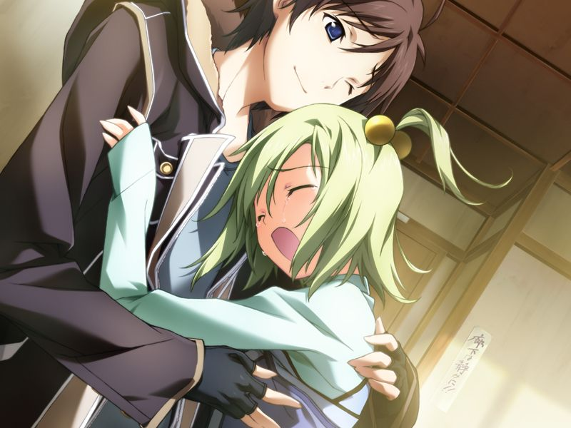

(接第4章)

甲联系亚季后，看到列车外一架军用运输机正在摆脱地对空导弹向清城市飞去。

# 第5章 追忆(Reminiscence)

甲和蕾前往米特斯拜亚。
途中两人遇到格雷戈里神父在公屏演说。

两人来到方舟，圣良建议两人前往方舟虚拟都市。
在都市入口，甲认出欢迎两人的是以空为原型的NPC.
亚季也来到入口迎接甲。
甲和亚季来到如月寮，宿舍中飘出韭菜的香味。
听到开门声赶来的菜叶哭泣着与甲相拥。

起居室里甲与菜叶独处，两人对彼此现在的状况都讳莫如深。
看到泣不成声的菜叶，甲理解到空已经死去的事实。
甲安慰着菜叶，不禁想起菜叶刚住进宿舍的时候的事情……

【记忆溯行】

> 在与菜叶通话时，泳装的千夏出来捣乱，吃醋赶来的菜叶见状跑出了宿舍……

亚季还原出甲的宿舍，甲在其中发现了空的立体照片。
亚季已经发现甲是佣兵，但认为甲还是拥有以前的温柔。
随后甲在榻榻米上睡着了……

【记忆溯行】

> 菜叶包办了宿舍的全部家务。

甲和记忆中一样被菜叶叫醒。
前来的蕾通知甲米内议员要召开政治集会。

甲与蕾在集会上目睹米内议员在试图揭开阿南丑闻时被潜脑身亡。
为避开暴动，甲和蕾躲进了街角，蕾让甲潜入追踪暗杀米内的犯人，自己则保护甲的实体安全。
甲没能抓住吉鲁贝鲁特，登出发现蕾安然无恙。

两人逃离时被人流冲散，约定在诊所门口会合。
途中甲遇到冷淡的千夏，两人在诊所前分开，甲在千夏离去前与千夏交换了联络地址。

---

[下一章](chapter6.md)