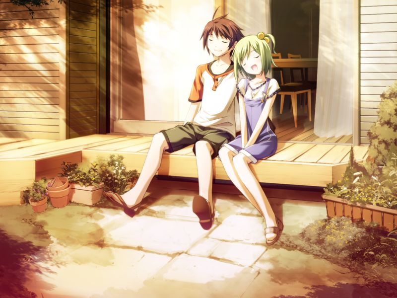
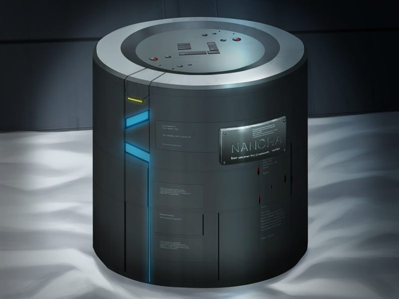

# Normal End

若甲在吉鲁贝鲁特闯入诊所时潜脑时间不够及时，最后打倒老师后编译者自爆，绝望登出的两人发现诺依的机器人。

诺依打算将两人封入密封舱以避开指挥者的通信，尽管有点“问题”。菜叶接受了医生所说的“问题”……

# 第14章 梦境(Dreamland)

甲回到南八坂，菜叶祝甲生日快乐。两人幸福地偎依在夕阳下……

甲被蕾用直接通话唤回登出。
现实中甲已继承亡父的魔狼队长职务，再次只身带领蕾卷入世界战争中。

在那天，菜叶以失去脑髓以外的一切为代价得以生还。
为了维持容纳菜叶脑髓的合金容器，甲一直在逐渐坏死的世界中进行着战斗……

---

[DE](de.md)

[BE](be.md)

[个人感受](comment.md)

[返回](../start.md)