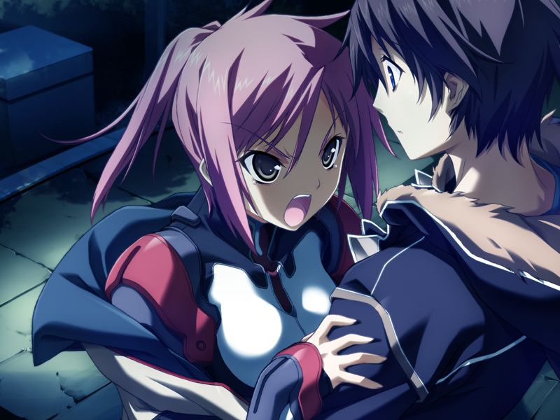

# 第11章 俘虏(POW)

【记忆溯行】

> 亚季发现甲等人去无名都市是为了调查自己的事情，并让甲相信久利原老师。
> 
> 空在照顾千夏与雅。甲发现空梦见了呼在无名都市的体验。
> 
> 甲和千夏在草原修理摩托车。甲意识到千夏在强装欢颜。
> 正在两人交谈时，一位严厉的统合军人训诫两人这片军方土地禁止一般人进入……

甲被CDF审讯，刑警通知甲被引渡给GOAT.
GOAT指挥官桐岛勳亲自接见甲，并以千夏的监护人身份向多次营救自己重要部下的甲致谢。
甲想起自己学生时代曾与勳见过面……

【记忆溯行】

> 来训诫两人的军人反而帮助两人修起摩托来……

勳向甲确认甲和自己女儿蕾的关系。
正在这时蕾冲入审讯室，父女二人关系冷淡，随后蕾被刑警带走。
勳为甲在灰色圣诞节救下蕾表示感谢，并承诺只要甲配合便不会加害他。

【记忆溯行】

> 甲寻找千夏时听到足球部的部员议论千夏今天也没有参加社团活动。
> 一身便装出现的千夏将甲拉到修理摩托的草原。
> 千夏为感谢甲之前的出手相助向甲吻去，恰好被路过的空遇到……

替换了义体的千夏来会见甲，并说明自己还在适应新的身体。

【记忆溯行】

> 空来找两人是打算商量怎样为临近入学考试的菜叶鼓劲，同行的还有久利原和真。
> 正当久利原建议邀请众人到研究所参观时，勳也来到这片空地。
> 勳与久利原互相敌视，久利原借故与真离开。
> 本对甲和千夏亲切的勳因为得知两人是久利原的学生而对两人冷眼相对。
> 看不下去的空正面和勳争吵起来……
> 
> 甲与千夏被迫回避，回来时发现勳正和空一脸和气地探讨和女儿说不上话的烦恼……

甲第二次被勳接见。勳劝甲脱离魔狼加入GOAT，并让甲在假释期间仔细考虑。
甲在米特斯拜亚遇到同样被假释的蕾。
蕾将甲带到自家别墅，千夏也接到了与两人一同居住并监视的命令。
星修出身的反AI派的千夏与凤翔出身的AI派的蕾一有机会便互相冷嘲热讽起来。

晚上千夏离开别墅散步。追上的甲与千夏说起自己和蕾在灰色圣诞节发生的事情，并向千夏询问她在那天发生的事情。
千夏在那个圣诞节参加了学园晚会，亲眼目睹了地狱般的惨状，并在想起自己身上发生的事情的时候失去了理智……

> 千夏：【我很高兴，你是在安慰我吧？】
> 
> 千夏：【可是，就算被紧紧抱着，也只会传来模糊的感触。你的味道也好，体温也好，都没法好好感受到……】
> 
> 千夏：【……你看……连流泪都做不到哦……？明明胸口疼的好像要撕裂一般……】

在那天被勳救下的千夏感谢勳给予的生存下去的大义和可以战斗的身体，并自此将自己视为了机械。

【记忆溯行】

> 千夏被从球队正式队员中除名。

【记忆溯行】

> 甲和空在空地遇到千夏和向千夏道歉的勳。
> 空说千夏从小踢球，只是和改变基因的被造子相比不再突出。
> 
> 甲与千夏独处，给千夏递上自己本打算作为生日礼物送出的足球鞋。
> 千夏与甲相吻。

甲与雅在已处于GOAT支配的CDF总部会面。
勳力排众议让假释中的甲也联网参加模拟战斗训练。
战斗结束后，勳再次请求甲成为自己的部下。
甲确实感受到了勳意图改变腐朽的世界的决心。

模拟战结束后甲和千夏与蕾前往酒馆。
喝醉的两人用下流话吵起架来，还和恶劣的士兵大打出手。
三人大闹一场后来到米特斯拜亚上层观赏夜景。
蕾疲惫地睡着后，千夏向甲倾诉自己对甲的爱意，并对自己的人造身体无法产生应有的感觉赶到难过。
甲和千夏接吻。

【记忆溯行】

> 千夏在电话中和亲人争论。
> 空不安地说【千夏看来并没有重新振作】

早上，甲与千夏和蕾突然发觉米特斯拜亚与外界的网络封锁被突破。
三人来到CDF总部，得知多米尼恩正在攻击米特斯拜亚。
神父发表袭击宣言，蕾建议甲趁乱脱离。
正在这时勳请求敌对立场的甲协助防守闸门，以避免难民成为牺牲品。
甲接受了勳的请求，携蕾一同协助雅抵挡多米尼恩的攻击。

对战中蕾发现了魔狼的气息，甲与蕾与魔狼会合。
永二声称特意赶来前线是来确认管理米特斯拜亚的机械论AI巴德尔系统的状况的。
众人在巴德尔系统下方发现了与之连接的GOAT巨大兵器。

正在此时甲收到千夏的联络，甲独自留下与千夏和雅会合。
听说雅的同僚陷入危机，三人前去搜寻，发现雅的同僚被残忍杀害。
众人一路追寻到格雷戈里神父，但在多米尼恩的巫女的保护下被他带着阿南逃走。
三人追寻到多米尼恩构造体，发现里面充满了如同丧尸一般徘徊的电子体。
千夏认为可能和方舟计划有关，即所谓“电子体幽灵”。

三人在构造体中被大量敌人分离。
神父使用大量空的NPC作为给予甲的“奖励”，久经沙场的甲扫射突围。
而另一边，千夏和雅已被捕获并被空的NPC们凌辱。
在寻找两人的途中，多米尼恩的巫女向甲提供协助。
赶到的甲发现多米尼恩摧毁了雅的精神。
雅和多米尼恩的巫女一样，相信了多米尼恩的“这里是模仿真实世界进行模拟实验的世界”的教义。
彻底陷入疯狂的雅袭击了赶来救援甲的希泽鲁，却被反击丧命。

代理人出现在为失去雅而悲痛的甲面前。
甲感到抱着安慰自己的少女越来越像呼。

【记忆溯行】

> 甲和千夏的关系变得越来越亲密，千夏说【有件事想告诉你】。

代理人在确认甲因为“至少千夏还活着”而情绪稳定下来后离开。
甲与千夏登出，等候两人的蕾告知魔狼已确保逃离米特斯拜亚的路线。
正当甲要离开时，听到了虚弱的千夏的呼唤。
甲最终决定为千夏留下，蕾确认了甲叛离魔狼的决议后离开。

---

[下一章](chapter12.md)