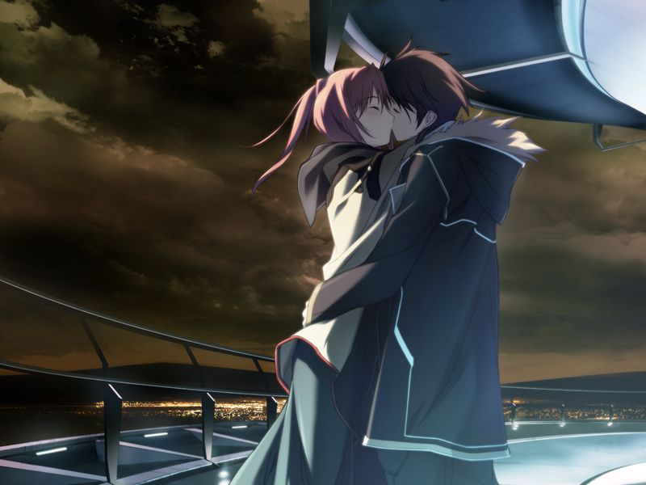

# 第12章 假日(holiday)

抵挡完多米尼恩的袭击后，勳会见甲。
甲坦白承认自己只是因为私人的原因留下。
勳向甲说明清剿多米尼恩也不能根本解决编译者的隐患。
而作为最终手段，统合军会使用可以抑制AI本身的【杀手锏】。

甲为没有救回雅而愧疚。
提前下床的千夏和甲相互安慰，并提到自己将会调换职位。

甲借住在蕾家，与千夏一同在餐厅吃晚饭。
两人想起学园时代的约会，但甲仍然想不起曾与千夏的“约定”。
在千夏邀请下，两人约好第二天约会。

【记忆溯行】

> 甲和千夏的某次约会的开头。

约会当天中午，甲被千夏叫醒。
千夏为甲做饭，甲发现千夏的感觉障碍比料想的还严重。

甲和千夏在米特斯拜亚内散步，甲逐渐回忆起自己和千夏在学生时代的某次约会经历。

两人在约会最后来到米特斯拜亚上层，聊起在星修的回忆。
甲想起学园时代那次约会最后……

【记忆溯行】

> 两人来到虚拟的海边。
> 千夏说自己要结束学园生活了，看到甲真心为自己担心时却又说自己是在骗甲玩。
> 不甘心被戏弄的甲追上了嬉闹的千夏……
> 
> 

看到记忆溯行的甲，千夏说自己在和甲相会后也有相似的体验。

甲向千夏承认自己是因为在意千夏而留下的。
两人紧紧相拥在一起……

【记忆溯行】

> 千夏在虚拟的海边吻甲。

千夏：【明明像这样近在身旁……明明在相互亲吻……！可恶……这个破烂身体……！真的……一点办法也没有……！】

两人迫不及待地赶回家。
为了让感觉迟钝的千夏安心，两人共享了触觉。
千夏感到了活着的实感。

两人一同高潮后，甲希望千夏能够替换义体。
千夏说自己的义体已是本该与生身别无二致的最高级品，问题在于自己的大脑不知为何不能正确地理解感觉本身。
千夏说自己绝不会忘记今天的事情，并透露自己将参与对多米尼恩的总攻。
两人用拥吻作为凯旋归来的誓约。

---

[下一章](chapter13.md)