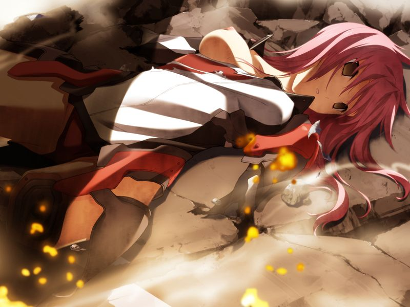

# 第13章 离别(separation)

【记忆溯行】

> 千夏说自己的脚已经到了极限，而丧失特长生的资格后家庭将无力维持自己在星修的学费。
> 甲想要帮助不得不离开星修学园的千夏。

起床时千夏已经先甲一步离开了。
甲来到总部，勳向甲说明对多米尼恩的地下据点的作战计划，并和甲谈起千夏的义体。

甲在离开总部时收到了代理人的直接通话，并相约在虚拟空间见面。
代理人像预言一般宣告地下军事设施的核反应堆正被病毒侵袭，未发现的GOAT将在30分钟后因核爆炸全灭。
甲询问代理人为何帮助自己，代理人百般苦恼后微笑地声称是【个人的兴趣】。

为了击倒侵蚀核反应堆的病毒，甲赶往地下军事设施构造体。
构造体中多方混战，甲在打倒敌人后和希泽鲁遭遇，却发现对核反应堆动手脚的正是魔狼。
少佐命令甲撤退，拒绝服从的甲对自己为了女人背叛部队和亲人的企业的事实无法辩解。
就在冲突一触即发时，甲收到了久利原直树的直接通信。
久利原请求对德雷克斯勒机关的研究者进行救助，而魔狼也有抓捕优先研究者的任务。
甲提议由自己阻止起爆来为魔狼争取抓捕时间。
希泽鲁劝甲在战争后带着女友引退后带领魔狼离开。

甲在战斗后找到了千夏，却发现GOAT也带来了战术核弹。
甲说服千夏放弃了与编译者同归于尽的想法。
与多米尼恩的巫女缠斗的千夏拜托甲一并阻止GOAT的起爆装置。

孤立无援的甲尝试向自称中立的观测者的代理人请求协助。
甲从代理人处获取到多米尼恩和久利原已撤退的影像，并向全设施广播多米尼恩意图让魔狼与GOAT自相残杀的阴谋。

在随后赶来的千夏的协助下，甲阻止了起爆。
此时奇点出现。
千夏向甲告知统合军关于奇点的机密情报，
即灰色圣诞节当天由于AI暴走导致对地射击卫星群系统异常，而那时也出现了奇点。

代理人再次出现，声称千夏所说的“AI暴走”是和现在一样必要的措施。
代理人颈上挂着甲送给空的吊坠，吊坠中的水晶球中的骰子显示着数字3.
代理人承认自己是【空的模仿体】，但仍然不知道自己存在的理由。

千夏登出后多米尼恩的神父用广播向甲宣称多米尼恩也引爆了自爆装置。
随着奇点消失，被延迟的爆炸将地下旧军设施毁灭。
甲从米特斯拜亚赶往清城市工业区，从暴徒手中救下了遍体鳞伤无法行动的千夏。

千夏更换了最后一份库存义体。
勳没有对甲的擅自行动做出任何处分，并邀甲随后来长官室谈话。

甲来到长官室看到勳从噩梦中惊醒。
以空曾送给勳的宇宙船模型为契机，勳向甲谈起灰色圣诞节前和空与编译者的过往。
千夏随后也来到长官室。
勳向视为子女的两人说明对地射击卫星群已经瞄准清城市，但甲与千夏决定留下。

离开长官室后，千夏向甲诉说勳对自己的恩情，并和甲畅想战后的人生。
拥抱千夏的甲似乎要回想起一些记忆，但却被千夏奋力阻止。
直抒胸臆的两人正要感受彼此的温暖，却被操纵了放送频道的神父的通告打断。
神父以编译者为要挟提出逃亡要求。
千夏和甲即刻被部队召唤。

勳进行作战说明，确认司令部受到AI伊芙的干扰。
为了夺回对地射击卫星群的控制权，勳决定发动压制伊芙的方舟攻略作战。
而作战的秘密武器便是机械论AI，巴德尔系统。
疯狂科学家十九曾与巴德尔系统连接并最终烧毁了自己的大脑，而十九主导的让人类与AI连接的连接者计划则被GOAT改造为对AI用压制装置——镇静剂。
为了阻止灰色圣诞节和守护自己最爱的女人，甲决心加入对如同生母般的方舟的作战。

---

[下一章](chapter14.md)