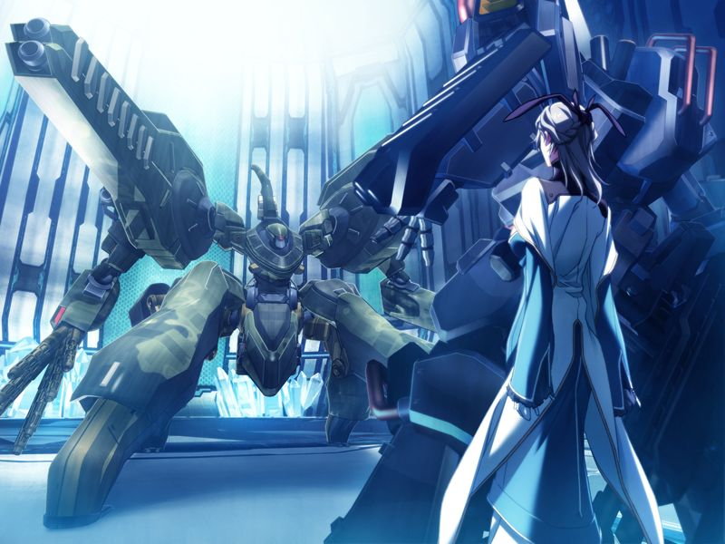

曾被奇点帮助与千夏生还的甲【想去相信】代理人。
为阻止镇静剂，甲追着代理人在方舟构造体中疾驰。

甲在行动途中发现了隐藏的亚季。
在学园时代曾经让巴德尔死机的亚季和甲共同行动。
亚季希望甲相信方舟没有人希望灰色圣诞节重现。

甲接近控制中枢，方舟深层处于混战状态。
圣良，永二和亲自上阵的勳对峙。
看似冷面的圣良被永二以外甥甲的性命为理由说服推迟方舟计划。

永二让甲阻止镇静剂，自己扛下了所有敌军的攻击。
亚季探测发现镇静剂的驾驶员是千夏。
为拯救因过负荷濒临发狂的千夏，甲掩护亚季入侵镇静剂。

亚季成功入侵镇静剂。
然而镇静剂对AI的抑制反而加强了。
千夏陷入疯狂进行无差别攻击，与此同时对地射击卫星群控制权被夺取，圣良不得已决定启动方舟计划。
正当甲绝望之时，代理人的声音传入甲的脑海。
在代理人的帮助下，甲抱住亚季和镇静剂一同落入光圈式阀门中的潜意识之海(ES)。

在意识媒介的潜意识之海中，甲看到了千夏一直以来对自己的记忆和逐渐拉近的心意，以及……

【记忆】

> 平安夜在派对现场独处的千夏为自己没有抓住机会结果被甲甩掉而叹息。
> 正在这时千夏收到了久利原老师联络，有些古怪的久利原说他的“圣诞礼物”很快就到。
> 随后千夏迎来了她的灰色圣诞节。
> 
> 失去一切的千夏被勳救下。千夏自此将自己当做战斗机器……

看到此幕的甲发出怒吼打破了噩梦，甲与千夏在AI虚构的如月寮中醒来。
代理人告知甲，两人仍处在千夏的噩梦中。

甲沿袭千夏学园时代的记忆与千夏站立在虚拟竞技场中。
记忆中的千夏因为甲和空的一些事情自认为被甩，自暴自弃地约甲对战。

> 千夏：【……一决胜负吧……如果你赢了，我就把处女之身献给你】
> 
> 千夏：【如果你输了，你就要夺走我的处女之身】
> 
> 甲：【喂……】
> 
> 千夏：【那要是你输了，就把童贞给我！总不会想临阵脱逃吧，甲……！？】

甲战胜了回到学园记忆的千夏，并和记忆中一样与千夏拥吻。

> 甲：【接下来的事情就先预留着吧】
> 
> 千夏：【呃……？】
> 
> 甲：【要是到毕业你还无法确定自己的心意……到那时我再欣喜接受吧】

随着甲终于记起与千夏的约定，封闭千夏意识的障壁终于融化消失。
甲在方舟的虚拟学园中醒来。
由于AI的介入，方舟计划、对地射击卫星群和镇静剂均已停止。
然而，勳仍执意与甲决战。

> 勳：【这是AI与人类一决雌雄的战斗吧？】
> 
> 甲：【不。这只是人类在妄自相残。AI只不过是在旁观而已哦……】

【结局分歧条件：是否击败勳】
【若战斗失败，进入[NE](ne.md)】

甲将勳击倒。
甲看到了勳的记忆。

【记忆】

> 灰色圣诞节当天，空劝勳让蕾转学星修。
> 勳感到这个与甲的母亲八重相似的少女真的能让他和女儿和解也说不定。
> 因此，勳始终无法饶恕夺走了自己妻女和空的AI。

千夏在甲与勳战斗时被亚季从镇静剂上分离。
代理人出现在甲的面前，似乎想起了什么。
代理人说“空在某个地方还活着”，并将手指向虚拟的蓝天。

登出的甲赶往镇静剂的操作席接千夏。
为安慰百般自责钻入牛角尖的千夏，甲对千夏履行学园时代和千夏的约定。
在过程中两人发现千夏的感觉恢复了正常。

两人力竭后互相依偎休息。
千夏提到自己在连接镇静剂的时候梦到了自己在地下据点被炸死、被久利原杀死、菜叶和甲在眼前自爆、甲在灰色圣诞节死去等各种梦境。
甲想起自己也梦见了千夏的过往。

圣良向甲发来讯息。
为了阻止编译者流出，圣良下令轰击多米尼恩所处的机场和方舟总部。
决定启动方舟计划舍弃肉体的圣良和亚季向甲和千夏道别。

---

[下一章](chapter15.md)