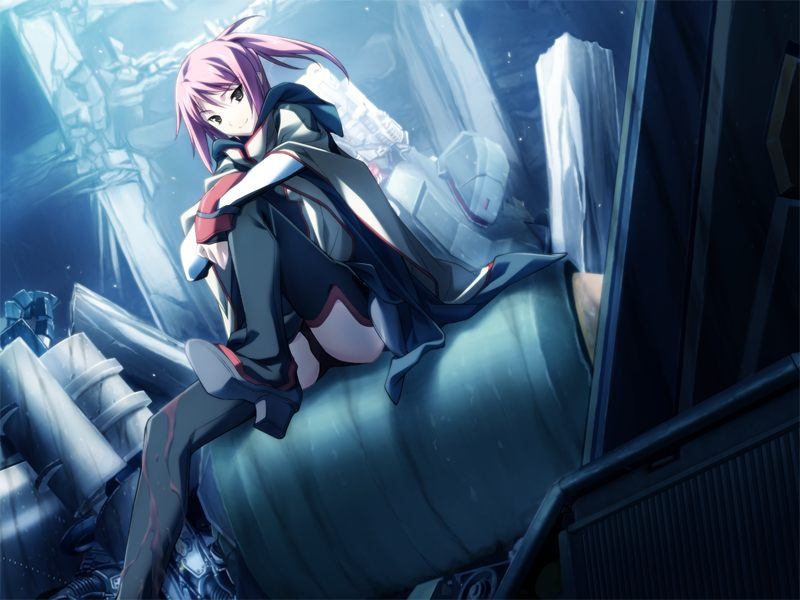

# 第8章 女性朋友(girlfriend)

【记忆溯行】

> 甲等三人对新人战的轻松战况感到不满足，遇到了邀请三人参加无限制对战的设赌人。

甲在诺依的诊所醒来。诺依判断甲的芯片已无异常，但奇怪的是甲的记忆溯行仍在继续。
甲向诺依询问Dr.十九的事情。
从诺依的介绍中甲得知十九是早年反统合势力制造的情报武器，被统合捕获后给予了人权。
十九主导了大量对后世影响深远的研究，而圣良也是十九的爱徒之一。

甲回到魔狼基地进行以GOAT为假想敌的训练。
甲在与莫霍克的交流中感到这个巨汉是个友善的怪人。

圣良加入了魔狼的作战会议。
甲向圣良询问神父提及的有关十九的遗志和方舟计划的事情。
圣良声称自己不会犯下师傅的错误，因此也不会容忍继承这个错误的神父。

【记忆溯行】

> 甲与如月寮众人在补习，听玛萨介绍关于AI的发展史。

甲收到千夏的通话，两人在无名都市会面。
身为与方舟敌对的GOAT成员的千夏说自己希望去方舟虚拟都市看看。
甲答应将此事拜托亚季。

正在这时敌人袭来，甲让千夏先登出。
甲在对战中判断出敌人是伪装成多米尼恩势力的杀手，迅速去支援被包围的千夏。

甲从现身的吉鲁贝鲁特口中得知千夏是在执行GOAT的潜入任务的间谍。
甲与千夏合作将敌人击退，千夏在战斗中腿部负伤。
甲对千夏的伤势感到担忧，但千夏似乎毫不在意。

千夏坦白自己在奉命打探阿南和德雷克斯勒的关系。
离开战场后千夏与战斗中对甲进行支援的蕾见面，两人间的关系剑拔弩张。

甲从网吧潜入方舟虚拟都市，亚季正在还原星修学园。
早已知晓千夏身份的亚季答应帮助她前来方舟虚拟都市，并鼓励了担心被背叛的甲。

---

[下一章](chapter9.md)