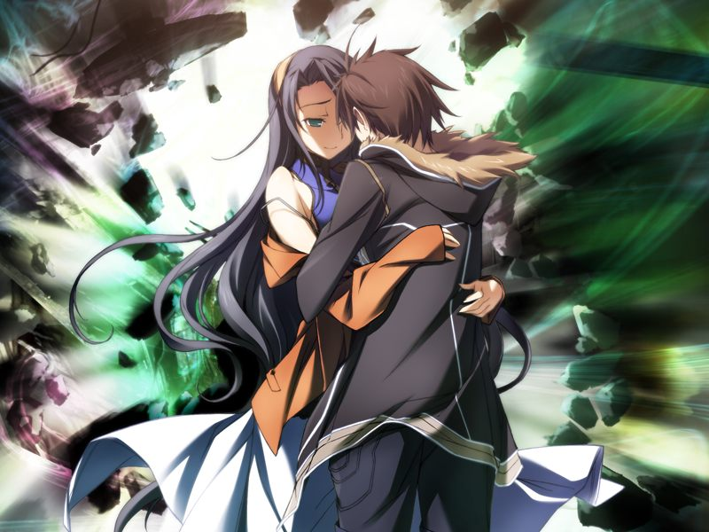

若甲未能阻止镇静剂，或败于勳，则镇静剂启动并夺回对地射击卫星群的控制权，方舟开始实施方舟计划。
在甲等人进入方舟前，看到的是对地射击卫星群不受控制瞄准清城市的画面……

# 第14章 涅槃(nirvana) (Bad End)

不想勉强将甲带上方舟之旅的亚季最终使得甲的实体生存下来。
心已死去的甲为守护承载众人意识的网络空间与镇静剂持续战斗着。

身受重伤的甲返回起居室，发现亚季出现在自己身边……

> 亚季：【即使表层意识(心灵)被杀死，深层意识(灵魂)也不会死亡】
>
> 亚季：【在深层意识(灵魂)的深井中交融的我们，是镇静剂(那个)的力量无法触及的…】

两人在虚拟世界的崩坏中相拥潜入虚无之中……

从幻境中清醒过来的甲意识到自己与亚季已不可能重逢。
面对镇静剂和其已陷入疯狂的驾驶员，甲重新挣扎站起……

> 甲：【来吧，来庆祝网络的末日…】
> 
> 甲：【你会做我的舞伴吧，镇静剂？】

---

[NE](ne.md)

[GE](chapter14.md)

[个人感受](comment.md)

[返回](../start.md)