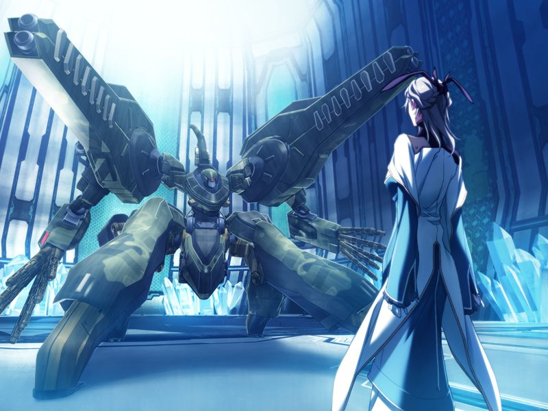

若在第10章甲未能深入巴德尔系统以了解八重与巴德尔系统的过往，
亚季将顺利与镇静剂接触，并在接触的瞬间被镇静剂支配。
镇静剂顺利重启。

勳亲自出马阻止甲等人攻击镇静剂，即使圣良警告镇静剂已经在违背GOAT的想法行动也在所不惜。

濒临消失的代理人最后传来了无法独自脱离的亚季是最后的希望的消息。
为掩护永二分离亚季，甲与勳长官战斗。

【若甲战斗失败，虽然亚季成功与镇静剂分离，但仍然无法阻止镇静剂接管对地射击卫星群，进入[BE](be.md)】

甲成功战胜勳。
然而，镇静剂驾驶员脑死，从镇静剂中分离的亚季身受濒死重伤，对编译者的改写也因为对AI的压制失败。
为阻止编译者，圣良不得已发动方舟计划。
亚季劝实体已被偷运到方舟外的甲返回现实生活，但甲执意与亚季前行。
两人交换约定之吻，一同向现实告别。

---

[下一章](ne.md)