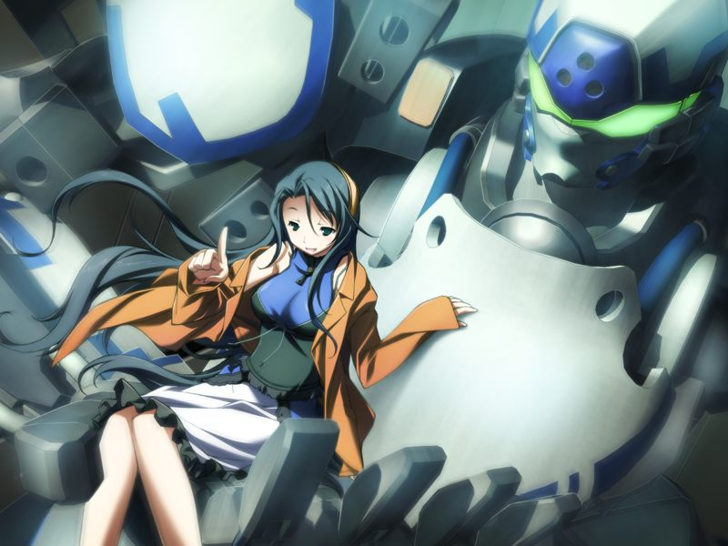
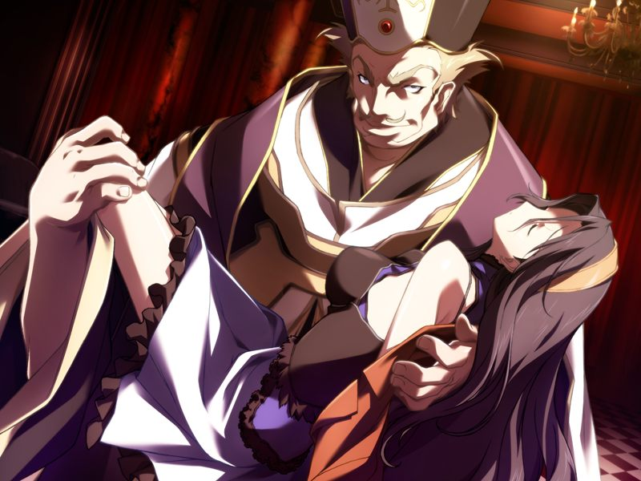

# 第7章 姐(My sister)

被莫霍克和蕾救出的甲在诺依的诊疗所醒来。
赶来的希泽鲁为甲之前不听命令的行为狠狠揍了甲一拳。
将诺依赶走的少佐悄悄告诉甲魔狼已决定对多米尼恩据点展开攻击。
在少佐临走时，诺依故意在甲的面前透露了少佐的少女倾向的兴趣。

次日清晨甲与蕾进行训练。
训练结束后，甲向父亲询问母亲去世时在和什么敌人作战。
永二提到那时在与多米尼恩战斗的他曾经将神父杀死过，但教团声称神父又复活了。

甲前往方舟与圣良会面。甲问起自己父母相遇的事情。
圣良说曾为统合军特殊部队军官的永二是在军方的研究设施认识身为研究员的八重和圣良的。

【记忆】

> 甲想起小时候听母亲讲过的父亲向母亲求婚的事情。
> 被直接抱走的八重不顾亲戚反对与永二结婚并私奔。
> 
> 但是，被母亲称为正义的伙伴的父亲却在母亲病倒后一直没有回家。

甲感谢曾收留私奔父母的圣良叔母，圣良的话语中充满对自己姐妹的关爱，并叮嘱甲照顾好姐姐亚季。

甲来到方舟虚拟都市，发现躲在草地里想吓自己的亚季，结果亚季反而被甲吓了一跳。
甲怀念地将体力透支的亚季背回虚拟的如月寮。

如月寮中蕾与菜叶正在整理菜园。
在帮忙时亚季注意到甲对千夏的现状似乎有所了解，单独与甲约谈。
甲将自己遇到千夏的事情告知了亚季，并答应亚季下次见到千夏时邀她来看看。
亚季说星修是兑现了和甲的约定的场所……

【记忆回溯】

> 甲童年中的西野家是个冷淡的地方。
> 甲和亚季每天在虚拟空间玩耍。甲劝亚季上学找朋友，亚季展示了自己制作的不成人形的“朋友”。
> 甲和亚季约定向她介绍朋友。

亚季后悔自己制作呼为大家带来了难过的回忆，没有记忆的甲不知道如何安慰。
但此时一名呼型NPC神情古怪……

> NPC：【没有…恨…毫无理由】
> 
> NPC：【憎恨母亲…是不可能的……只是，很寂寞…】

亚季为了调查量产型呼的异常离开。

第二天甲回归魔狼，被命令潜入制造性爱NPC的人偶秘造工厂袭击。
作战会议结束后，永二单独将甲与蕾召集到司令室。
圣良通过通话委托两人回收盗版NPC的源数据。
面对甲的疑问，圣良承认被盗取的不是量产型，而是空死去后应该无法运作的原型呼的数据。
圣良声称如果无法夺取破坏也可以，因为这是不能落到多米尼恩手中的将AI与人类连接的连接者技术。
甲在试探中发现亚季似乎还没有汇报异常NPC的事情。

甲与蕾前往网吧，发现网吧门口下班的菜叶的身影。
潜入无名都市后两人遭遇亚季，无法说服亚季的两人请求永二协助。
在执拗的亚季的坚持下，甲被安排负责护送亚季，永二也亲自加入行动中。
在行动中，为通过检查使用了虚拟药物的甲对亚季，以及蕾，甚至永二想入非非。

身为特级程序员的亚季轻易取得构造体的示意图。
永二改变作战方针，让甲与蕾护送亚季前往中枢完成圣良的委托。

在亚季的指挥下众人一路都没有遭遇敌人。面对甲的名不虚传的赞誉，亚季得意地回答道：

> 亚季：【当然。我还是甲的人生蓝图的设计者哦，不记得了吗？】

【记忆回溯】

> 童年的亚季将甲带往星修学园的构造体。
> 决定前往学园读书的亚季，向甲提案将来能与甲在星修汇合的周密计划。
> 
> 

甲留下蕾守护亚季，与守卫的病毒战斗。
到达中枢的众人发现中枢正被黑客入侵。
甲试图追踪侵入者真身，发现侵入者触发了警报。
被工作人员围住即将暴露的甲被千夏所救。
在与千夏离别前，甲想要询问与千夏过去的约定，并似乎隐约想起那时千夏泫然欲泣的脸颊。
千夏只是淡淡地说自己还在守着那时的约定。
离别时甲向千夏呼喊亚季已复原了虚拟的如月寮。

甲向构造体深处移动，途中亚季报告发现了被诱拐的真人少女们。
甲到达目的地，看到了学生时代曾见过的白色机体。
追踪而去的甲通信线路受到干扰，随后多米尼恩的巫女主动出现。
巫女将NPC的源数据交给甲，希望甲将其托付给自己信任的人，并劝甲在那位大人察觉前尽快回到亚季身边。

巫女离开后甲收到蕾的联络。
想到巫女的话，甲谎称源程序已被破坏。
返回途中希泽鲁报告被绑架的少女已获救。
蕾单独向甲汇报，称亚季确认被绑架的少女都是方舟社的芯片持有者，怀疑敌人借此将她们与NPC的体验情报传送给了AI学习。

亚季的通信突然中断。甲通过视觉同步看到漆黑的战斗用电子体使用链锯将蕾击倒。甲迅速前往蕾与亚季所在处。

甲赶到现场，格雷戈里神父的战斗用电子体已等候多时。
神父放开身负重伤的蕾，但亚季仍被神父囚禁。

甲与神父对话拖延时间，声称要将女神的启示传授给甲的神父让甲询问圣良有关十九博士以及方舟计划的事情。
永二随后赶到现场，神父向永二声称连接者已经完成，而十九的意志将会被实现，随后抱着亚季逃离。
永二挡下拖后的多米尼恩士兵，让甲保护亚季。

魔狼众将神父围堵。神父解除武装逃入电子体专用门中。

被枪包围的神父声称亚季是神明的新娘，在试图逃往密道时被莫霍克撞翻，但亚季却落入密道洞口。
甲不顾永二的阻拦跃入密道，与亚季一同掉入情欲的粘液池陷阱。

清醒过来的甲发现自己和亚季被代理人拖出了粘液池。
甲调查代理人的ID，发现与呼相同。
代理人说自己不是呼，不是人偶，也不是空，并询问甲自己是什么。

代理人察觉到有人前来而离开。
鲜红的战斗用电子体突入，亚季识别出这是千夏的机体。
千夏因为立场原因要求将身为平民的亚季引渡到GOAT，不想让甲与千夏互相伤害的亚季同意协助。

正当两人要被千夏带走时，为救自己儿子将战场上堆满残骸的永二出现将局势逆转。
在千夏被放走时，亚季与千夏进行了直接通话。

众人与魔狼部队会合，得知神父已逃脱。
甲带领亚季登出演变为战场的无名都市。

---

[下一章](chapter8.md)