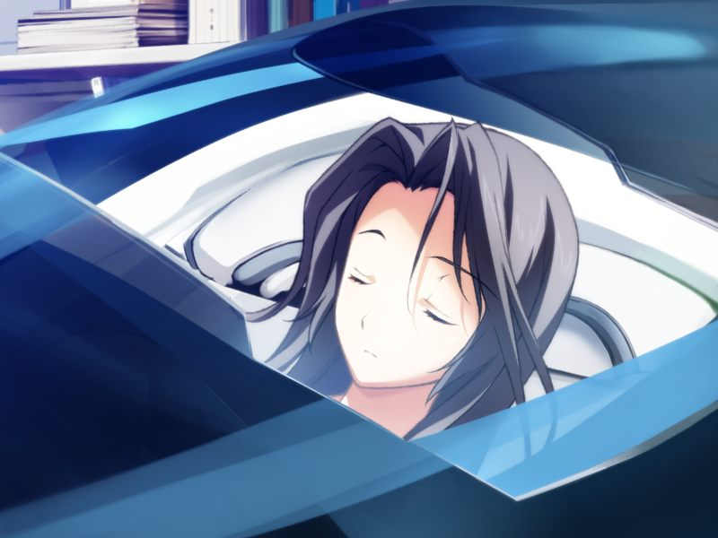

# 第8章 过去(The Past)

甲在诺依的诊所醒来，向诺依询问蕾的伤情，得知蕾尚未伤愈。
诺依告知甲的芯片已无异常，但奇怪的是甲的记忆溯行仍在继续。
甲向诺依询问Dr.十九的事情。
从诺依的介绍中甲得知十九是早年反统合势力制造的情报武器，被统合捕获后给予了人权。
十九主导了大量对后世影响深远的研究，而圣良也是十九的爱徒之一。

永二来接甲，与诺依的对话丧心病狂。

甲回到魔狼基地，与莫霍克一同以GOAT为假想敌进行作战演习。
演习结束后甲向永二询问母亲去世时的事情。
永二说八重和圣良当时在研究将AI和人类神经网络连接的研究。
八重在成为最初的第二世代后病情恶化，永二与八重私奔。
但后来盯上八重的多米尼恩将她的电子体囚禁。

甲独自散心。莫霍克用自己的方式笨拙地安慰甲。
甲听到了关于希泽鲁的过去。

两人回到作战室，听取昨日的作战报告以及阿南发表的声明。
作战简报结束后，甲独自移动至方舟。
甲从圣良处得知其与十九的关系。
圣良声称自己不会犯下师傅的错误，因此也不会容忍继承这个错误的神父。
在甲犹豫是否询问方舟计划时，圣良突然问甲是否喜欢亚季，并希望甲多关注亚季的行动。

甲来到虚拟的如月寮，突然收到亚季的联络。
为救被袭击的亚季，甲前往无名都市，与不知为何跟亚季在一起的千夏一同抵抗多米尼恩的袭击。
甲向蕾请求增援，但永二与希泽鲁在执行机密任务。尚未伤愈的蕾表示会在现实中进行后援。

蕾识别出敌人的真身是Dying-Slave.
甲从现身的吉鲁贝鲁特口中得知千夏是在执行GOAT的潜入任务的间谍。
甲与千夏合作将敌人击退，吉鲁贝鲁特狼狈撤离。

甲要求千夏说明情况，得知是亚季主动叫出的千夏，但会谈的内容保密。

第二天清晨甲在魔狼基地演习。甲跟希泽鲁用比赛歼敌数打赌午饭。

甲在休息时潜入方舟虚拟都市，在NPC的带领下来到曾和千夏一同打发时间的空地，被再现的场景所震惊。
亚季说和千夏见面也是希望将千夏邀来此处。
没有得到千夏答复的亚季仍然相信千夏的本性。

甲去网吧找菜叶，邀菜叶共进午餐。
为了给亚季惊喜，两人在未联络的情况下前往方舟，看到在密封舱中潜入的亚季。

三人愉快地共进午餐。餐后，亚季说千夏接受了前往方舟虚拟都市的邀请。
亚季和菜叶对此非常开心，甲则心情复杂。

第二天清晨，甲在魔狼基地以GOAT、多米尼恩为假想敌进行混战演习。

演习后甲与蕾、菜叶一同前往方舟虚拟都市。
在等待千夏到来的时候甲与NPC谈话，得知方舟的AI伊芙残存着星修学园所有学生与职员的记忆，但技术上还无法转换为人类能够识别的形式。

千夏来到方舟虚拟都市，被甲带往如月寮。
尽管众人热情迎接，千夏依旧神情冷淡，并因为纳米机器的话题与菜叶发生了争执。

甲安慰完菜叶后去追亚季和千夏。
甲经由蕾的帮助听取到亚季与千夏的对话。对话中千夏似乎向亚季展示了自己的身体。

甲与亚季回到如月寮。
对独处的千夏进行监视的蕾未发现异常，亚季让甲去安慰千夏。
甲在接近千夏时，听到代理人发来的千夏与两名可疑男子的直接通话内容。
甲目睹千夏撒下了病毒的种子，但千夏转身发现了甲。
甲与掩护千夏的GOAT的战斗用电子体、病毒交战。
发誓不让后辈成为罪犯的亚季进行了空间封锁，并拜托甲在叔母发现前行动。

甲将坚持执行任务的千夏击败。
在亚季的注视下，千夏坦白自己的目的是被方舟隐藏的玛萨所记录的灰色圣诞节的数据，并质问亚季何为方舟计划。
声称千夏“不在此处”的亚季既往不咎，甲护送千夏登出。

甲独自在与千夏的回忆之处。菜叶来到甲身边谈论千夏的事情。两人谈起在南八坂时的约定。

甲回到如月寮，在空的房间情感爆发，忍不住在亚季的怀中哭泣。

---

[下一章](chapter9.md)