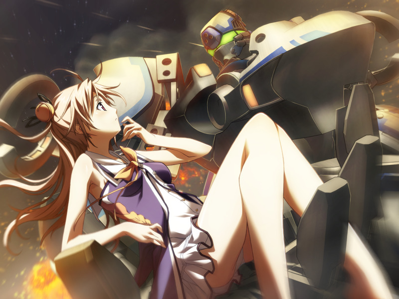

# 第1章 觉醒(Awakening)

冷静下来整理现状的门仓甲在躲避追击的同时回想起被病毒袭击前的经过。

> 为了调查灰色圣诞节的真相而追查久利原直树的甲带领临时召集的部队找到了德雷克斯勒机关的痕迹。
> 甲在追查中与部队失去联络，随后和吉鲁贝鲁特遭遇。
> 甲试图强行突破吉鲁贝鲁特的层层包围，但一架白色战斗用电子体突入迫使吉鲁贝鲁特撤退。
> 被称为多米尼恩的巫女的白色机体驾驶员警告甲马上逃离后迅速离开。
> 
> 甲在单独潜入数据库时收到蕾发现自爆装置的警告。
> 正当甲找到编译者的资料时，遇到了拥有情感的呼型NPC.
> 甲为保护自称代理人的少女将其带走。
> 
> 
> 
> 甲意识到已无法逃离，但在差点被爆炸卷入前，世界仿佛被冻结了一般，而代理人也消失无踪。
> 甲在冻结的世界中奔跑，但还是在最后关头被爆炸卷入……

整理完状况的甲想起了一切。
甲和蕾会合，并在甲的指挥下为脱离设施与大量病毒战斗。
两人最终找到展开登出干扰的敌方后勤中型病毒，并在将其击毙后登出。

[【播放OP】](http://www.bilibili.com/video/av1434158/)

返回现实的甲与蕾向已脑死的战友们道别，离开地下通道前往旅馆。
夜晚两人同床共枕，蕾因担心甲而睡不着，并邀请甲按曾约定的那样“一起哭泣”。
甲在将蕾的身体拉近时意识到自己因为之前的攻击缺失了部分记忆。

甲在深夜收到情报贩子艾迪的邮件。
甲主动与艾迪联络并交换情报，得知自己之前袭击的秘密基地为一家私人公司所有，而其董事可能是清城市的议员。
甲还得知了GOAT部分部队可能已经驻扎清都市的消息。

甲为了唤醒自己缺失的记忆，想起久利原直树曾经教导，决定“回归原点”。
甲想起蕾在灰色圣诞节中许下终生陪伴自己的约定。
尽管如此，甲仍然一直希望蕾不要陪自己送死。
甲决心抛下睡眠中的蕾独自前往灰色圣诞节的遗址。

甲搭乘列车来到星修旧址。
正在甲面对遗迹思绪万千时，希泽鲁出现并邀约甲到公园搭话。

希泽鲁指出魔狼已经知晓甲的意图与现状，并邀请甲加入魔狼。
甲主动提出用战斗用电子体证明自己的技术，并提前声明阻止了希泽鲁登出控制其实体的企图。

甲战胜希泽鲁。正当甲想要登出时，代理人出现在甲的眼前。
甲发现代理人的ID与呼一致，代理人说这是因为空还活着。
甲以为自己的大脑产生了幻觉，生气的代理人让甲去问真。
甲没能在代理人离开前追问到真的下落。

隐匿着的蕾在登出的两人身后显出身形。
希泽鲁希望甲为了自己忠心的部下重新考虑一下，至少跟其父亲对话后再决定。
甲因不想失去行动自由而无法立刻答应。
希泽鲁留下“想改变心意的话随时来方舟集团”的话语离开。

甲向蕾致歉，随后被蕾带去看医生。

---

[下一章](chapter2.md)