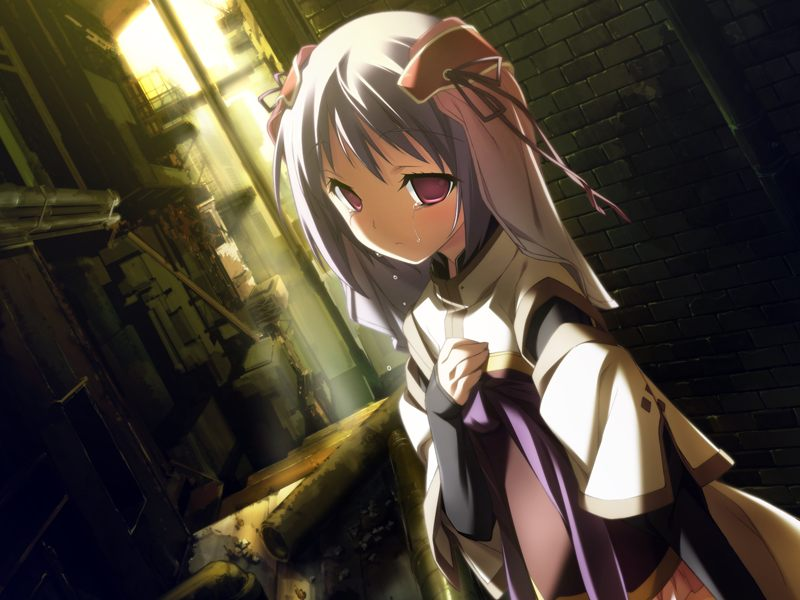
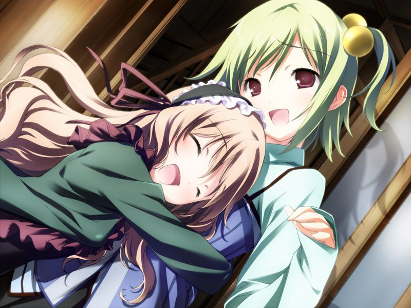
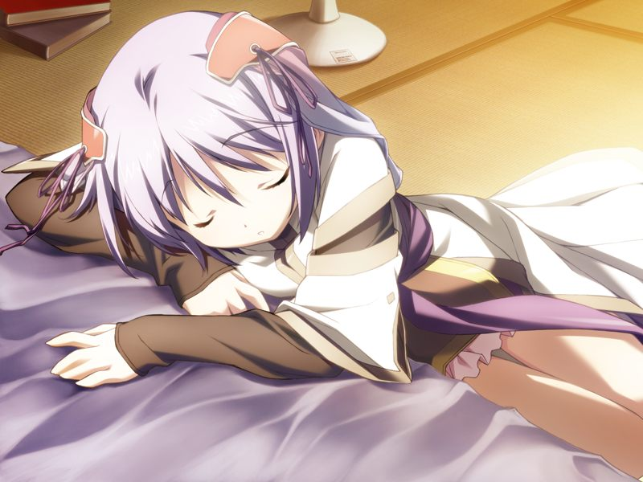
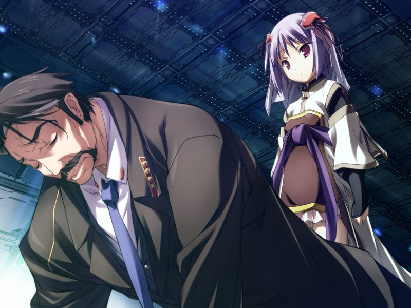

# 第11章 集中(Concentration)

在地下的众人无法得知已污染的地表的状况。
尚未被侵蚀的方舟总部接纳了千夏带领的GOAT的士兵们。

众人来到社长室，发现清城市地表已完全被编译者污染，好在仓促的改写总算暂停了编译者的增殖。
与圣良通信的勳说由于对地射击卫星群被干扰无法使用，统合中央已宣布24小时后将实行核攻击。
圣良根据代理人传来的20小时后将出现巨大奇点的情报，向勳提出用奇点改写编译者的计划。
但勳以自己另有办法为由拒绝。

会后，亚季约甲来到圣堂见在此等待的代理人。

代理人说出自己所接受的任务是通过给予信息，对世界的状况施加干涉。
但她也承认自己已经背离了所赋予的任务。
代理人展示自己胸口的挂坠，其内的量子骰子上显示的数字是5.

> 代理人：【在那个多米尼恩据点发生的战斗是概率发生重大分歧的位点】
> 
> 代理人：【模式1…据点爆破，编译者被破坏…】
> 
> 代理人：【模式2…生物移植体从清城市脱离…】
> 
> 代理人：【模式3和4…生物移植体逃离到方舟…】
> 
> 亚季：【那么，现在的状况是模式5？】
> 
> 代理人：【估计是的…而且，这是我未知的模式】

甲询问代理人为何凭借自由意志背离了任务，得到了代理人“因为喜欢你们”的答复。

甲按代理人的指示发现了在无名都市游荡的小真。

甲安慰了害怕的小真，将她带往方舟虚拟都市。

小真再次来到重现的学园。
睹物思情的小真突然意识到自己已经忘记了灰色圣诞节当天自己所经历的事情。
甲试图追问，但因为小真陷入恐慌而打断。
甲也因为想起那天的事情内心动摇，反而靠小真的安慰才恢复了冷静。

小真在对话中仍然在毫不动摇地坚信着多米尼恩的教义。
也和往常一样，相信神父和自己是被神选中的恶人。
甲制止了真的自责，邀请她和自己今后一同居住。
挂念着真的甲向真告白。

两人接吻，随后诺依出现令两人十分尴尬。

诺依说起小真的灰色圣诞节。
那天的真在清城市医院中潜入时因精神冲击失去知觉。
随后真与当时在陪同的诺依被不明组织绑架到清城市的地下。
真的实体在昏迷中被连接到特殊装置上冷冻保存。
之后诺依趁一次混乱强制将真的电子体释放到网络中后逃走。
成为了地下医生的诺依一直凭自身力量寻找着小真的电子体与实体。
尽管一度一无所获，但诺依相信在甲与魔狼的帮助下，小真回到现实世界将指日可待。

众人一同来到虚拟的宿舍，如月寮仿佛也恢复了过去的光景。
诺依在和甲闲聊的时候提出或许十九也渴望拥有感情的想法。

甲和千夏来到如月寮外。
千夏将GOAT的资料传给甲。
甲推测之前绑架小真的犯人可能是当时管理巴德尔系统的米内。
千夏强调自己是为阻止编译者的悲剧而战斗至今的。
在编译者已被释放的现在，能够防止最坏状况的是方舟，而不是不愿认错的勳长官。
两人随后被菜叶叫回宿舍，发现诺依在伪装自己的年龄和菜叶亲昵。

甲和小真一同来到真的房间。两人就这样睡到了傍晚。

距离奇点出现还有2小时。在小真房门前待机的蕾向甲报告了睡着这段时间的情况。
两人不禁聊起战争结束后的打算。甲坚定了连空的份一起守护好真的决心。

甲等人来到方舟食堂，看到在灰色圣诞节后第一次出现的无云的夜空。
众人看到了流星，但魔狼众明白这只是统合象征性地派来的救援机。

代理人所预告的奇点出现的时间终于到来，然而却什么也没有发生。
与此同时，在虚拟空间中，勳带领GOAT部队来到了方舟构造体大门。
意识到勳可能动用镇静剂的千夏请求永二允许她同行，并让甲专心守护小真。

GOAT为了捕获小真入侵方舟构造体。
此时，与千夏一同逃进方舟的GOAT成员趁机围住甲与真。
真以自杀为要挟阻止了劫持者们对甲的袭击，千夏趁机将仍相信十九的遗产的GOAT队员击倒。

甲与真联手击退GOAT的部队。
最终，勳也被击败。
试图自杀的勳被真拦下。

在真的质问下，勳坦白虽然并不是自己掳走真的实体，但的确是想利用真。
真再次试图回想自己在灰色圣诞节当天的行动……

【记忆】

> 众人从小真的视角看到的灰色圣诞节。
> 
> 真想起自己当晚在偷看空的通话，却不记得为何要偷看。
> 随后，小真目睹了灰色圣诞节发生时空被溶解的场景。

甲意识到了小真深信这个世界是梦境的原因。
想起了过去的真抱紧甲哭泣。

---

[下一章](chapter12.md)