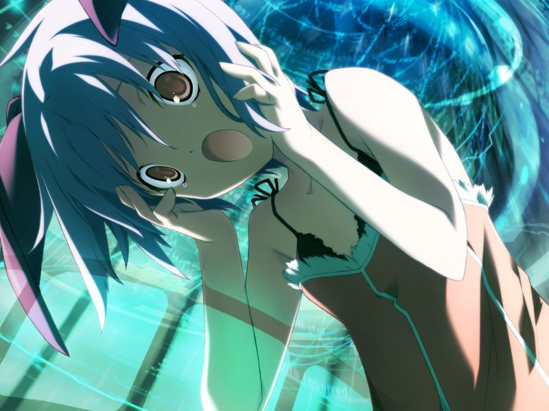
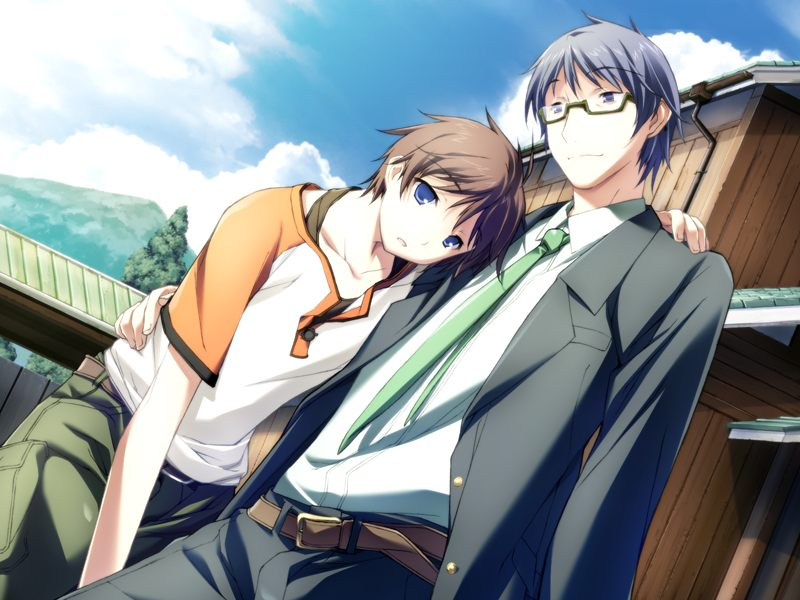
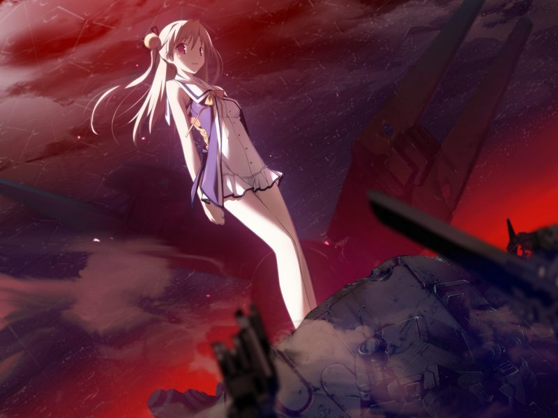

# 第13章 心理创伤(trauma)

【记忆】

> 培养槽中的真期待着和姐姐一同玩耍，但出生后却因病弱无法同行。
> 好在两姐妹的精神依然相互连接着。

甲在ES的最深处醒来，在代理人的带领下来到真的精神所构建的一所研究所。
两人穿过研究所的通道来到另一侧的沙滩，发现正在重新启动的镇静剂，和守护着镇静剂的神父。

甲在沙滩上将神父打倒，神父却宣告是自己的胜利。
甲无法呼叫到去尝试拉出真的代理人，而镇静剂也重新启动。
甲不知为何从神父身上听到了吉鲁贝鲁特的诅咒，那是他对自己幼年时被排挤孤立轻视的怨念。

甲将对镇静剂的精神控制能力的绝望抛在脑后，冲向镇静剂。
甲在镇静剂的精神世界中，看到的是心已死去的抑郁症患者眼中的世界。
在小真潜意识中沉淀的罪恶感的元凶终于浮现出来……

【记忆】

> 甲看到了真的记忆。
> 在灰色圣诞节前，小真恶作剧地让空买错了车票。
> 网络中的真注视着空与甲的通话，祝福着两人。
> 随后，真亲眼目睹了因为自己的恶作剧还留在研究所前的姐姐成为了编译者的牺牲品。
> 接下来，小真因电脑症感受到了被编译者溶解、被对地射击卫星群烧死的每个人的痛苦。
> 
> 
> 
> 真因为自己没能阻止久利原，得出是自己引发了导致姐姐和无数人死亡的灰色圣诞节的结论。

甲因和真感受到同样的心境而理性粉碎。
甲眼前浮现出描绘无限螺旋的光环。甲在错乱的意识中感到状况总是以空的死为开端，以真的死为结束。
甲感到自己逐渐能理解到多米尼恩和真看到的东西，仿佛看到了自己和空都存活的，对小真而言的“真实的世界”。
甲也想到达那个世界，却听到了空的声音……

> 空：【（不要看终结，看看起点吧。正是在那里，有着脱离圆环的钥匙）】

在空的声音的鼓励下，甲鼓起勇气，在意识的螺旋中搜寻空被溶解的场景。

【记忆】

> 甲看到灰色圣诞节发生时空脑海中的思绪。
> 空在弥留之际回想起久利原与她的约定……
> 
> > 直树：【万一，我若是踏上了错误的道路，有些话想让你传达给甲】
> > 
> > 直树：【告诉他，回想起我和你之间那【被抹消的约定】吧。因为那必定还留存在AI的记忆中】
> > 
> > 直树：【作为钥匙(Keyword)的词语……由那背负着受人敬畏的神之名的机械，与我们应当寻回的那片青空组合而成】
> > 
> > 直树：【并且还包含着…受此重托的你的名字…】

【没错，我在那个时候，听到了空的话语。空用双唇奏响的最后音符。】

【可是，绝望与冲击，却从我脑中夺走了那份记忆。】

【那个词语……作为钥匙的词语……那就是……】

【【Baldr Sky】】

遥远彼方世界的空终于将久利原老师的话语传达给了甲。
甲被抹消的记忆在头脑中苏醒……

【记忆溯行】

> 久利原提醒甲今后被改造为杀戮兵器的编译者可能会被人散播。
> 为防止被“他”针对开发对抗手段，久利原将修复程序通过纳米机器托付给有战斗力量和守护意志的甲，并令甲忘记了这段记忆。
> 直树相信甲在听到特定的关键词之时会回想起来，也相信正在注视两人的伊芙(AI)会助一臂之力。
> 
> 

甲再次在ES底部醒来。勉强找回了自我意识的代理人也看到了甲与久利原老师的约定，找到了想要的答案。
代理人说想要解救小真，需要小真自己的力量。
然而，无法原谅自己的小真仍然将自己封闭着，期待着自己的毁灭。
比谁都清楚空的心情的代理人无法沉默下去，姐妹俩敞开的心扉终于使得小真恢复理智。

巴德尔中十九的意志无视真的意愿操作镇静剂。
甲将久利原的“被抹消的约定”告诉了真。
在甲的劝说下，小真绝望的心境中出现了希望的种子，

【我也终于明白。【要保护你】这种话语，对小真而言毫无意义，只是单纯的自我满足而已。】

【小真并不是因为软弱才感到害怕。这份害怕，是从能够撼动整个网络空间的强大中滋生出来的。】

小真拜托甲同镇静剂战斗转移其注意力。
为了为空和老师报仇，甲与镇静剂开战。

【GE/NE分歧点（若与镇静剂的战斗失败，前往[Normal End](ne.md)）】

甲战胜镇静剂，但镇静剂开始向甲发射激光。
小真为保护甲如鬼神般高喊，以战斗用电子体的姿态从内击碎镇静剂的躯壳冲出。

被真称作呼的代理人站立在半毁的镇静剂上。
甲将拥有空的自我和呼的意识的代理人称作朋友。
即将随奇点消失的代理人(呼)对甲和真表示感谢和爱意后，替代真与镇静剂连接，作为非人类的“毒药”与镇静剂一同沉入海底。

甲和真许下互相守护的约定，两人在接吻中被深层之海吞噬。

甲回想起自己在床上等待被空叫醒的体验，但这次来唤醒甲的是代理人。
甲明白代理人希望带着空的名字与大家重逢的心情，也明白她因为担心小真顾虑而最终没有承认的用心。
与网络一体化的甲意识到AI网络的真实，那是无数被奇点连接的节点……

甲被另一个次元的空唤醒，并从她手中得到了直树制作的编译者正常化程序。

> 空：【（在几乎等于零的概率中，甲把这个回想了起来，AI将这份知识进行共享，创造出了新的局面）】
> 
> 空：【（谢谢……我只想这样说…）】

一切结束了，甲和真回到ES。
两人许下爱的誓言，小真的身心体验到了从未有过的羞涩。

甲回到方舟构造体，得知统合军已撤退，多米尼恩也已溃败，大家也都平安无事。
正在甲打算登出时，千夏发来现实世界发生了不得了的状况的通信。
甲从亚季等人接收到现实世界的图像，惊讶的膛目结舌……

---

[下一章](chapter14.md)