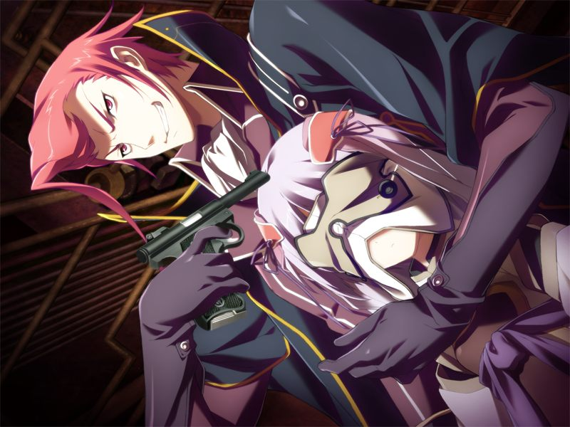
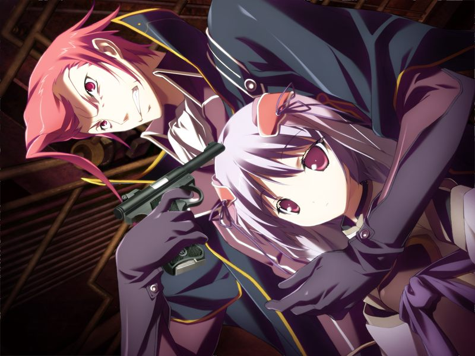

# 第3章 监禁(imprisonment)

诺依对甲进行诊疗，发现甲的脑内芯片在向外持续发出微弱的信号。
甲向诺依打听圣良口中提到的十九的事情。

蕾破解了艾迪脑中的情报。甲拜托蕾保护其实体，在网吧潜入可能是盗版NPC制造者藏身处的论坛。
甲在搜寻过程中突然听到代理人的警告，发现吉鲁贝鲁特携部下也来到了此处。

甲在追踪吉鲁贝鲁特的途中被保安拦下，偶遇追查而来的希泽鲁和诺依。
三人伪装成客人一同进入设施中无人的游戏室。
在甲利用终端进行调查的同时诺依开始对希泽鲁上下其手。
甲以不可思议的速度完成调查，感到获得了代理人的暗中帮助。

甲通过监视摄像头观测到吉鲁贝鲁特在威胁盗版NPC老板交出科学家以及多米尼恩的巫女的情报。
盗版NPC老板离开后，众人在代理人的帮助下偷听到了吉鲁贝鲁特和阿南的直接通话内容。

甲为了找到多方追寻的多米尼恩的巫女独自离开，被追出的诺依阻止。
诺依操纵量产型NPC和甲一同潜入。
甲因为诺依的举止感到感伤，了解到量产型NPC身世的诺依安慰了甲。

两人在行动中发现了单独行动的千夏。
千夏离开后设施的警报响起，甲前往吉鲁贝鲁特之前所在的房间，发现吉鲁贝鲁特已经离开。

甲击倒了留守的吉鲁贝鲁特的部下。
诺依发现之前吉鲁贝鲁特等人折磨的NPC其实是电子体。
诺依制止了愤怒的甲，但在折磨盘问敌人后仍不知吉鲁贝鲁特的下落。

被救出的电子体少女希望甲救出自己的同伴，以及同样被监禁的多米尼恩的巫女。
诺依问甲是否要单枪匹马与整个组织作战救人后再去追赶自己的仇敌，在得到肯定的答案后不禁感慨有其父必有其子。
本反对背离侦查任务的希泽鲁被诺依说服联络永二支援。
在场外的蕾也加入了后勤支援。

甲独自击倒众多敌人，最终将盗版NPC老板制服，救出被囚禁的电子体少女们。
希泽鲁随后赶到，与甲一同审问老板。
老板听到甲询问被囚禁的巫女，反而希望甲将巫女带走。
老板说巫女是个电脑症魔女，贩卖人口也是巫女为了让死去的姐姐复活而将人类的痛苦传送到“那个世界”。
得知吉鲁贝鲁特也追入巫女所在之地，甲感到了莫名的不安。

甲根据老板的指示追入另一个构造体。
与甲一同前往的诺依突然失去了对NPC的控制权，代理人的意识随之在NPC上浮现，并指示甲回避了吉鲁贝鲁特部下的埋伏。

甲击倒了吉鲁贝鲁特的部下。
吉鲁贝鲁特持枪现身，枪口指向被劫持的多米尼恩的巫女。

吉鲁贝鲁特发现甲竟然不知道巫女的真实身份，将巫女的面具一把扯下……

---

[下一章](chapter4.md)