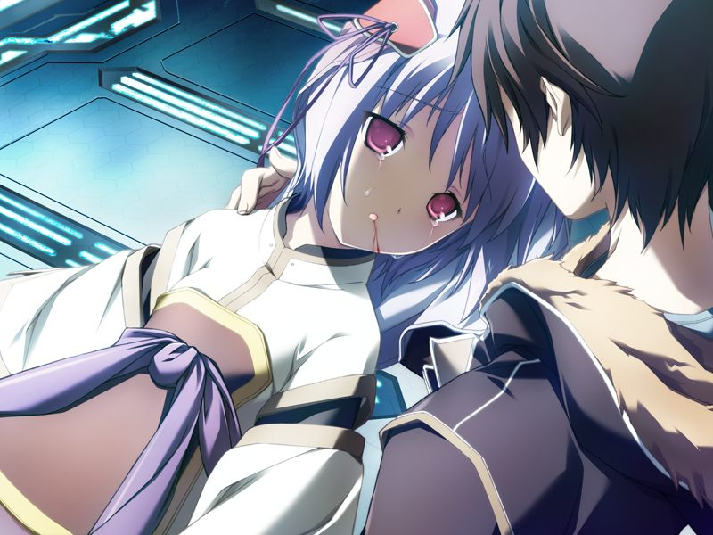
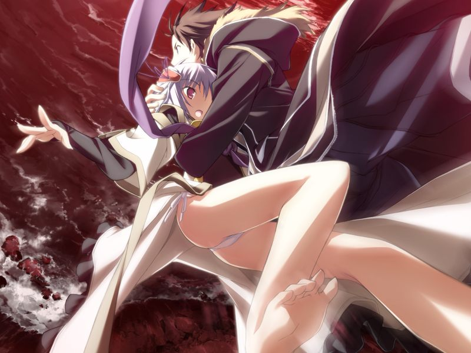

# 第6章 妄想(delusion)

甲被菜叶叫醒，接到希泽鲁告知地下制造者的情报解析完毕的消息，前往社长室。
甲在交换情报时得到米内议员被暗杀的消息。
试图阻止过暗杀的魔狼众透露潜脑者是伪装成多米尼恩的吉鲁贝鲁特。

在希泽鲁试图再次劝甲加入魔狼时，方舟发出入侵者警报。
圣良已知晓侵入的白色机体是多米尼恩的巫女水无月真。

由于直接通话被拒绝，甲只好和蕾一同赶去直接说服。
移动过程中两人发现了大量被真打倒的部队，也意识到身为企业的方舟的实力甚至能与GOAT抗衡。

甲发现了真的身影，但被多米尼恩的部队阻拦。
亚季也发来了千夏已向构造体深处逃走的消息。
为了不让千夏成为真正的俘虏，亚季也搭乘战斗用电子体赶来。

甲与蕾兵分两路将小真堵截。
正当真将被甲说服时，因同伴被袭违背指令赶来的方舟保安部队对真进行袭击。
误会被甲欺骗的真发狂并一击击倒甲以外的所有部队，用仇恨的目光瞪视着甲……

> 真：【果然前辈想要杀我】
> 
> 真：【我果然会被前辈杀掉】

失去理智的真直接穿过了隔离墙，其赶往的方向是构造体深处的危险地带——ES之海。

甲说服圣良为其打开隔离墙，和蕾一同在赶往深层的通道中和方舟的自律型病毒战斗。

甲在ES之海找到暴走的小真，与认定将被甲杀死的她战斗。

在甲击倒小真前，小真的意识流入甲的大脑。
甲看到真的“记忆”，那是在其他次元的甲使用战斗用电子体打倒并杀死小真的情景。

小真在甲的怀中清醒过来。
在甲的安慰下，小真说“一直期望做这样的梦”，随后在甲的怀中昏睡。

突然出现的千夏向甲提出用亚季和小真进行人质交换。
得知千夏原本希望将亚季也一同带走，亚季询问千夏想知道什么。
千夏认为方舟隐瞒了AI暴走的真相，而甲和亚季都被方舟所蒙骗……

> 亚季：【……我知道了。终于找到出发点了】
> 
> 亚季：【在信息的海洋前进行这种偏执的争论……实在太过滑稽可笑】

亚季走向ES之海，从中搜集玛萨的记忆。
玛萨陈述AI在灰色圣诞节时处于被干涉丧失自控的状态，千夏因此更加认为应当对反抗人类的AI进行控制。
然而玛萨指出尝试控制AI正是污染的原因，AI再次陷入心神丧失状态可能会导致悲剧再度发生。

方舟的自律型重型战斗用电子体接连出现。
甲和千夏再次并肩作战，但小真移行逃离了亚季。
在千夏的掩护拖延下，甲赶往亚季身边，边保护亚季边和海量的敌人战斗。
途中魔狼的队员也赶来支援。

甲在ES之海的悬崖边找到了真。
声称见过其他的自己被方舟捕获当成实验动物对待的小真想要跳入ES。
试图阻止的甲询问真为何认为这个世界是虚拟的，真却说自己已经死了。

> 真：【明明已经死去无数次……尽管如此，却怎么也无法去到姐姐所在的地方】

小真向海中跳去，甲飞身扑出，两人一同沉入到ES之海。

---

[下一章](chapter7.md)