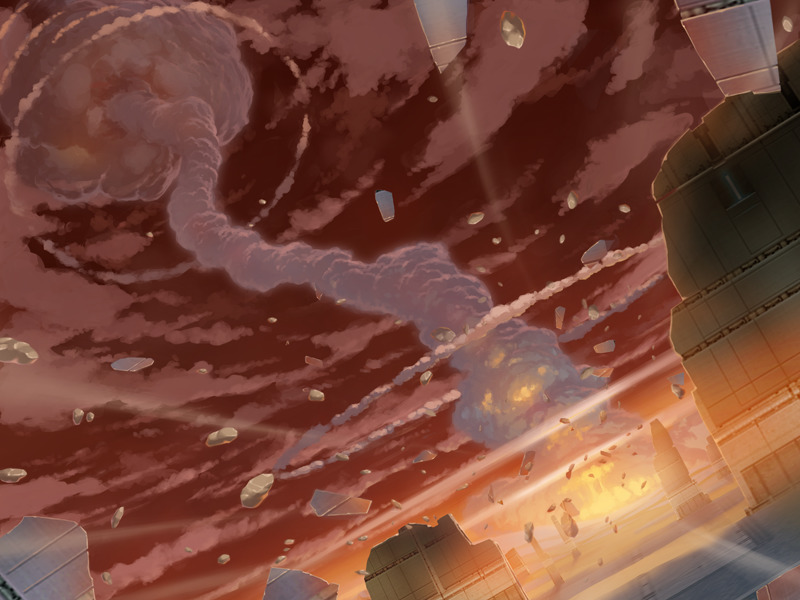
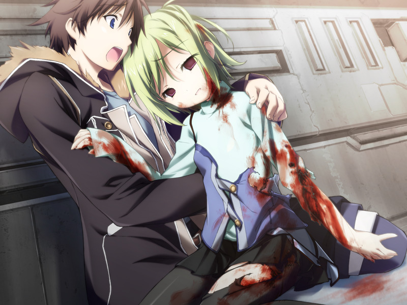
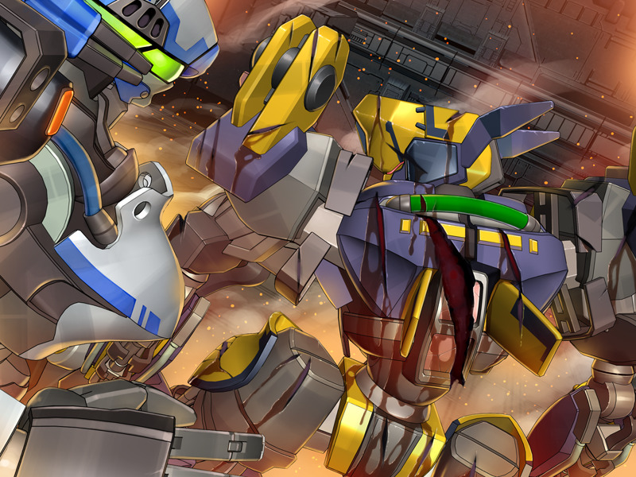
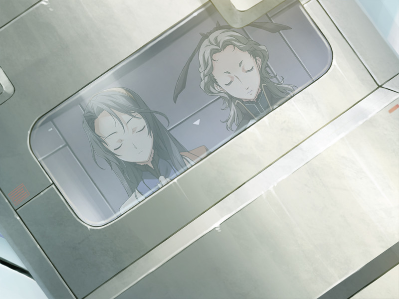
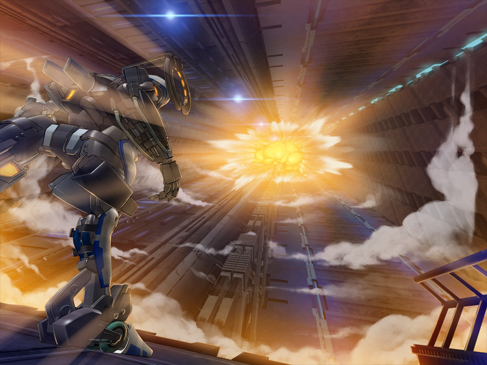
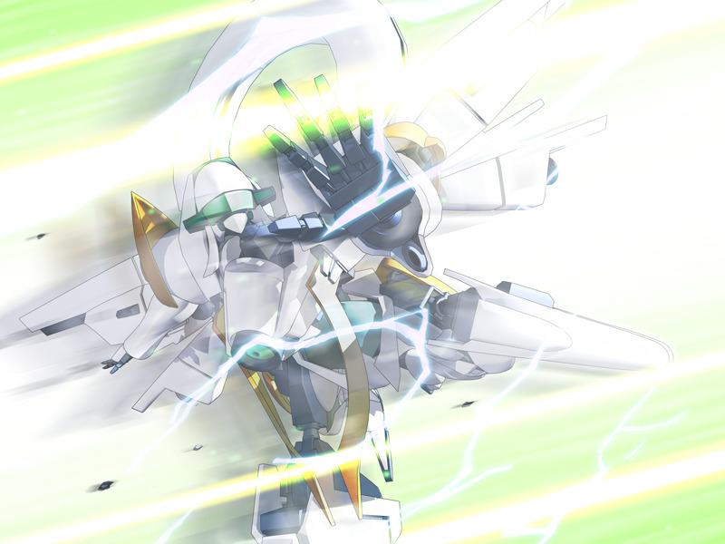
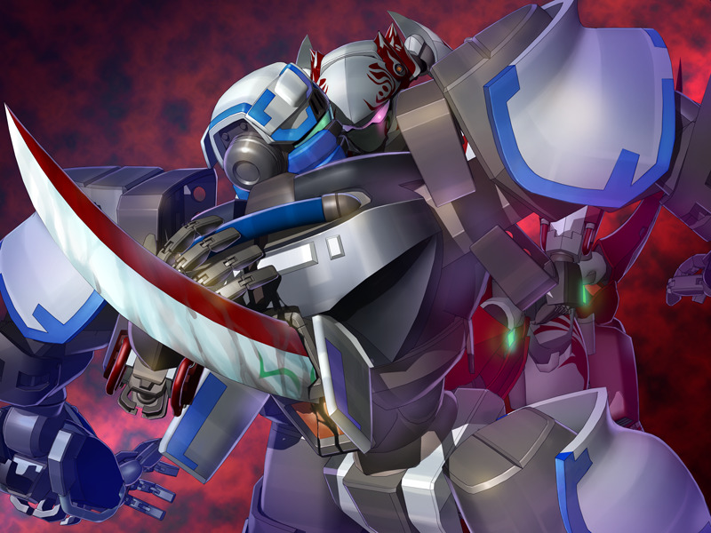

# 第10章 融合(Merge)

甲因为看到空的死亡和镇静剂的复活陷入绝望，被蕾呵斥。
呼也提醒甲自己的存在正是空仍然存活的证据。
意识到空被十九夺走的甲清醒过来。

圣良声称有只有甲能使用的对抗镇静剂的方案，让甲回到方舟。
甲和蕾试图突破登出干扰区域，但镇静剂紧随其后。
拖延时间的蕾采取了自杀袭击……

甲赶往方舟中枢，得知控制中枢已被入侵。
菜叶使用战斗用电子体开启闸门，但身体受了重伤……

甲利用菜叶死前传来的路线图前往构造体中枢，途中圣良报告说正在赶制对巴德尔使用的逻辑炸弹。
输入逻辑炸弹的时机极其短暂，只有作为模仿体的甲有可能执行AI实时生成的程序。

甲终于突破到达中枢和守备的雅再会。
而雅已在与无人机的战斗中受了致命伤……

甲来到雅拼死守护的社长室，意识到亚季与圣良口中所谓的“世界上第一个拥有着灵感和完全智能的病毒”的含义……

甲携带放入了圣良和亚季电子体的病毒与千夏会合，前往米特斯拜亚地下。
两人看到镇静剂正在将虚拟空间分解到ES的原始状态。

海量的敌人向两人袭来，千夏留下操作前往巴德尔系统的手动式地下电梯。
离别前，千夏谈起自己曾经看到的梦境，与甲相拥吻别。
在被留下“这次就去爱空吧”的话语后，甲的头顶传来剧烈的爆炸，之后与千夏的连接断绝……

甲与在地下待机的小真会合。
在追悼千夏之后，两人继续前进。

闸门的另一侧是多米尼恩的构造体。途中小真提出自己佯攻的对策。
为了防止小真可能被感染或支配的情况，诺依早就与小真的真的战斗用电子体进行了同化。

甲和小真到达巴德尔面前。
甲见到了八重被杀害那天和永二通话的幻影。

小真为保护甲承受了镇静剂的攻击，战斗用电子体消失无踪……

镇静剂因顾虑波及甲周围的巴德尔而无法使用炮击。
正在这时一架与甲的机体外形非常相似的机体出现，甲发现机体的主人正是空。

本该感到欣喜的甲压抑住自己内心的不安踏向前方。
然而，空却请求甲逃跑。
随后，表情消失的空在十九的命令下将甲贯穿。
甲的意识随之消散。

---

[下一章](chapter11.md)