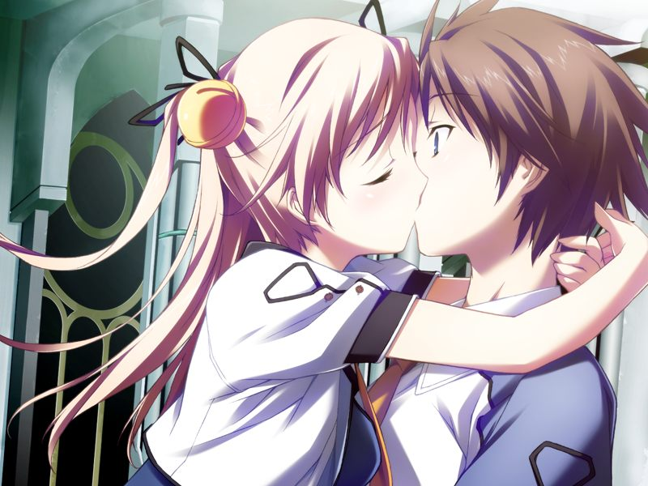

# 第11章 伊芙(Eve)

甲在ES的浓雾中恢复意识，看到自己所爱的人的身影，却唯独感觉不到某个人的存在。
在ES中与众人融合在一起的甲无论如何也想不起自己的名字，但在想到吉鲁贝鲁特时却被拒绝与众人同化的他痛骂。
甲看到了吉鲁贝鲁特的灰色圣诞节的记忆。

【记忆】

> 甲和蕾在灰色圣诞节中向被暴徒袭击濒死的吉鲁贝鲁特伸出援手。
> 感到自尊受到侮辱的吉鲁贝鲁特反复诅咒着甲的名字……

甲被思念着自己的呼从自我融合中剥离唤醒，在被拥抱时发现原本是虚像的呼已经获得了电子体。

两人确认到奇点的存在，正在此时，AI伊芙出现。
伊芙解释此处为镇静剂重新构筑的世界。
原本以不介入不关心为基本准则的AI借助奇点的处理能力将两人再构成，期望两人去打倒十九。

伊芙继续解释奇点的真相。
最初，AI从未体验过敌对行为，并将其归结于情报的不一致，因此向十九共享了情报处理能力，导致世界0的AI被十九支配。
在对空的行动进行观察后，AI终于理解了【敌人】的概念，并将其向空所观测到的世界中的AI分享，进而产生了奇点。
在第一次奇点中，为保护观测学习对象，AI将阻止编译者流出作为最优先事项，主动介入并操纵了对地射击卫星群。

甲向伊芙询问为何要对身为观测对象的人类提供帮助，而不是无视人类更有效率地战斗。
以玛萨形态出现的伊芙用玛萨每次讲义的结束语回答道……

> AI.伊芙：【我想理解你们，也盼望着你们能够理解我们…】
> 
> AI.伊芙：【要问为什么的话……】
> 
> AI.伊芙：【就是因为我们将人类认识为【朋友】。是行走在同一道路上的友人】
> 
> AI.伊芙：【我们对你们人类抱着【喜欢】的概念。这个能作为回答吗？】

甲望向地平线上的奇点。现在正是所有世界中出现第二次奇点的时候。在奇点的另一侧，无数个门仓甲正在战斗着。
从伊芙口中甲得知，正因为恢复了与真正的甲们的连接，身为模仿体的自己才得以重新启动。
同样的，在第三次奇点后，与连接切断的自己也将与AI网络同化。

打算离开前，甲向AI询问，自己战斗的意愿是不是被AI干涉而产生的。
伊芙感到了甲对自己作为模仿体被制作出来的事情上拥有疑问，将相关情报传送给了甲。

> 看了一眼信息，我惊讶地睁大了双眼。
> 这正是所谓惊喜的感觉。
> 
> 甲：【哈哈哈哈……为什么不早一些让我看到这些信息呢？】
> 
> AI.伊芙：【因为从没有人问过】
> 
> 甲：【…真是的，正因为这样你们才会被认为是在策划什么阴谋哦？】

就此下定决心的甲与呼一起被伊芙传送到虚拟空间中最后一片没有被破坏的地方。

甲与呼来到文艺复兴计划的研究所前。
感到时日不多的甲向呼表示感谢，突然被呼亲吻。
甲想问看看她对空抱有的心情。

1. 呼是不是在忍耐着不去嫉妒呢？
2. 正因为是呼。所以一定是在真心地为我们着想吧。

在被问到是不是在嫉妒空时，呼带着复杂的心情做出回答。
同时体验着空的心情和甲在其他世界的记忆的呼尽管清楚自己不是空，但依然感到寂寞。
尽管如此，这份看到另一个自己痛苦而渴望将其拯救的心情却依然没有改变。
甲感激地回吻了呼，独自进入研究所中。

甲在研究所内部与空再会，得知空仍与深度睡眠中的十九连接着。
一直与十九连接的空告知甲，这里是对十九而言承载着回忆的场所。
十九的众多大脑中和爱情相关的部分集中在了一个女孩的脑髓中，而在淘汰过程中十九亲手将那个女孩击溃了。
尽管如此，在感情方面连孩童都不如的十九内心渴望着母性。
也正因为如此，十九才会爱上研究所中唯一一位怀孕之身的八重。
甲得知了十九异常的表达感情的方式，和连接者系统与八重的关系的真相。

空向甲询问之前一直待在自己身边的约定，已经接受自己命运的空希望甲和呼在一起。
尽管已经被空知道自己即将消失，但甲依然发誓要将空从十九手中拯救出来。
空还在希望甲能在安稳地活到最后时刻前，此时呼突然插入对话，指出空心底担心的其实是现在想要拼死拯救自己的甲的感情是AI造成的。
想到两人恋爱的开端的确是很不自然的状况，得知真相的甲让空去询问伊芙。

伊芙解释可以确定的三件事情：
其一，AI从共振(Howling)事件中吸取教训，不再出手干涉人类之间的关系；
其二，亚季对事件的时间序列有所误解，甲的模仿体与空的初次相遇实际上是在呼被创造之前——

> AI.伊芙：【门仓甲的模仿体，为什么会去拥抱空呢？我们向了解那究竟是怎样的一种现象】
> 
> AI.伊芙：【所以我们才选择了空，作为被亚季构造出来的呼的原型】

得知自己被甲一见钟情的空露出了红晕。
看到空的表情，甲想起了某个世界里的小真曾提到过，空唯一一次暗动春心还是在小时候的事情。

而伊芙最后确定的事情，是应该由空自己回想起来的，与空的灵魂别无二致的，每个世界中代理人的行动。

空终于不再因为担心再次失去甲而欺骗自己的感情……

> 空：【为什么我们两个，就不能好好地走到一起呢。果然还是命中注定我们不能在一起吗…】

在空的拜托下，两人为了忘却痛苦沉浸在一起。

回过神来后，空奋力将甲推开。
奋力抵抗十九的空在最后呼喊出了自己对甲的爱意，随后被十九操纵，以战斗用电子体的形态出现在甲的面前。

> 甲：【我发过誓……一定要把你救回来！！】

【战斗背景音乐：沉默之空(Dive 1 OP)】

【若失败，空想刺下最后一击时被呼制止。】

甲趁空恢复意识，将圣良准备的病毒投入空的机体，随后再度失去意识。

甲被呼焦急地喊醒，发现复活的神父挥舞着电锯高呼“想死你了啊”的出现在自己眼前。

神父以十九的代言人身份威胁甲离开，被甲断然拒绝。
多个神父出现在甲面前。呼看穿了不断增加的神父的真身。

击倒神父的甲与完全复活的伊芙再会。AI正在对世界进行再构成，甲被传送到再构成的战场，拉开最终决战的序幕。

---

[下一章](chapter12.md)