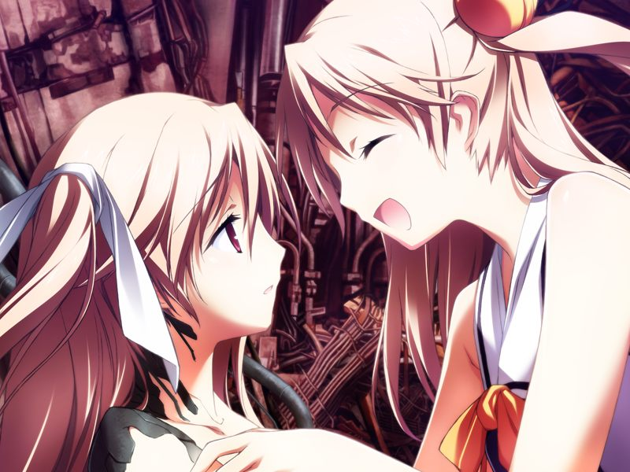
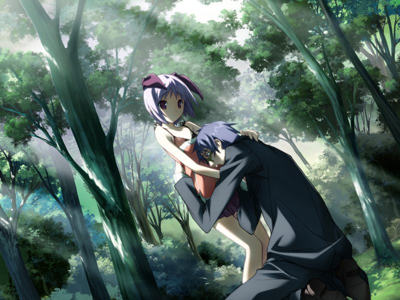

# 第13章 空(Sora)

甲和呼在诺依的引导下来到空身旁，与全身与机械相连的空做临别的告白。
空已无法支撑，而作为完成使命的模仿体，甲自身也将跟随奇点消逝。
互相倾诉爱意的两人双唇交叠，甲用手指扣住了两人一同紧握的手榴弹的安全针……

呼阻止了想用手榴弹自爆的甲和空。
如同脏器移植般，呼向伊芙提出用自己的数据对空内心的欠落进行补充的方案，而这意味着呼的自我意识的消亡。

呼与空最终融合，看到两人彼此欢迎对方的身影，甲的意识开始模糊……

> 机械声：【连接断绝】

甲被空和呼拉回。
原来空依然保持着与其他世界的甲的连接……

> 甲：【莫非…你还在观察着异世界吗…？】
> 
> 空：【没关系的，这次只是像梦境一般静静看着而已。这次要把甲紧紧抱在怀里，为了让甲活下去而做梦……】
> 
> 呼：【所以，和我们一同睡去吧？只要我们还在做梦，甲就永远不会消失】
> 
> 空：【嗯，去做梦吧。去做令人怀念的梦，温暖的梦……还有长长的，长长的，恋爱的梦】

空想起了伊芙曾让她自己回想起来的最后一个原因。
原来在对其他世界的观测中，空也曾梦见过更久以前的事情。
不希望甲沉浸在悲伤中的空一直在默默地守望着每个世界里甲的童年，
无论是在母亲离开人世时哭泣着的甲，还是拼命守护着年幼的菜叶的甲，还是在学园里和雅并肩走在一起的甲……

> 空：【我一直一直都在看着。虽然甲说过，就算我什么都没做，也同样会对我一见钟情】
> 
> 呼：【……呵呵，才不是那样哦，空早就在试着接近甲了。从甲还很小很小的时候开始】
> 
> 空.呼：【一起去做梦吧？直到，我们两人能够再次一同散步那天…】

---

【世界1+改变后26040小时】

甲和蕾再次回到星修遗址。

【世界2+改变后13128小时】

甲和菜叶回到已经荒废的南八坂。

【世界3+改变后19680小时】

甲在海边和通过克隆技术恢复少女之身的千夏对话。

【世界4+改变后34320小时】

甲和亚季照顾着自己的小孩。

【世界5+改变后40080小时】

小真为自己明明已经怀了孩子，可胸部还是没有长大而哀叹。

【世界7】

直树向小真倾诉被神父侵蚀的痛苦。

小真本想鼓励痛苦的直树，突然感到一股这样做一定会后悔的确信。
原本无法在现实世界中正常说话的小真突然说道……

> 真：【老师……如果真的那么痛苦的话，那么把研究停下来不就好了吗？】

在小真的劝说下，已完成了基础研究的久利原直树放弃了亲自深入，接受小真推荐的诺伊医生的治疗，并为自己被小真视为父亲看待而不好意思。

【世界7+1240小时】

平安夜，甲和空如约相见。
街头的新闻播报说编译者的展示获得了圆满成功，勳向研究的先驱者直树表示感谢。
空说勳同意了明年将蕾转入星修和如月寮的事情。

两人在街上散步，谈起一同做了漫长噩梦的事情。
两人的梦境都是从对方被溶解死去开始，到两人相爱结合结束。
相信来年将会成为载满回忆的一年的空拉起甲的手，庆祝他们共同度过的第一个平安夜……

【世界6+突破计测极限(Over Flow)】

经历了永远的时间，编译者终于制造出了人类的肉体。
甲以实体(Real body)回到故乡(Real)的海边，和空作为人类再度结合，人类的历史再一次开始……

> 越过永劫的时光终于结合的我们…
> 
> 在头上，亘古不变的蔚蓝天空
> 一直延伸到无限的远方

---

[个人感受](comment.md)

[返回](../start.md)