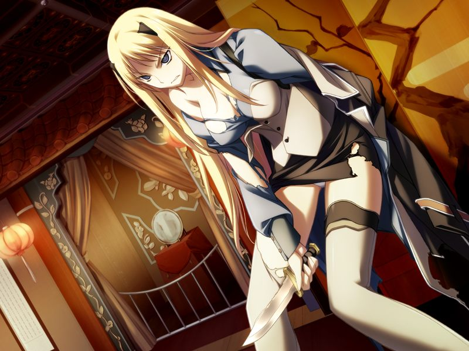

# 第2章 伙伴(partner)

甲清醒后听到电波的问候。
甲虽然在社长室看到了圣良，但却发现她并没有反应。
电波判断包括甲之前看到的幽灵，大家都处于意识朦胧的状态。
甲询问电波的身份，电波说自己在据点自爆前曾与甲相见。
甲回想起了那时的场景，得知电波是呼。

甲对呼已经能如此流畅地和人谈话而感到惊讶。
同时，呼也对自己依然存活感到不解。
呼希望和甲同行以恢复自己的记忆(Memory)，并说自己也不知道自己电子体的下落。
甲逐渐感受到，已经获得自我意识的呼充满了人类的气息，并且话语性格和空生前时已别无二致。

甲来到中继界，和虚像化的呼对话。
两人开始分析情报，判断甲在设施中获取数据和再次醒来间存在关键的间隔。
呼建议甲推测自己在获取数据后可能采取的行动。
甲想起过去情报贩子的事情，前往无名都市的据点。
在呼的帮助下，甲从化为尸骸的艾迪的脑内芯片中搜寻到艾迪和蕾等人汇报的阿南的情报。
甲认为蕾可能因此前往CDF构造体，决定去那边寻找线索。

甲击倒大量CDF和GOAT的无人机，推测GOAT为逮捕阿南占据了CDF。
甲再次在房间中看到了大量幽灵般伫立的幻象。

甲试图寻找阿南的私有房间，在一间小房间内发现了蕾的所有物。
甲在监视系统中听到蕾被凌辱的情景，拼命向声音源头赶去。
战斗过程中，呼发现情况有些异常，让甲镇静。

甲来到扭曲的大门前，听到另一侧蕾想使用吊坠自杀，但这时一个女性的声音突然响起……

> ？？？：【（快给我助手，蕾！自杀什么的我才不允许…这是长官的命令哦！？）】
> 
> 蕾：【（中尉…！？）】

呼推测，自始至终甲听到的蕾呼喊的中尉都不是指甲，而甲的直接通话也从来没有传给蕾过。

甲进入房间，发现了并非幽灵体的蕾。
但甲却突然被蕾袭击。

> 蕾：【神父……你到底要…做到什么地步……在母亲大人之后，连这个人你也想亵渎吗……】

甲判断可以通过战斗让蕾清醒，与蕾战斗。

【战斗结果影响结局细节】

* 若甲战胜了蕾，蕾再次想用吊坠自杀，被甲劝说放弃。
* 若甲败于蕾，在蕾下手杀甲的瞬间，蕾恢复理智，认识到甲是本人的同时昏倒。

和甲再会的蕾在甲的怀中哭泣，甲感觉这种场景似曾相识。
蕾似乎认为甲已经死去，并对甲看起来如同学院时代一般羞涩。
一旁的呼因为虚像只是靠干扰甲的视觉所得，除了甲以外无法看到和听到，因此无法帮上什么忙。
在对话中，甲和蕾逐渐发现双方的记忆有不吻合的地方。
在蕾的记忆中，甲在灰色圣诞节中丧生，而蕾被空救了一命，此后两人结伴成为军人。

甲让蕾调查网络，蕾也迅速发现了网络的异常。
蕾发现自己的记忆体中存在自己没有印象的CDF的数据残骸。
甲将数据转交给呼解析。
在交流彼此的经历后，蕾决定继续听从甲的指挥行动。

两人沿着蕾的记忆前往诺依的诊疗所，得知空曾因为爆炸产生了记忆障碍并在此治疗。

甲将蕾带到如月寮。
蕾解释虚拟的如月寮是亚季创造的。如今如月寮中的物体腐朽生锈，应该是网络法则进化的结果。

甲和蕾再次来到圣堂休息，交谈中两人意识到对方和自己记忆中虽然有所偏差，本质却没有变。
尽管呼一直在不停吐槽甲的想法，但对甲与蕾的关系变得亲密也感到高兴。
在蕾睡后，呼告诉甲自己的记忆和甲是相同的，希望甲能保持神志。

---

[下一章](chapter3.md)