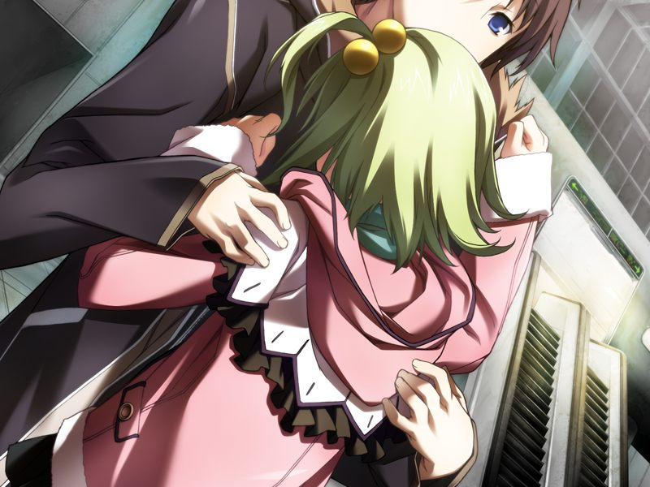
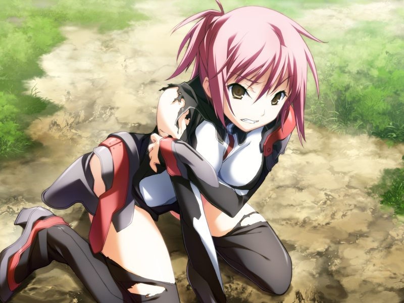

# 第3章 残骸(the remains)

呼完成了对CDF的数据的解析，判明了德雷克斯勒机关的潜伏场所。
甲和蕾前往地下设施。

众人来到已因地下核爆炸化作废墟的工厂区。
蕾想起自己和空曾同魔狼一同入侵核反应堆，并发现了被多米尼恩劫持的菜叶。
呼发现蕾在记忆溯行时脑内芯片在收到AI发来的信息。

众人潜入地下通道，同大量多米尼恩的病毒战斗。
甲与蕾配合默契，蕾不禁感慨连空这样的高手都无法与甲的经验相提并论。

甲与蕾发现了隐藏通道。
两人在前进过程中谈起空的事情，得知已在灰色圣诞节中失去全部的空始终无法对甲忘怀。

众人发现了十九的隐匿处。
呼提到久利原疯狂前曾访问了巴德尔中十九死前留下的连AI也无法解释的某些东西。
甲的脑海中隐约回想起自己似乎曾在某位年幼身形的女性口中得知的十九的情报。

突然，一个手持链锯的木乃伊从操作席中爬起。
甲和蕾无心与之纠缠。
在撤退途中，蕾突然收到了来自菜叶的混杂噪音的直接通话。
呼反向查出了菜叶的位置，但奔跑求救的菜叶无法听到甲的呼叫。

为了救出被潜脑的菜叶，甲向呼确认的坐标移动，将在该处的格雷戈里神父的战斗用电子体击倒，并回收了残留的木乃伊。

【战斗时间影响结局细节】

胜利后，甲一瞬间看到了空救下被潜脑的菜叶的记忆。
认定自己已无药可救的菜叶乞求空让自己回到和甲有着共同回忆的那个地方。

甲回到蕾身边，得知菜叶的信号已消失，其源头在早已倒塌的瓦砾之中。
在甲的追问下，蕾回忆起当时作战结束后，菜叶从据点中逃脱后在都市中被发现，之后在菜叶体内发现了编译者移植体。

甲在车站边发现了等待前往南八坂的列车的菜叶。
菜叶在甲的怀中泪水决堤。

蕾调查菜叶的身体，发现其腹部有留下手术的痕迹，但没有发现生物移植体。
甲向菜叶询问其记忆，但菜叶也记不得被空救后的事情了。

众人前往荒废的宿舍清除杂草。
晚饭后，甲本打算同蕾继续调查，但还是因为担心菜叶而留下。

甲安慰担心甲消失的菜叶，讲到自己记忆中去世的是空而非自己。
菜叶说，空也和甲一样，为了不去想起逝去的对方而拼命战斗。
菜叶祈盼着甲与空的重逢。

虚拟都市中突然响起警报。
甲与蕾发现GOAT与CDF的无人机部队正与方舟的无人机部队在空无一人的构造体中战斗。
呼发现入侵方舟的敌人正被巴德尔系统操纵着。

菜叶说自己的如月寮中见到了千夏和亚季的幽灵。
甲对比自己之前的遭遇，推测幽灵只在众人回忆起其本人时才会出现。
蕾也认为AI为了维持虚拟世界需要人类的观测，推测这个现象或许与量子力学有关。
菜叶觉得甲或许也可以像找到蕾和自己那样找出千夏和亚季。

甲追问菜叶和蕾在德雷克斯勒机关据点战斗后的记忆。
两人回忆起千夏是GOAT的成员，并曾作为间谍潜入了方舟。

GOAT的无人机再次出现，蕾想起记忆中方舟将菜叶藏匿起来，并试图通过诺依医生的帮助抢救菜叶的大脑。

战斗途中蕾陷入梦境，呼将蕾看到的梦境传递给甲。
甲看到空与暴露间谍行为的千夏对峙的场景。

甲跟随梦境指引来到病毒密布的草原，终于找到了千夏。
恍惚的千夏将面前的机体认定为亵渎甲的人偶。甲与千夏战斗。

【战斗结果影响结局细节】

(若甲败于千夏，千夏在看到甲时会发出惨叫除装。)

甲战胜了千夏，在赶往千夏身边时看到千夏回忆中询问其过去遭遇的空的身影。
甲将自己的电子体移到空的虚像所在的位置……

> 
> 
> 千夏：【空，杀了我吧！求你了……请允许我先行一步去到甲的身边吧！】
> 
> 甲：【真是久违了呢，千夏。我现在自己上门来找你咯】

---

[下一章](chapter4.md)