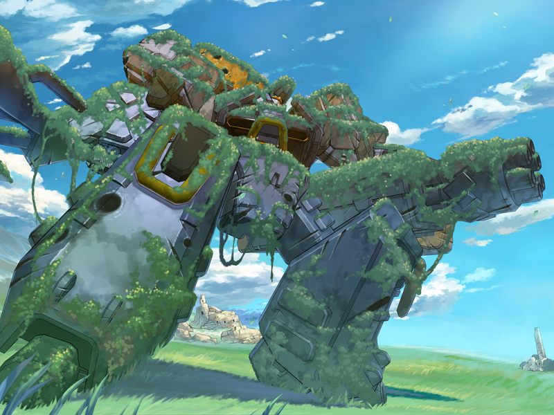

# 第4章 隔绝(Complete isolation)

无数的记忆碎片在甲的脑海中闪过。
随后，甲被呼温柔的唤醒。
呼认为甲的梦境和众人的白日梦可能是AI通过脑内芯片传递的信息。

甲想去看一下千夏的状况，蕾报告说千夏一直隐瞒着其身体已是完全义体的事情。

千夏依然认为向自己搭话的甲是NPC，但在甲讲起两人间的青涩往事后略有动摇。
甲向千夏询问不相信自己是甲本人的理由，但千夏却将面前的甲视为“老呆在空的身边的人偶”。

甲找到在清理杂草的菜叶，询问之前为什么没有藏进圣堂，得知菜叶看到了小真的幽灵。
千夏因看到本以为死去的菜叶而大吃一惊。
甲制止了千夏想问菜叶其体内的生物移植体的企图。

千夏因为害怕希望被再次粉碎而坚决否定甲的存在，蕾却对甲的身份坚信不疑。
原本就水火不容的两人争执升级，前往虚拟竞技场决斗。
甲赶去阻止两人，反被当成了碍事者。
呼声称已经取得了虚拟竞技场的控制，得知限制器已设定为非致伤级别的甲失去理智把蕾和千夏一起收拾了一顿。

战斗结束后，由于呼设定错误，蕾和千夏的衣服都被剥光。
但愤怒的甲毫不在意地怒斥了两人一顿。
甲甚至和劝其冷静的呼也吵了起来，看不见呼的两位女性以为甲被气疯了，赶紧道歉。
千夏也终于承认面前的甲是本尊。

甲与蕾，菜叶，千夏在圣堂交换情报。
蕾和千夏回忆起神父以编译者要挟逃离，由于对地射击卫星群被AI干扰，GOAT试图使用镇静剂镇压AI.
千夏原本身为预备驾驶员，但在出战前却被临时更换。勳将该驾驶员称为“连接者”。
千夏和蕾无法想起之后的事情，呼发现AI又将情报传到两人脑中，随后两人回忆起镇静剂侵入了方舟中枢。

众人来到方舟，在记忆中最后的战场上搜寻，但一无所获。
社长室中也是空无一人，试图破解系统的众人想起亚季。
蕾提到亚季在最后一战时与魔狼和空一起试图使用逻辑炸弹阻止巴德尔。
菜叶也想起了方舟当时在保护体内有移植体的自己。
尽管如此，众人却都无法回忆起那场战斗的最终结果。

甲和千夏质疑圣良并非如此铤而走险的个性，无法掌握全部事实的蕾只是强调圣良和永二将连接者视为比编译者更危险的存在。
正在此时房间的屏幕突然开始播放战时勳的通话，与之对话的圣良的幽灵也在社长室中出现。
甲和呼发现这和之前的白日梦一样是被传入脑内芯片的情报。
圣良的幽灵宣告将实行方舟计划。

甲向众人询问何为方舟计划，但无人应答，只是蕾的神情似乎有所隐瞒。
在菜叶的提议下，众人开始搜索应该知道什么的亚季。

众人的搜索一无所获。在呼的建议下，众人来到亚季的私人虚拟空间。
甲和呼在对话时不小心让千夏听到，千夏因误以为甲对自己仍抱有留恋而困扰。

正在尴尬时亚季预留的陷阱发动，众人和病毒战斗。
因为蕾被陷阱所困，甲和千夏两人单独行动。
甲试图解开和千夏的误解……

> 千夏：【我们之间的关系很久以前就已经结束了。这个你也明白吧……？】
> 
> ……
> 
> 甲：【抱歉。虽然确实没有什么办法补偿你，不过可以一直骂我直到你消气为止也没关系的】
> 
> 千夏：【是想这样做呢。……可是，一旦看到你的脸，又感觉怎么样都无所谓了】

千夏说自己也曾做过自己在接受克隆治疗后和甲一同四海漂泊的梦。

莫霍克阻挡在甲等人的面前。
甲与接受守护亚季的使命的莫霍克提出一对一单挑。

【战斗结果影响结局细节】

次元扭曲后甲等人回到原本的虚拟空间，担心甲在自己眼前再次死去的千夏甩了甲一个耳光。
甲意识到千夏心中仍然残留着创伤。

两人在虚拟的草原上发现了伫立着的锈迹斑斑的钢铁巨人。
机体上无数的弹痕正是莫霍克为所爱之人拼死守护到最后一刻的见证。

在救出受到防火墙精神攻击的蕾后，众人发现了熟睡中的亚季。

意识到眼前并不是幻觉的亚季突然抱住甲接吻。
亚季清醒后调查甲的脑内数据，随后与甲相拥哭泣。

亚季来到宿舍，在调查后发现虚拟世界的法则与现实已几乎没有差别，而这个空间和现实已完全隔绝，众人已经被孤立在虚拟世界中。

---

[下一章](chapter5.md)