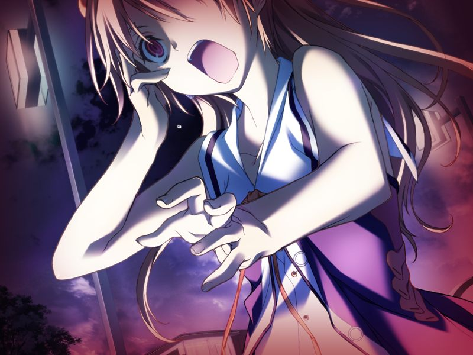
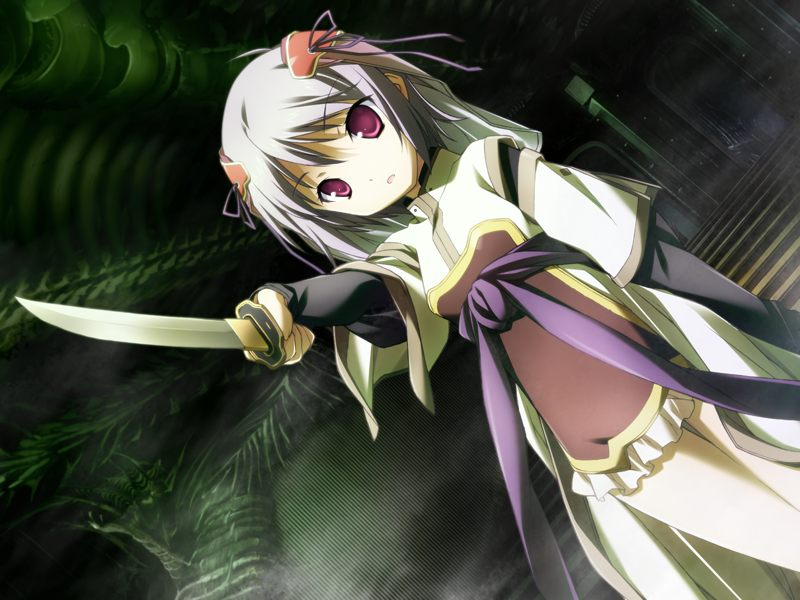

# 第5章 亡灵(Revenant)

甲被呼摇醒，发现呼已经能干涉触觉信号了。

甲与亚季在破败的虚拟校园中回想过去。
亚季也意识到，众人记忆中的空与甲记忆中的甲的立场是对换的。
而且尽管看不到，亚季也早就注意到呼正陪在甲身边。
甲和呼感觉到亚季虽然在拥抱着甲，却仍然在感到寂寞。

众人来到方舟构造体中枢。
亚季讲述自己的记忆中最后一战的结局。
那时尽管亚季暂时使得镇静剂停机，但方舟最终还是因为战况恶化而准备自爆。
然而，更进一步的发展仍然无人能记起。

亚季将整理中的镇静剂的资料传给众人。
众人发现能成为连接者的只有与甲的母亲八重的遗传因子相近之人，而在适应者人选中水无月真的名字赫然在目。

亚季想起自己在那一战中最后看到的是空为了救真同镇静剂一同坠入光圈闸门的情景。
得知水无月姐妹最后消失在这附近，众人开始在方舟构造体中搜索。

在搜索过程中众人被多米尼恩的病毒袭击，清剿中蕾发现了电子体反应，结果搜查后发现是躲起来的吉鲁贝鲁特。
从吉鲁贝鲁特虚张声势的威胁中，甲和呼听出吉鲁贝鲁特似乎在甲死后还见过甲的样子。

吉鲁贝鲁特也意识到了空间的异常，并试图通过劫持甲逃走，反被甲打翻。
吉鲁贝鲁特与甲单挑落败，恼羞成怒地把病毒种子洒在地上后趁机逃脱了。

一无所获的众人回到圣堂，阅读有关水无月姐妹过去的资料。
众人得知水无月姐妹是永二从南美的秘密工厂带回的。
空并不像真那样具有连接者的素质，而像千夏这样的非连接者若搭乘镇静剂便会狂乱甚至脑死。
甲不禁想起入侵巴德尔而发狂的久利原，但突然意识到自己知道久利原发狂的原因这一点本身就是异常的。
事实上，甲之前也有对很多理应不知道的事情的既视感。

甲在呼的提议下向千夏询问小真在搭乘镇静剂时的实体所在地。
众人因此决定第二天去米特斯拜亚继续调查。

休息前，亚季把甲叫到ES。
亚季坦白了水无月姐妹的遗传因子的来源，甲对两人的遗传因子有一半与自己相同并不在意。
亚季随后透露自身也是被造子。
联系之前的话语，甲意识到亚季的真实想法，与亚季相拥。

除菜叶外的众人传送到破败不堪的米特斯拜亚继续搜索小真，并见到了巴德尔系统。
千夏在巴德尔的一个小房间内发现了操作席和电子体足迹。

众人追着足迹进入多米尼恩构造体，与众多无人机战斗。
千夏与甲一同行动，说起自己曾梦见自己与雅在这里被多米尼恩俘获并被惨无人道的处置。
甲隐约觉得自己仿佛也梦见过相同的梦境。

甲发现了小真，但真仿佛心死一般观看着多米尼恩的“丧尸”们。
真说编译者在分解人类时会将其脑细胞和所处环境的情报传输到网络上，虚拟空间中再现的清城市正是现实中被编译者吞没的清城市的写照。

> 甲：【也就是说，这里就是多米尼恩所许诺的乐园了吗？】
> 
> 真：【是的】
> 
> 甲：【……为什么从刚才开始就能那么平静地作答？小真对事情变成了现在的结果莫非什么感觉也没有吗！？】
> 
> 真：【看来，还没有明白呢……？】
> 
> 真：【因为啊，甲前辈不是已经死去了吗？】

一瞬间，甲看到了灰色圣诞节那天“自己的恋人被溶解的场景”。
然而，在蠕动的肉块表面，浮现的却是自己的脸孔。

在呼的呼喊下甲清醒过来。
想要拒绝甲的真举起了匕首，心中所想的却是……

> 真：《想回去…想和前辈一起回去…前辈…救救我…救救我…！》

甲意识到小真与其他陷入噩梦的友人们不同。
看穿了小真正被巴德尔控制的甲移行到战斗用电子体进入战斗。

【战斗结果影响结局细节】

甲顺利救出小真。
呼奖励了甲一个令人怀念的吻。
小真醒来后扑倒在甲的怀里。

> 真：《终于，回到了真正的世界……回到了前辈和姐姐都在的世界…》

---

[下一章](chapter6.md)