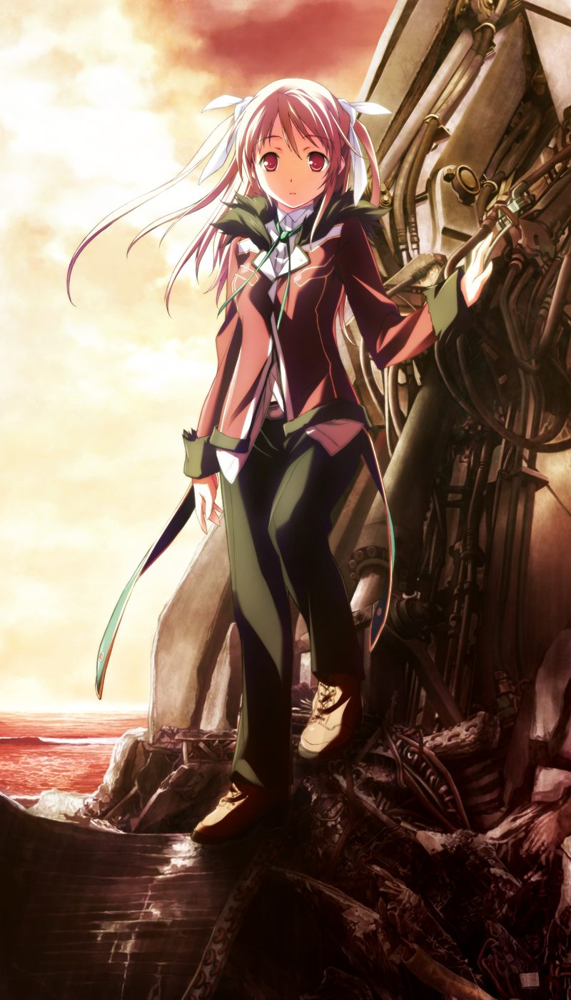

# 第6章 自我融合(Ego unite)

甲在圣堂中被小真叫醒，发现AI的机能已经部分恢复。

甲与众人在社长室集合，发现圣良的幽灵出现在操作席上。
在小真的帮助下，众人看到了最后一战的影像。
亚季想起了方舟计划正是让人类成为电子体幽灵生存的计划。
然而，在圣良向勳宣告方舟计划的时候，永二和空为了救出真说服了圣良暂时中断了倒计时。
之后，空和镇静剂一同沉入了ES之中。
众人开始意识到，若方舟计划随后仍然不得不启动的话，大家现在可能都已变成了电子体幽灵。

会后，甲被千夏带到雅最终作战时所处的CDF构造体。
两人发现了雅的战斗用电子体。
甲为了让雅清醒将其打倒。随后甲看到了雅发疯后被杀死的幻觉。
幻觉消失后，雅的电子体出现在甲的眼前。
甲与千夏在返回如月寮的途中向以为甲早已死去的雅说明现状。

三人回到如月寮，发现如月寮已经被众人在部分恢复机能的AI的帮助下修整的焕然一新。
进入房间后，小真说有重要事情把甲叫到自己的房间。
在小真的口中，存在着和这个世界不同的世界，并通过梦境展现出来。
甲找到小真的时候，小真正处在被巴德尔囚禁的梦境中，而镇静剂其实是巴德尔利用人类来抑制AI的武器。
在与甲交谈中，小真也靠直觉发现了和甲交换意见的呼。

在小真的请求下，甲将她带到方舟的中枢，调查保管于此的袭击过甲的木乃伊。
小真发现木乃伊实际是格雷戈里神父，并从木乃伊内取出程序。
呼解析出程序中部分片段的作者之一是亚季，甲终于得知神父就是曾拜托亚季帮助连接到巴德尔的久利原老师。
而一直将老师视为父亲仰慕的真很大程度上也因此一直留在神父的身边。
甲随后看到了真的梦境，那是甲想起了和久利原老师的约定的世界的梦。

> 甲：【话说回来，好像你也说过梦到了我什么的呢】
> 
> 真：《前辈要不要一起看看呢？》
> 
> 真：《在那个世界里面，前辈和姐姐生死相隔，而且前辈还失去了学院时代的记忆……》

甲看到了小真梦到的一个个异世界的梦境。呼也感到自己见过这些梦境，在这些梦境中，呼将自己称作“代理人”。
小真推测这些幻象是AI想向众人传达的某种信息。

两人在理应空无一人的构造体中听到了脚步声。
甲追踪脚步声赶去发现一个少女，反被袭击几近强上。
闯入的真发现所谓的“少女”是自己学院时代的主治医生诺依。

诺依自称是方舟虚拟都市中最后的幸存者。
原来方舟计划确实已经被实行了。
漫长的岁月中，关系亲密的居民们逐渐开始心意相通，最终开始出现丧失了自我意识界线的人。
在自我融合的过程中，人们开始接连消失，意识被AI同化……

> 诺依：【恐怕，这是因为作为个体的人已经无法被有意识的存在观测到了吧】

甲将众人召集到社长室，与诺依交换情报。
诺依判断众人正是因为友人对个体的认识而分离复活的。
唤醒众人的甲想到自己最初苏醒前，在做的是被空唤醒的梦。
甲愈发相信作为复活的起点的空可能依然存活。

会后，甲以钢铁般的意志拒绝了诺依的引诱。
甲想起诺依在初次见面时袭击自己的理由是将他误认为是NPC，再次向诺依确认，得知诺依曾见过与甲长相相同的NPC，而且一眼看去有种类似电子体的感觉。

对诺依的话产生疑问的甲来到亚季的房间，早已等待于此的亚季坦白了自己年幼时的往事。
那时，亚季制造了甲的模仿体，并让AI为其制作了恋人呼。
两个模仿体本保管在一般人无法进入的地方，然而却偶然有个小女孩进入了那里，并被甲的模仿体拥抱并试图亲吻。
方舟立即将引发了骚乱的男性模仿体冻结，而甲偶遇呼则是多年以后的事情了。
然而，现在亚季却发现被冻结的模仿体和呼一样行踪不明了。

早晨甲被叫醒，呼汇报说找到了空的电子体的所在地。
为了说服众人，甲还是说明了只有自己能看到的呼的事情。

尽管一度怀疑，但众人最终还是相信了甲。
亚季根据呼的情报发射侦查病毒。
病毒穿过ES之海的浓雾，观测到了奇点的存在，并看到了一座孤岛。
甲从诺依口中得知甲的父亲和其魔狼部下曾试图在ES之海中寻找与镇静剂一同消失的空，但再也没有回来。

侦查病毒在抵达岛屿前失去连接。
众人通过孤岛能在ES中一直存在判断岛上确实有意识在观测与认知。
甲决定亲自前往，众人为队伍构成争论。
最终，蕾与小真一同与甲前往孤岛。

甲一行人来到空所在的岛屿，见到的却是和显示器中截然不同的明媚海滩。
海边还有一座格格不入的研究所，亚季判断这里是由现实中不同的地方拼接而成的。

众人来到与德雷克斯勒机关相似的研究所，并从亚季发来的资料得知这里是文艺复兴计划的研究设施。
甲的母亲便是在这里与圣良一同参与十九主导的连接者的开发，并与警卫队长永二相恋。

众人进入设施探索，途中发现了战斗用电子体的尸海，以及为了守护背后的闸门，制造了这片尸海并化作屹立不倒的残骸的希泽鲁和永二的机体。

甲等人进入闸门，与接连传送过来的无人机战斗。途中本该在宿舍待机的千夏也前来支援。

真等人相继留下阻挡留守的敌人。
最终，甲独自来到岛的另一侧，发现了镇静剂的残骸。
在那里，甲听到了熟悉的声音……

---

？？？：【还是来了呢……甲……】

一个声音冷不防地传入了耳中。

？？？：【对，这就是镇静剂哦】

这个声音听起来很像呼。但，并不是。

我轻轻吸了一口气，整理了一下自己的呼吸。因为这个声音，对我而言实在是太具有冲击力了。

直至如今仍然烧灼在鼓膜中的，最后的声音。

“救……甲……救……救救……呃”

那家伙确实是这样说的吧。
我听着那个声音却什么也做不到……

刚才的那个声音是从我的面前，从头上的方向传过来的。

我寻找着声音的源头，把视线向上方挪去。

慢慢地……战战兢兢地…………

…明明已经来到了这一步，可是真的要亲眼去看那个身姿时，却又感到忐忑不安。

空真的还活着吗……？
真的会以安然无恙的身姿站在我的眼前吗……？

？？？：【……】

听到了她的呼吸声……

于是我狠狠下了决心，向这个声音的主人说道。

甲：【……空】

空：【……甲，好久不见呢】

在眼前的……
是用寂寞的表情迎接着我的空。

---

[下一章](chapter7.md)