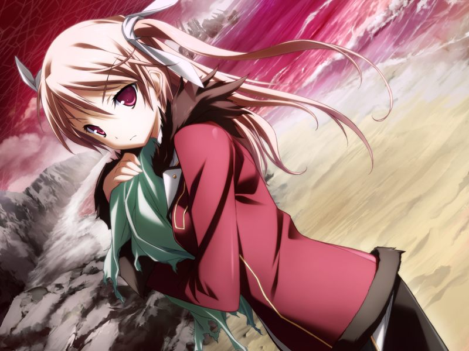

# 第7章 游戏者(Gamer)

甲对与空的再会欢喜不已，但空却不希望甲来到这里。
一边诉说着对甲的爱意一边拒绝着甲的空说道……

> 空：【你并不是甲。我所喜欢的甲啊……早已在这个世上死去了哦】

愤怒的呼被空发现，空感慨比起自己，现在的呼更像水无月空。
在说服紧闭心扉的空的时候，呼发现空的后颈连接着一个婴儿。
在甲的逼问下，空不得不承认，那个婴儿正是十九。

绝望的甲只能选择返回，并将怒火发泄到包围蕾和千夏的众多机体上。
然而甲等人最终还是被包围，好在不知何人布下的陷阱打破了包围圈。

突围后的甲等人与吉鲁贝鲁特遭遇，甲意识到布下陷阱的正是吉鲁贝鲁特。
吉鲁贝鲁特为寻找回到实体的方法提出和甲等人休战，甲同意了其要求，但隐瞒了方舟计划已经实施的现状。

回到方舟社长室的众人认为圣良可能对空与十九的现状有所了解，但圣良仍旧没有醒来的迹象。
无奈之下，亚季尝试了唤醒圣良的“魔法咒文”。

被亚季用“母亲”称呼而唤醒的圣良花10分钟掌握了状况。
圣良断定十九已死，但小真却声称十九还以凭依在格雷戈里和久利原身上的方式存在。
圣良将关于十九过去的资料传送给甲等人。

会后，甲根据圣良的指示和诺依及小真会合。
原来表面否定小真说法的圣良也和小真持相同观点。
十九的大脑并不是在连接巴德尔系统时被烧毁的，而是他主动将记忆烧录到其中时自己烧毁的。

甲在拿到真递给自己的巴德尔入侵工具时，想起了直树曾向亚季求助用这个工具连接巴德尔的记忆，却不记得自己曾从亚季那里听说过这件事情。
得到工具的甲被指示潜入木乃伊化的直树的脑内芯片。
为了空，甲决心舍命一搏，开始接受诺依的记忆备份。

甲潜入直树脑内时防壁启动。甲击倒了作为防御系统的直树的战斗用电子体。

甲在尝试访问数据容器时自我意识被庞大的数据量夺走，看到了复苏的十九的记忆。
十九将他心目中疯狂而又无意义的“纳米机器集合体”们称作“游戏者”，而这些游戏者却要将他们唯一创造出的有价值的智慧生命体——巴德尔系统埋葬。

甲在呼的喊声中恢复了意识。被诺依紧急切除的甲自身的污染部分变成了甲的战斗用电子体。

在击倒假货后，甲失去意识昏倒。

---

[下一章](chapter8.md)