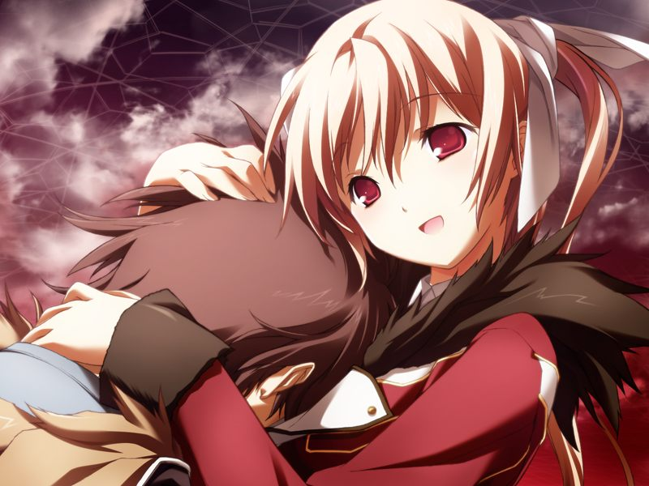

# 第8章 世界0(World Zero)

甲在失去意识的一天后终于醒来，担心甲死去而痛哭的呼用虚像与甲相拥。

圣良在调查数据后确定了十九的记忆是一种让与之接触的人变化为“神父”的病毒。
十九的目的是通过连接者系统反过来支配AI网络。
而曾与镇静剂一同沉没到潜意识之海的空尽管作为连接者并未完全被感染，但状况也并不乐观。
正在这时，诺依却说还有更难以启齿的事情。
做好心理准备的甲被告知……

> 诺依：【你是…模仿体……】

“甲”终于得知自己与呼是相同的存在。

回到空身边的甲说医生是因为发现备份记忆的异常才发现自己的身份的。
空对甲试图与十九的记忆接触而震惊和担心。
在甲对自己身份的追问下，空说出了这个世界是十九得以实现目的并对其他世界持续干涉的，作为起点的世界。
看到空对自己表示无法理解时露出的怀念的笑容，甲的眼角不禁湿润……

> 空：【你是男人对吧？……就连我…也一直在忍耐着哦？】

甲感到空的内心里仍然没有把自己当做人类看待。

甲回到社长室。众人经由AI终端看到了现实世界的景象。
尽管蓝天和草原的美景令人惊叹，但众人马上意识到了这片蓝天下已无人类和动物的痕迹，只剩下植物昆虫和编译者的残骸，以及繁殖到地面的AI生物元件。
众人终于不得不承认，这段足以令现实空间如此异变，虚拟空间法则变化的自我融合的时间，恐怕已经远超万年。

在众人沉浸在人类灭亡许久的丧失感中时，吉鲁贝鲁特打来通话。
甲将情报发给了吉鲁贝鲁特，但吉鲁贝鲁特认定是甲等人在欺骗自己，拒绝相信自己身体已经消逝的事实。

夜晚，意气消沉的甲与呼散步。
呼说不同世界的代理人们尽管彼此独立存在，但其经验却以记忆的形式积蓄在这个世界的AI中，同样作为模仿体的甲们一定也是如此。
而为了学习人类被成对创造出来的模仿体在一同度过无数战争后终于获得了人格。

> 呼：【（对！我们再也不是模仿着某个人的存在了！）】
> 
> 呼：【（我们的人生是在那个化为废墟的据点中开始的哦？实话说，在这个世界中作为模仿体存在那个时候的记忆，我和甲不都是一点也没有吗？）】
> 
> 甲：【我知道了！】
> 
> 在那所有世界中的我都在高喊着，去拯救空吧。
> 
> 我们那份无可奈何的会很，就都托付给你了。
> 
> 甲：【我就是门仓甲。就算我的基体是模仿体也罢，但我除了门仓甲以外绝不会是其他任何人！】

消除迷茫振作起来的两人终于想通了各自的使命，决定天亮后向空确认的两人牵手返回圣堂。

---

[下一章](chapter9.md)