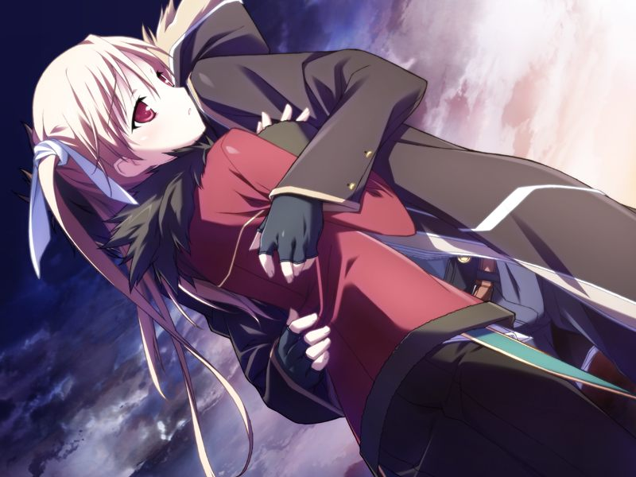
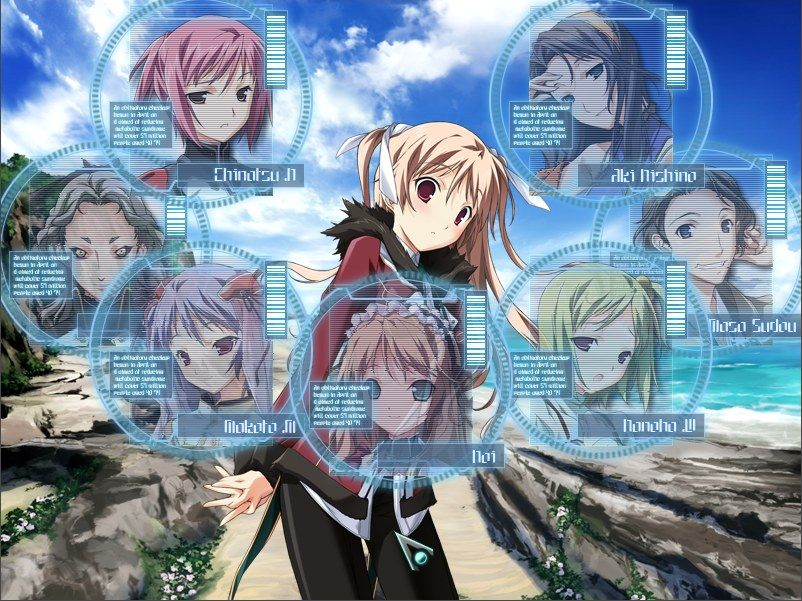

# 第9章 鼓动(Pulse)

第二天早上，甲准备前往空所在的海岸时，诺依过来搭话。
甲向她询问方舟是否曾观测到过来自其他世界的信号，并确认到奇点的存在。

带着自己是门仓甲的确信的甲来到空身边。
空用满足而安稳的表情接受了甲。
呼向空询问代理人的事情，空回答说她是AI侧的棋子。
在潜意识之海边，空反复观察着甲存活，然而依然走向毁灭的世界。
AI对空的愿望做出回应，将多个世界中情报传递到下一个世界的代理人身上。
然而世界0中与空连接的十九却同样以神父为棋子进行干涉。
在反复博弈中，能将多个世界的AI连接的奇点终于使得编译者的无效化成为可能。

坚信已无法对这个世界造成改变的空望着坚信自己为门仓甲的模仿体。
空认为自己最后见甲一面的愿望已经实现，向甲拜托道……

> 空：【把我……杀死吧】

与十九部分融合的空说十九仍以微弱的程度保持运作并压制着AI。
尽管空与十九将彼此束缚，但空已经不知道自己能坚持到何时。
数据的洪流向甲的脑海奔涌而来，甲看到的是神父与空在各种各样的世界中博弈的次元干涉战争。

> 空：【这已经超越我们人类的认知范围了吧…？其实，我想甲能够清晰回忆起来的世界最多也只有10个左右的程度】

> 空：【但我看到的世界比这还要多得多哦？而且在其中探寻，探寻，不断地探寻，可是不管怎样仍旧无法找到自己想看到的世界……】

> 甲：【你说在探寻…究竟想看到怎么样的世界呢？】

> 空：【我和甲都没有死，两人能够走到一起的世界】

甲下定决心将内心动摇的空抱在怀中，许下了拯救空的诺言。
经历了无数战场的两人仿佛回到了学园时代，

一觉醒来，甲向空问起和她连接着的十九的事情。
空能感知到与自己相连的十九，其作为管理计算机的最初的行动目标便是维持世界的和平与秩序。
然而，十九马上意识到人类自身正是这个目标的最大障碍。
同时，十九也对自己所拥有的人类大脑的非理性部分感到不安，对生物学AI既感到抗拒又感到吸引。

感到话题晦暗的两人开始谈论未来的生活。
正在此时，一直在偷听的吉鲁贝鲁特突然出现并向甲和空开枪。
陷入疯狂的吉鲁贝鲁特声称要以讨伐十九作为人类的最后一战。
在蕾的警告下，甲千钧一发地躲过了吉鲁贝鲁特的自杀式袭击，并将吉鲁贝鲁特击倒。

担心甲发生意外的空吐露了自己的真心，众人向心意相合的两人发来祝福。

在众人安心之时，甲在空的脚边发现了吉鲁贝鲁特掉下的延时炸弹。
来不及发出警告的甲亲眼目睹空被炸弹炸飞。
同时，空与十九连接的线缆被切断，镇静剂复活。

---

[下一章](chapter10.md)